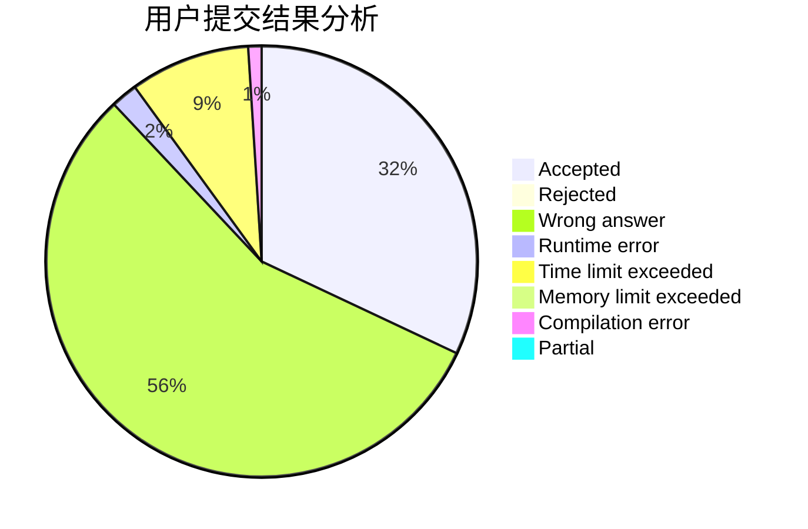
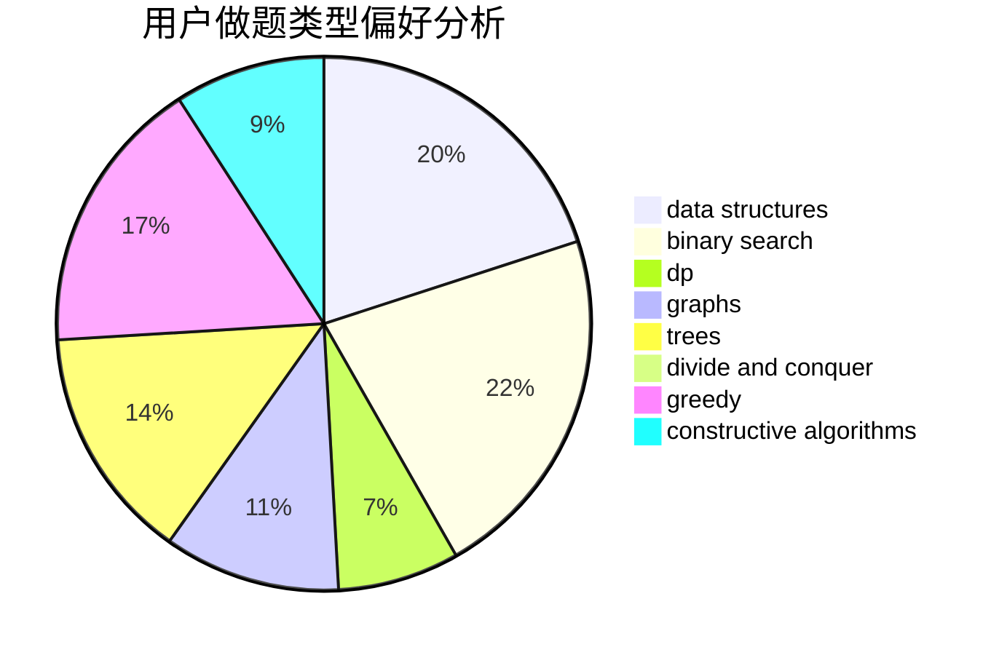
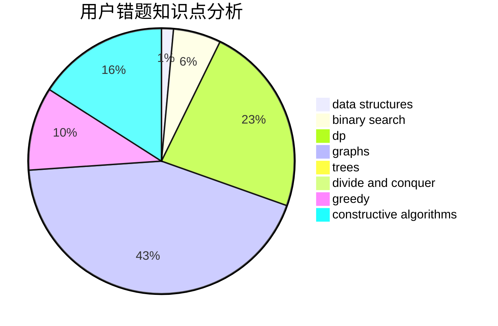

# czqqqaq
<!-- tabs:start -->
#### **用户提交结果分析**

#### **用户做题类型偏好分析**

#### **用户错题知识点分析**

<!-- tabs:end -->
# 推荐题目
[Divide Points](http://codeforces.com/problemset/problem/1270/E)		constructive algorithms,
                        geometry,
                        math		  
[Prefix Enlightenment](https://codeforces.com/contest/1291/problem/E)		dfs and similar,
                        dsu,
                        graphs		  
[Magical Sticks](http://codeforces.com/problemset/problem/1371/A)		math		  
[Riverside Curio](http://codeforces.com/problemset/problem/924/C)		data structures,
                        dp,
                        greedy		  
[Subset with Zero Sum](http://codeforces.com/problemset/problem/1270/G)		constructive algorithms,
                        dfs and similar,
                        graphs,
                        math		  
[Radio stations](http://codeforces.com/problemset/problem/762/E)		binary search,
                        data structures		  
[Yet Another Division Into Teams](http://codeforces.com/problemset/problem/1256/E)		dp,
                        greedy,
                        sortings		  
[Tourists](http://codeforces.com/problemset/problem/286/D)		data structures,
                        sortings		  
[Links and Pearls](http://codeforces.com/problemset/problem/980/A)		implementation,
                        math		  
[Hot is Cold](http://codeforces.com/problemset/problem/1146/E)		bitmasks,
                        data structures,
                        divide and conquer,
                        implementation		  
<!-- tabs:start -->
#### **data structures**
[Divide Points](http://codeforces.com/problemset/problem/924/C)		data structures,
                        dp,
                        greedy		  
[Prefix Enlightenment](http://codeforces.com/problemset/problem/762/E)		binary search,
                        data structures		  
[Magical Sticks](http://codeforces.com/problemset/problem/286/D)		data structures,
                        sortings		  
[Riverside Curio](http://codeforces.com/problemset/problem/1146/E)		bitmasks,
                        data structures,
                        divide and conquer,
                        implementation		  
[Subset with Zero Sum](http://codeforces.com/problemset/problem/431/E)		binary search,
                        data structures,
                        ternary search		  
[Radio stations](http://codeforces.com/problemset/problem/899/F)		data structures,
                        strings		  
[Yet Another Division Into Teams](http://codeforces.com/problemset/problem/56/E)		binary search,
                        data structures,
                        sortings		  
[Tourists](http://codeforces.com/problemset/problem/453/E)		data structures		  
[Links and Pearls](http://codeforces.com/problemset/problem/1430/D)		binary search,
                        data structures,
                        greedy,
                        two pointers		  
[Hot is Cold](http://codeforces.com/problemset/problem/1304/E)		data structures,
                        dfs and similar,
                        shortest paths,
                        trees		  
#### **binary search**
[Divide Points](http://codeforces.com/problemset/problem/762/E)		binary search,
                        data structures		  
[Prefix Enlightenment](http://codeforces.com/problemset/problem/431/E)		binary search,
                        data structures,
                        ternary search		  
[Magical Sticks](http://codeforces.com/problemset/problem/152/B)		binary search,
                        implementation		  
[Riverside Curio](http://codeforces.com/problemset/problem/1217/C)		binary search,
                        bitmasks,
                        brute force		  
[Subset with Zero Sum](http://codeforces.com/problemset/problem/56/E)		binary search,
                        data structures,
                        sortings		  
[Radio stations](http://codeforces.com/problemset/problem/1430/D)		binary search,
                        data structures,
                        greedy,
                        two pointers		  
[Yet Another Division Into Teams](https://codeforces.com/contest/737/problem/A)		binary search,
                        greedy,
                        sortings		  
[Tourists](http://codeforces.com/problemset/problem/1468/D)		binary search,
                        sortings		  
[Links and Pearls](http://codeforces.com/problemset/problem/21/C)		binary search,
                        dp,
                        sortings		  
[Hot is Cold](http://codeforces.com/problemset/problem/1492/C)		binary search,
                        data structures,
                        dp,
                        greedy,
                        two pointers		  
#### **dp**
[Divide Points](http://codeforces.com/problemset/problem/924/C)		data structures,
                        dp,
                        greedy		  
[Prefix Enlightenment](http://codeforces.com/problemset/problem/1256/E)		dp,
                        greedy,
                        sortings		  
[Magical Sticks](http://codeforces.com/problemset/problem/295/D)		combinatorics,
                        dp		  
[Riverside Curio](http://codeforces.com/problemset/problem/1000/D)		combinatorics,
                        dp		  
[Subset with Zero Sum](http://codeforces.com/problemset/problem/115/D)		dp,
                        expression parsing		  
[Radio stations](http://codeforces.com/problemset/problem/1323/A)		brute force,
                        dp,
                        greedy,
                        implementation		  
[Yet Another Division Into Teams](http://codeforces.com/problemset/problem/1067/D)		dp,
                        greedy,
                        math,
                        probabilities		  
[Tourists](https://codeforces.com/contest/1277/problem/C)		dp,
                        greedy		  
[Links and Pearls](http://codeforces.com/problemset/problem/21/C)		binary search,
                        dp,
                        sortings		  
[Hot is Cold](http://codeforces.com/problemset/problem/702/A)		dp,
                        greedy,
                        implementation		  
#### **graph**
[Divide Points](https://codeforces.com/contest/1291/problem/E)		dfs and similar,
                        dsu,
                        graphs		  
[Prefix Enlightenment](http://codeforces.com/problemset/problem/1270/G)		constructive algorithms,
                        dfs and similar,
                        graphs,
                        math		  
[Magical Sticks](http://codeforces.com/problemset/problem/508/D)		dfs and similar,
                        graphs		  
[Riverside Curio](http://codeforces.com/problemset/problem/1433/G)		brute force,
                        graphs,
                        shortest paths		  
[Subset with Zero Sum](http://codeforces.com/problemset/problem/1487/C)		brute force,
                        constructive algorithms,
                        dfs and similar,
                        graphs,
                        greedy,
                        implementation,
                        math		  
[Radio stations](http://codeforces.com/problemset/problem/1437/C)		dp,
                        flows,
                        graph matchings,
                        greedy,
                        math,
                        sortings		  
[Yet Another Division Into Teams](http://codeforces.com/problemset/problem/1470/D)		constructive algorithms,
                        dfs and similar,
                        graph matchings,
                        graphs,
                        greedy		  
[Tourists](http://codeforces.com/problemset/problem/1476/C)		dp,
                        graphs,
                        greedy		  
[Links and Pearls](http://codeforces.com/problemset/problem/1304/D)		constructive algorithms,
                        graphs,
                        greedy,
                        two pointers		  
[Hot is Cold](http://codeforces.com/problemset/problem/1475/C)		combinatorics,
                        graphs,
                        math		  
#### **trees**
[Divide Points](http://codeforces.com/problemset/problem/1304/E)		data structures,
                        dfs and similar,
                        shortest paths,
                        trees		  
[Prefix Enlightenment](http://codeforces.com/problemset/problem/1479/D)		binary search,
                        bitmasks,
                        brute force,
                        data structures,
                        probabilities,
                        trees		  
[Magical Sticks](http://codeforces.com/problemset/problem/1511/C)		brute force,
                        data structures,
                        implementation,
                        trees		  
[Riverside Curio](http://codeforces.com/problemset/problem/1499/F)		combinatorics,
                        dfs and similar,
                        dp,
                        trees		  
[Subset with Zero Sum](http://codeforces.com/problemset/problem/1491/E)		brute force,
                        dfs and similar,
                        divide and conquer,
                        number theory,
                        trees		  
[Radio stations](http://codeforces.com/problemset/problem/1466/D)		data structures,
                        greedy,
                        sortings,
                        trees		  
[Yet Another Division Into Teams](http://codeforces.com/problemset/problem/1495/D)		combinatorics,
                        dfs and similar,
                        graphs,
                        math,
                        shortest paths,
                        trees		  
[Tourists](http://codeforces.com/problemset/problem/1303/G)		data structures,
                        divide and conquer,
                        geometry,
                        trees		  
[Links and Pearls](http://codeforces.com/problemset/problem/1454/E)		combinatorics,
                        dfs and similar,
                        graphs,
                        trees		  
[Hot is Cold](http://codeforces.com/problemset/problem/1494/D)		constructive algorithms,
                        data structures,
                        dfs and similar,
                        divide and conquer,
                        dsu,
                        greedy,
                        sortings,
                        trees		  
#### **divide and conquer**
[Divide Points](http://codeforces.com/problemset/problem/1146/E)		bitmasks,
                        data structures,
                        divide and conquer,
                        implementation		  
[Prefix Enlightenment](http://codeforces.com/problemset/problem/1461/D)		binary search,
                        brute force,
                        data structures,
                        divide and conquer,
                        implementation,
                        sortings		  
[Magical Sticks](http://codeforces.com/problemset/problem/1466/G)		combinatorics,
                        divide and conquer,
                        hashing,
                        math,
                        string suffix structures,
                        strings		  
[Riverside Curio](http://codeforces.com/problemset/problem/1490/D)		dfs and similar,
                        divide and conquer,
                        implementation		  
[Subset with Zero Sum](https://codeforces.com/contest/1483/problem/C)		data structures,
                        divide and conquer,
                        dp		  
[Radio stations](http://codeforces.com/problemset/problem/1491/E)		brute force,
                        dfs and similar,
                        divide and conquer,
                        number theory,
                        trees		  
[Yet Another Division Into Teams](http://codeforces.com/problemset/problem/1303/G)		data structures,
                        divide and conquer,
                        geometry,
                        trees		  
[Tourists](http://codeforces.com/problemset/problem/1494/D)		constructive algorithms,
                        data structures,
                        dfs and similar,
                        divide and conquer,
                        dsu,
                        greedy,
                        sortings,
                        trees		  
[Links and Pearls](http://codeforces.com/problemset/problem/1482/E)		data structures,
                        divide and conquer,
                        dp		  
[Hot is Cold](http://codeforces.com/problemset/problem/566/C)		dfs and similar,
                        divide and conquer,
                        trees		  
#### **greedy**
[Divide Points](http://codeforces.com/problemset/problem/924/C)		data structures,
                        dp,
                        greedy		  
[Prefix Enlightenment](http://codeforces.com/problemset/problem/1256/E)		dp,
                        greedy,
                        sortings		  
[Magical Sticks](http://codeforces.com/problemset/problem/1430/D)		binary search,
                        data structures,
                        greedy,
                        two pointers		  
[Riverside Curio](https://codeforces.com/contest/737/problem/A)		binary search,
                        greedy,
                        sortings		  
[Subset with Zero Sum](http://codeforces.com/problemset/problem/1323/A)		brute force,
                        dp,
                        greedy,
                        implementation		  
[Radio stations](http://codeforces.com/problemset/problem/1067/D)		dp,
                        greedy,
                        math,
                        probabilities		  
[Yet Another Division Into Teams](https://codeforces.com/contest/1277/problem/C)		dp,
                        greedy		  
[Tourists](http://codeforces.com/problemset/problem/702/A)		dp,
                        greedy,
                        implementation		  
[Links and Pearls](http://codeforces.com/problemset/problem/1016/A)		greedy,
                        implementation,
                        math		  
[Hot is Cold](http://codeforces.com/problemset/problem/1137/B)		greedy,
                        hashing,
                        strings		  
#### **constructive algorithms**
[Divide Points](http://codeforces.com/problemset/problem/1270/E)		constructive algorithms,
                        geometry,
                        math		  
[Prefix Enlightenment](http://codeforces.com/problemset/problem/1270/G)		constructive algorithms,
                        dfs and similar,
                        graphs,
                        math		  
[Magical Sticks](http://codeforces.com/problemset/problem/496/B)		brute force,
                        constructive algorithms,
                        implementation		  
[Riverside Curio](http://codeforces.com/problemset/problem/621/D)		brute force,
                        constructive algorithms,
                        math		  
[Subset with Zero Sum](http://codeforces.com/problemset/problem/1103/A)		constructive algorithms,
                        implementation		  
[Radio stations](http://codeforces.com/problemset/problem/1421/B)		constructive algorithms,
                        implementation		  
[Yet Another Division Into Teams](http://codeforces.com/problemset/problem/1493/A)		constructive algorithms,
                        greedy		  
[Tourists](http://codeforces.com/problemset/problem/1463/D)		binary search,
                        constructive algorithms,
                        greedy,
                        two pointers		  
[Links and Pearls](https://codeforces.com/contest/1456/problem/B)		bitmasks,
                        brute force,
                        constructive algorithms		  
[Hot is Cold](http://codeforces.com/problemset/problem/1492/D)		bitmasks,
                        constructive algorithms,
                        greedy,
                        math		  
#### **sortings**
[Divide Points](http://codeforces.com/problemset/problem/1256/E)		dp,
                        greedy,
                        sortings		  
[Prefix Enlightenment](http://codeforces.com/problemset/problem/286/D)		data structures,
                        sortings		  
[Magical Sticks](http://codeforces.com/problemset/problem/459/B)		combinatorics,
                        implementation,
                        sortings		  
[Riverside Curio](http://codeforces.com/problemset/problem/56/E)		binary search,
                        data structures,
                        sortings		  
[Subset with Zero Sum](https://codeforces.com/contest/737/problem/A)		binary search,
                        greedy,
                        sortings		  
[Radio stations](http://codeforces.com/problemset/problem/1468/D)		binary search,
                        sortings		  
[Yet Another Division Into Teams](http://codeforces.com/problemset/problem/21/C)		binary search,
                        dp,
                        sortings		  
[Tourists](https://codeforces.com/contest/1496/problem/C)		geometry,
                        greedy,
                        math,
                        sortings		  
[Links and Pearls](http://codeforces.com/problemset/problem/1495/A)		geometry,
                        greedy,
                        math,
                        sortings		  
[Hot is Cold](http://codeforces.com/problemset/problem/1497/A)		brute force,
                        data structures,
                        greedy,
                        sortings		  
<!-- tabs:end -->
