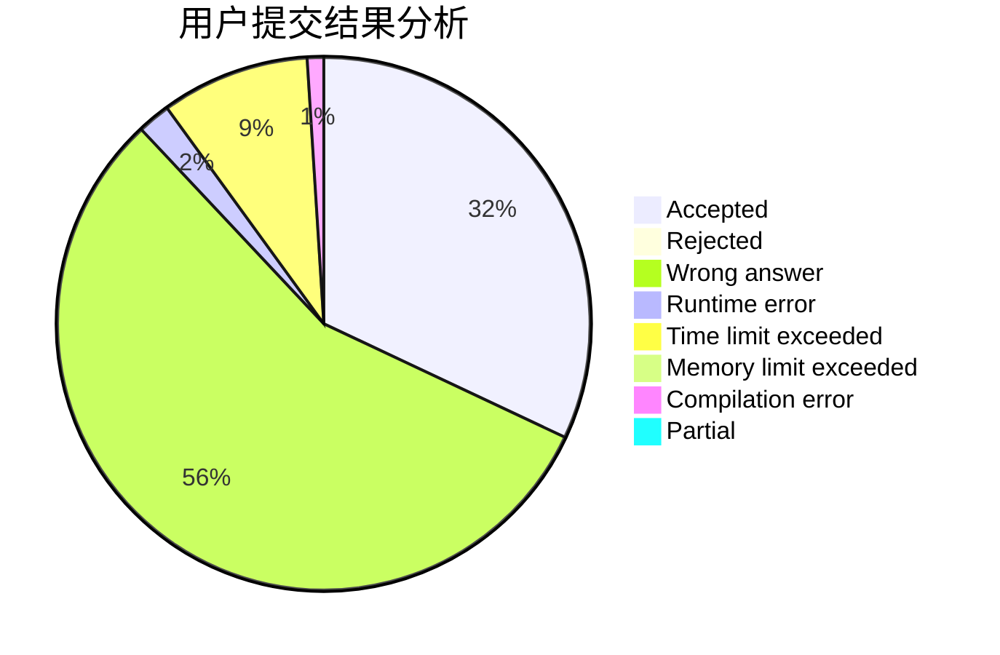
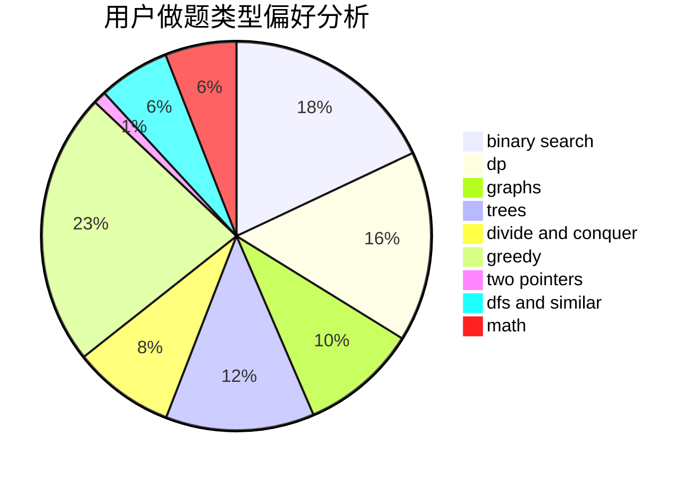

# czqqqaq

<!-- tabs:start -->

#### **用户提交结果分析**

#### **用户做题类型偏好分析**

<!-- tabs:end -->
# 推荐题目
[1379E](https://codeforces.com/contest/1379/problem/E)
[1298D](https://codeforces.com/contest/1298/problem/D)
[1279E](https://codeforces.com/contest/1279/problem/E)
[127A](https://codeforces.com/contest/127/problem/A)
[132C](https://codeforces.com/contest/132/problem/C)
[781C](https://codeforces.com/contest/781/problem/C)
[1103D](https://codeforces.com/contest/1103/problem/D)
[1148E](https://codeforces.com/contest/1148/problem/E)
[590A](https://codeforces.com/contest/590/problem/A)
[300E](https://codeforces.com/contest/300/problem/E)
