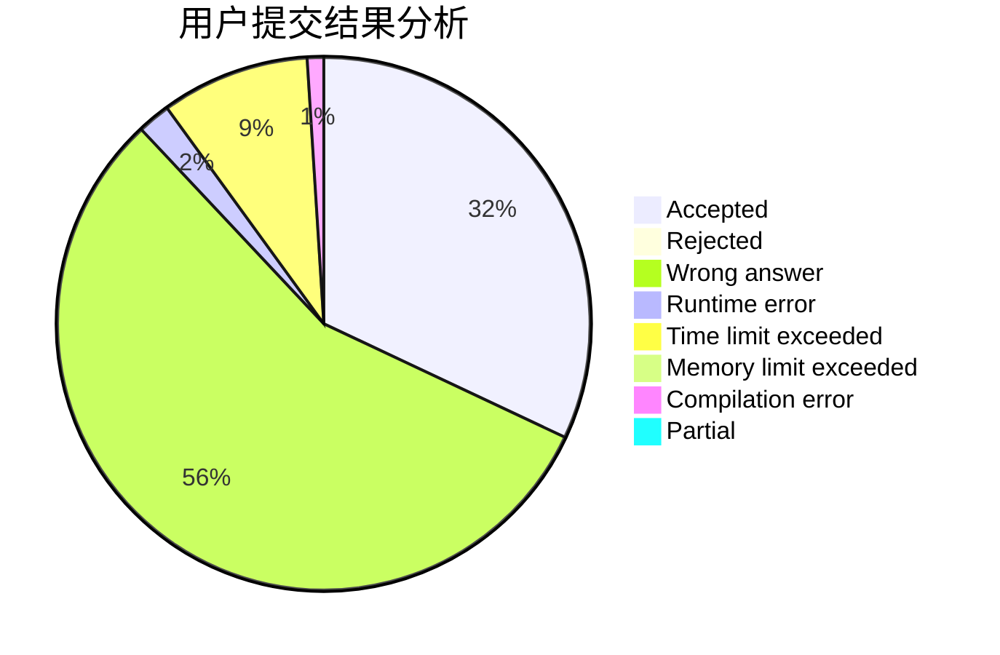
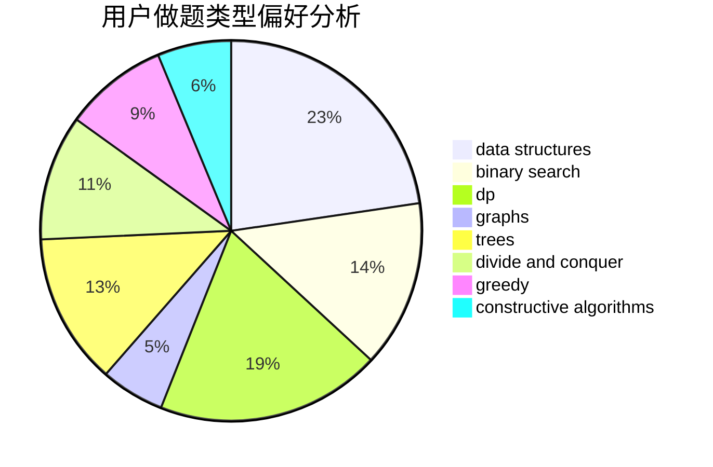
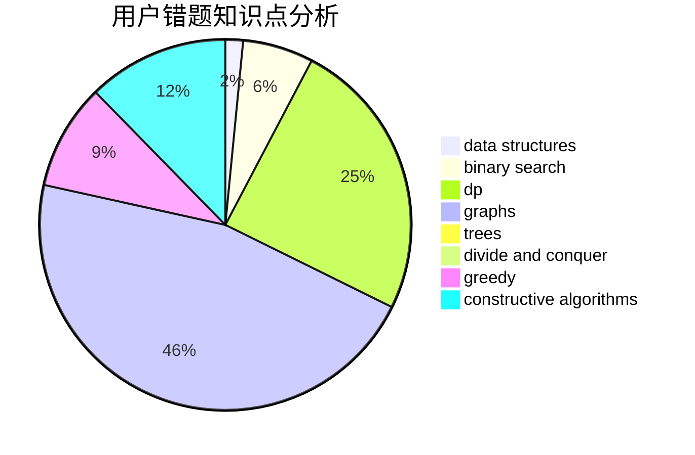

# czqqqaq

<!-- tabs:start -->

#### **用户提交结果分析**

#### **用户做题类型偏好分析**

#### **用户错题知识点分析**

<!-- tabs:end -->
# 推荐题目
[1379E](https://codeforces.com/contest/1379/problem/E)		constructive algorithms,
                        divide and conquer,
                        dp,
                        math,
                        trees		  
[1298D](https://codeforces.com/contest/1298/problem/D)		dsu,graphs,sortings,trees		  
[1279E](https://codeforces.com/contest/1279/problem/E)		combinatorics,
                        dp		  
[127A](https://codeforces.com/contest/127/problem/A)		geometry		  
[132C](https://codeforces.com/contest/132/problem/C)		dp		  
[781C](https://codeforces.com/contest/781/problem/C)		dsu,graphs,sortings,trees		  
[1103D](https://codeforces.com/contest/1103/problem/D)		bitmasks,
                        dp		  
[1148E](https://codeforces.com/contest/1148/problem/E)		constructive algorithms,
                        greedy,
                        math,
                        sortings,
                        two pointers		  
[590A](https://codeforces.com/contest/590/problem/A)		implementation		  
[300E](https://codeforces.com/contest/300/problem/E)		binary search,
                        math,
                        number theory		  
