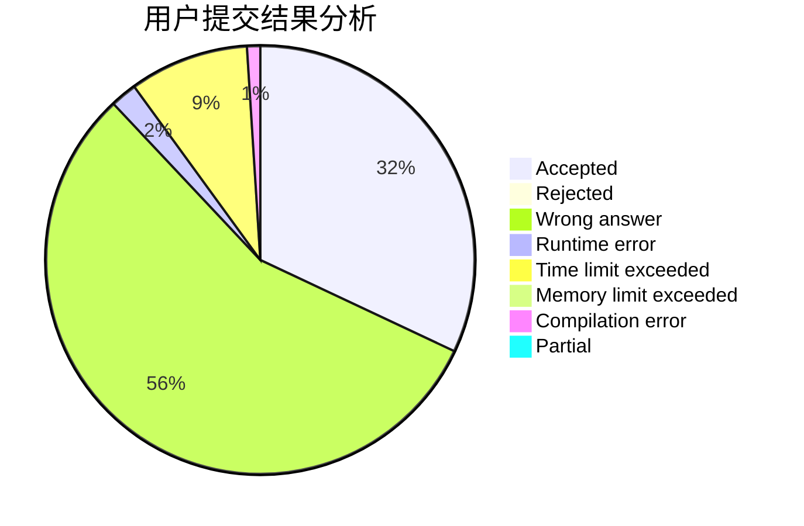
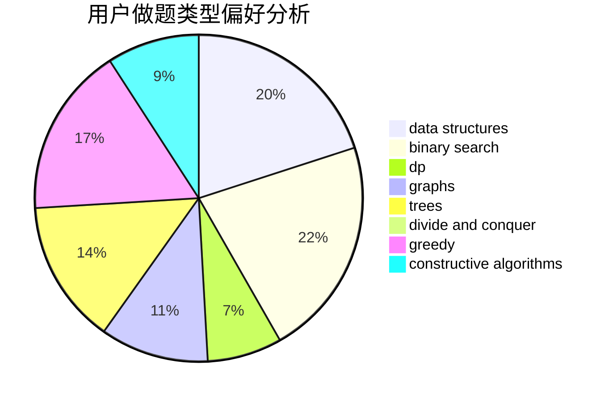
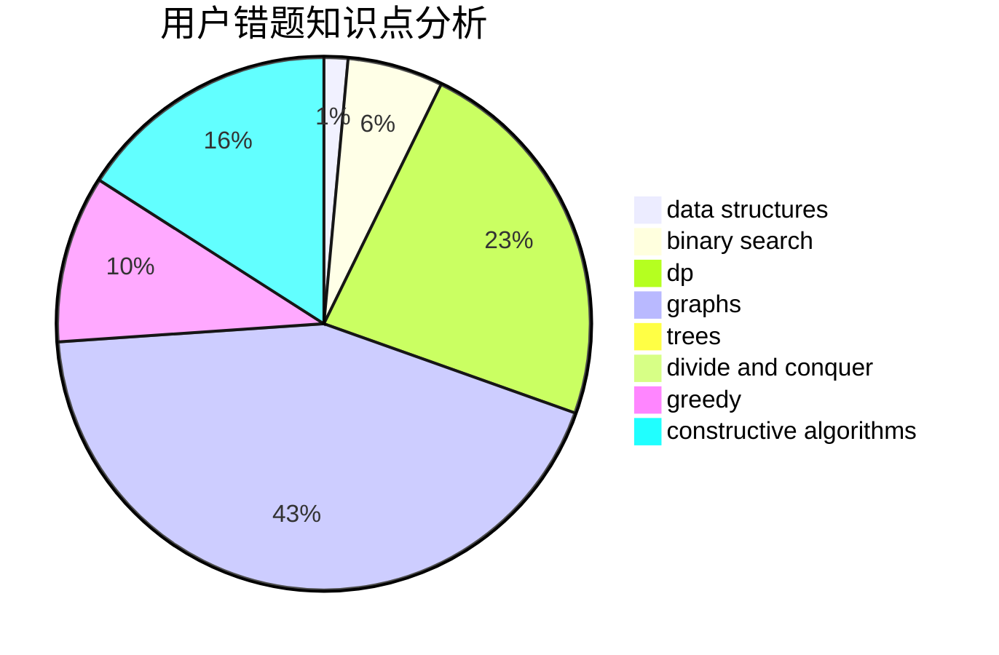

# czqqqaq

<!-- tabs:start -->

#### **用户提交结果分析**

#### **用户做题类型偏好分析**

#### **用户错题知识点分析**

<!-- tabs:end -->
# 推荐题目
[1371A](https://codeforces.com/contest/1371/problem/A)		math		  
[1291E](https://codeforces.com/contest/1291/problem/E)		dsu,graphs,sortings,trees		  
[1270E](https://codeforces.com/contest/1270/problem/E)		constructive algorithms,
                        geometry,
                        math		  
[1270G](https://codeforces.com/contest/1270/problem/G)		constructive algorithms,
                        dfs and similar,
                        graphs,
                        math		  
[1323A](https://codeforces.com/contest/1323/problem/A)		brute force,
                        dp,
                        greedy,
                        implementation		  
[762E](https://codeforces.com/contest/762/problem/E)		binary search,
                        data structures		  
[1103A](https://codeforces.com/contest/1103/problem/A)		constructive algorithms,
                        implementation		  
[1146E](https://codeforces.com/contest/1146/problem/E)		bitmasks,
                        data structures,
                        divide and conquer,
                        implementation		  
[56E](https://codeforces.com/contest/56/problem/E)		binary search,
                        data structures,
                        sortings		  
[286D](https://codeforces.com/contest/286/problem/D)		data structures,
                        sortings		  
