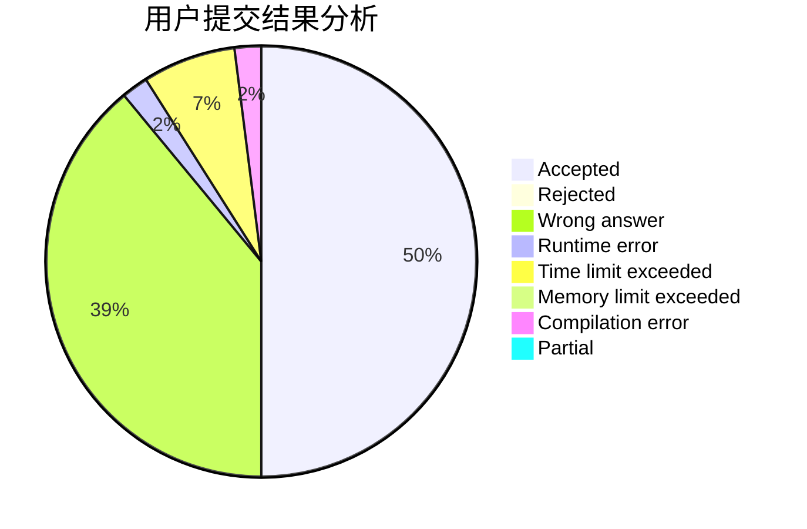
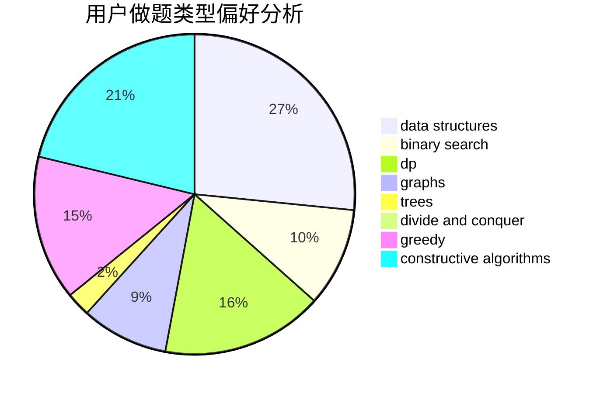
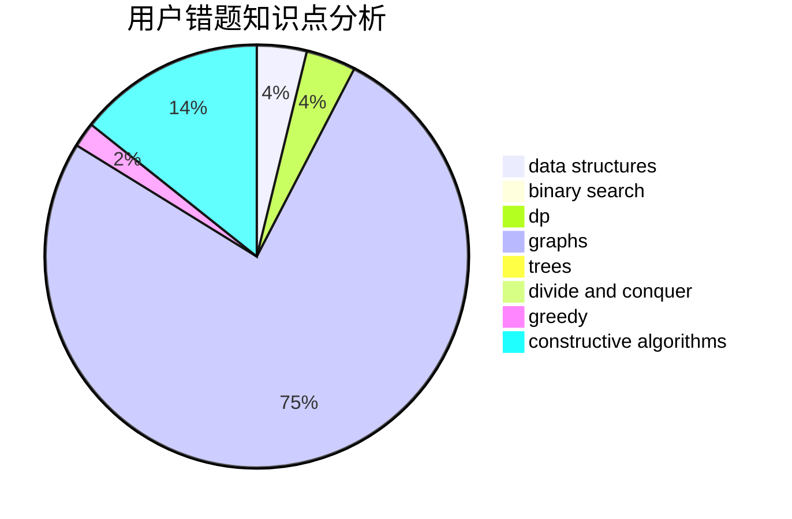

# czsnb

<!-- tabs:start -->

#### **用户提交结果分析**

#### **用户做题类型偏好分析**

#### **用户错题知识点分析**

<!-- tabs:end -->
# 推荐题目
[1237F](https://codeforces.com/contest/1237/problem/F)		combinatorics,
                        dp		  
[933B](https://codeforces.com/contest/933/problem/B)		math		  
[1366F](https://codeforces.com/contest/1366/problem/F)		binary search,
                        dp,
                        geometry,
                        graphs		  
[1488C](https://codeforces.com/contest/1488/problem/C)		*special problem,
                        binary search,
                        brute force,
                        math		  
[434D](https://codeforces.com/contest/434/problem/D)		flows		  
[525B](https://codeforces.com/contest/525/problem/B)		constructive algorithms,
                        greedy,
                        math,
                        strings		  
[10151](https://codeforces.com/contest/1015/problem/1)		dsu,graphs,sortings,trees		  
[1170E](https://codeforces.com/contest/1170/problem/E)		*special problem,
                        binary search		  
[998A](https://codeforces.com/contest/998/problem/A)		constructive algorithms,
                        implementation		  
[1027A](https://codeforces.com/contest/1027/problem/A)		implementation,
                        strings		  
