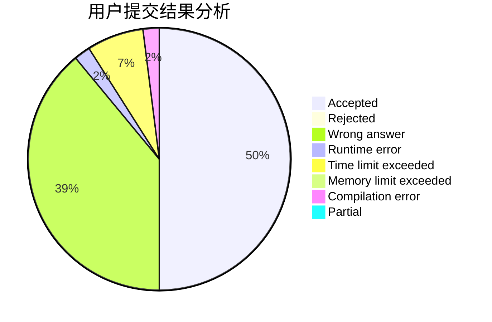
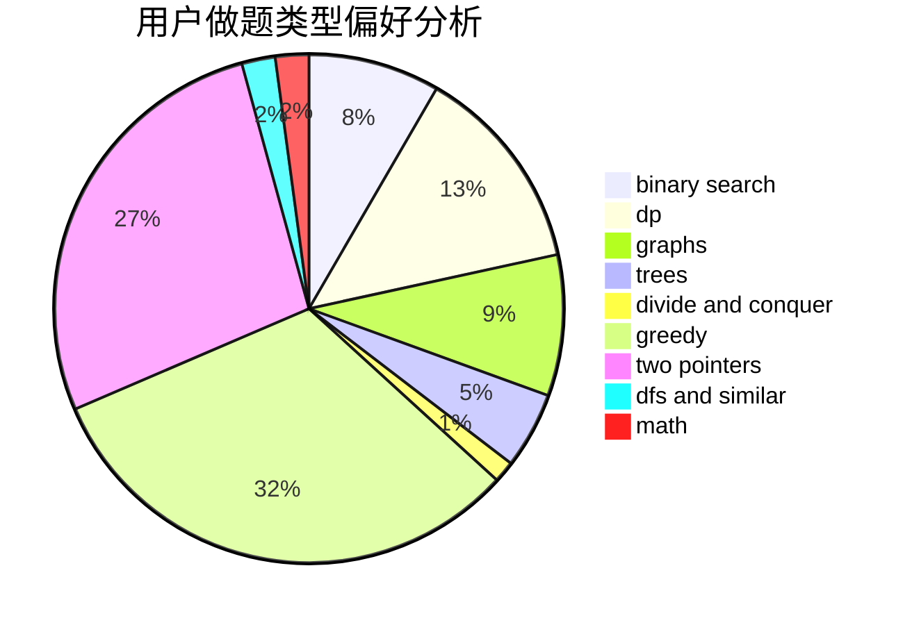

# czsnb

<!-- tabs:start -->

#### **用户提交结果分析**

#### **用户做题类型偏好分析**

<!-- tabs:end -->
# 推荐题目
[1237F](https://codeforces.com/contest/1237/problem/F)
[933B](https://codeforces.com/contest/933/problem/B)
[1366F](https://codeforces.com/contest/1366/problem/F)
[1488C](https://codeforces.com/contest/1488/problem/C)
[434D](https://codeforces.com/contest/434/problem/D)
[525B](https://codeforces.com/contest/525/problem/B)
[10151](https://codeforces.com/contest/1015/problem/1)
[1170E](https://codeforces.com/contest/1170/problem/E)
[998A](https://codeforces.com/contest/998/problem/A)
[1027A](https://codeforces.com/contest/1027/problem/A)
