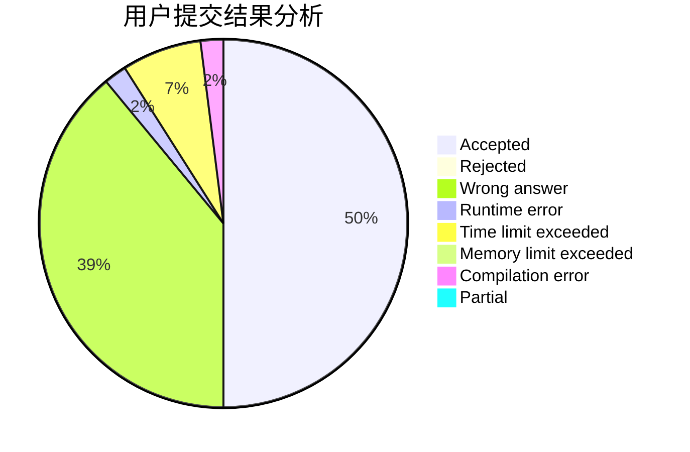
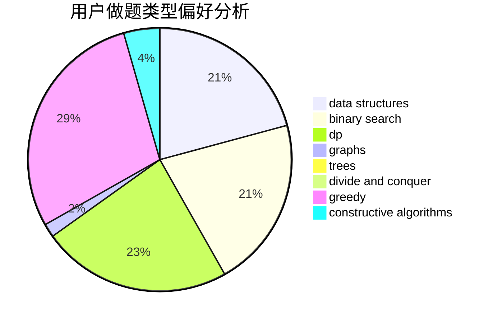
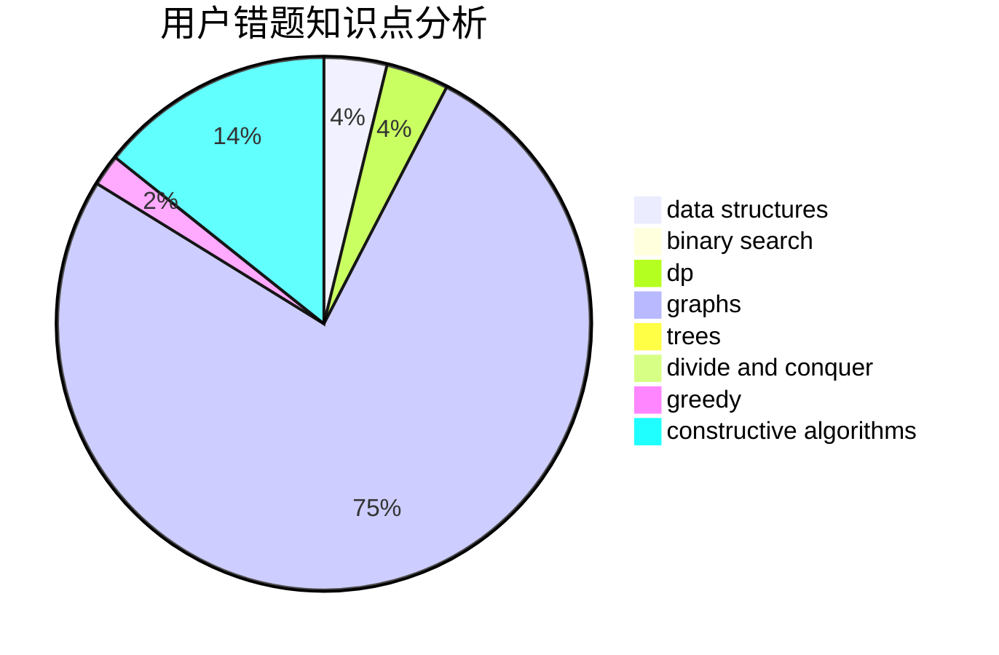

# czsnb

<!-- tabs:start -->

#### **用户提交结果分析**

#### **用户做题类型偏好分析**

#### **用户错题知识点分析**

<!-- tabs:end -->
# 推荐题目
[1229B](https://codeforces.com/contest/1229/problem/B)		dsu,graphs,sortings,trees		  
[914C](https://codeforces.com/contest/914/problem/C)		brute force,
                        combinatorics,
                        dp		  
[1358D](https://codeforces.com/contest/1358/problem/D)		binary search,
                        brute force,
                        greedy,
                        implementation,
                        two pointers		  
[1479E](https://codeforces.com/contest/1479/problem/E)		dp,
                        fft,
                        math,
                        number theory,
                        probabilities		  
[405D](https://codeforces.com/contest/405/problem/D)		greedy,
                        implementation,
                        math		  
[504E](https://codeforces.com/contest/504/problem/E)		binary search,
                        dfs and similar,
                        hashing,
                        string suffix structures,
                        trees		  
[1013C](https://codeforces.com/contest/1013/problem/C)		dsu,graphs,sortings,trees		  
[1167A](https://codeforces.com/contest/1167/problem/A)		brute force,
                        greedy,
                        strings		  
[982C](https://codeforces.com/contest/982/problem/C)		dfs and similar,
                        dp,
                        graphs,
                        greedy,
                        trees		  
[1025E](https://codeforces.com/contest/1025/problem/E)		constructive algorithms,
                        implementation,
                        matrices		  
