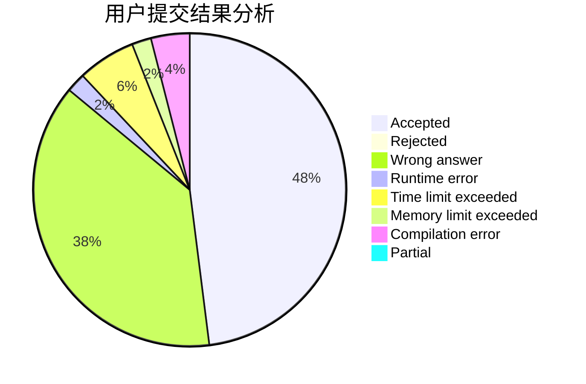
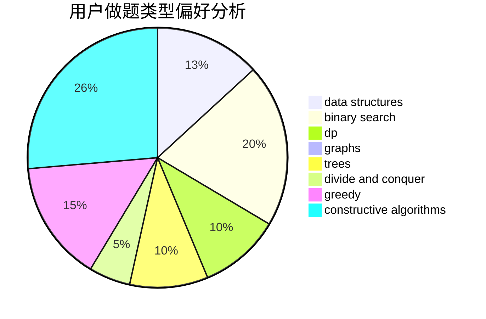
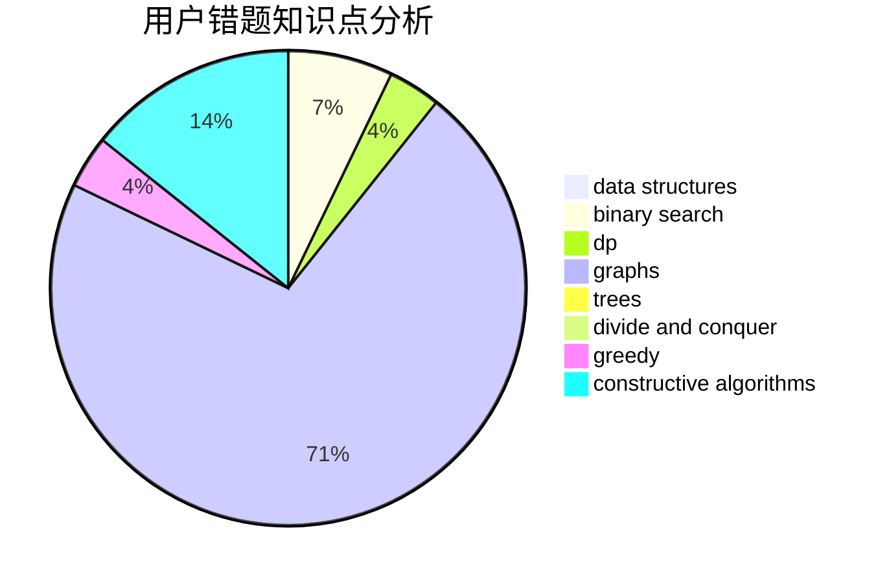

# czyarl

<!-- tabs:start -->

#### **用户提交结果分析**

#### **用户做题类型偏好分析**

#### **用户错题知识点分析**

<!-- tabs:end -->
# 推荐题目
[1417E](https://codeforces.com/contest/1417/problem/E)		dsu,graphs,sortings,trees		  
[1218C](https://codeforces.com/contest/1218/problem/C)		dp		  
[1019E](https://codeforces.com/contest/1019/problem/E)		data structures,
                        divide and conquer,
                        trees		  
[1196B](https://codeforces.com/contest/1196/problem/B)		constructive algorithms,
                        math		  
[158A](https://codeforces.com/contest/158/problem/A)		*special problem,
                        implementation		  
[1144G](https://codeforces.com/contest/1144/problem/G)		dp,
                        greedy		  
[545D](https://codeforces.com/contest/545/problem/D)		greedy,
                        implementation,
                        sortings		  
[1240F](https://codeforces.com/contest/1240/problem/F)		graphs		  
[369A](https://codeforces.com/contest/369/problem/A)		greedy,
                        implementation		  
[765D](https://codeforces.com/contest/765/problem/D)		constructive algorithms,
                        dsu,
                        math		  
