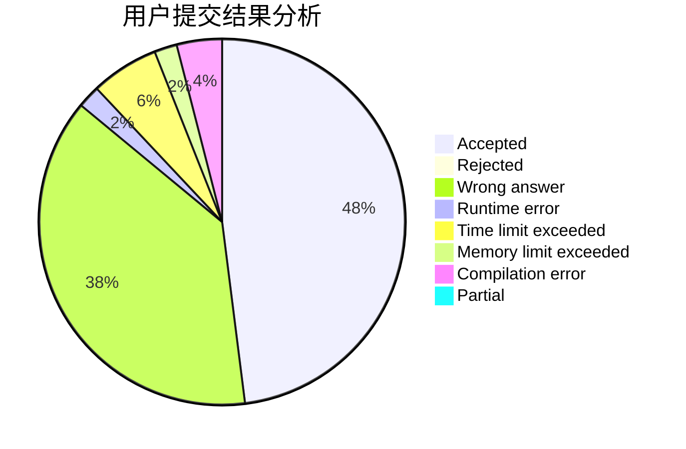
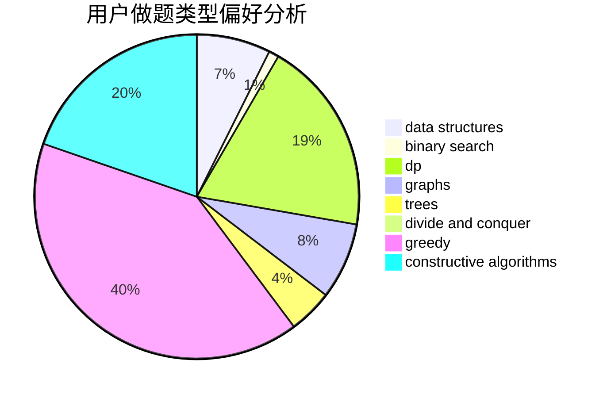
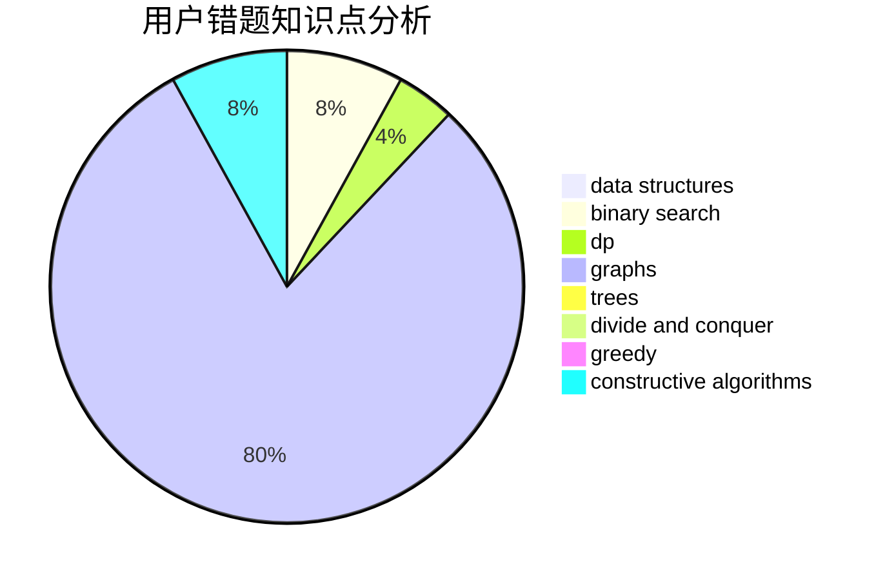

# czyarl

<!-- tabs:start -->

#### **用户提交结果分析**

#### **用户做题类型偏好分析**

#### **用户错题知识点分析**

<!-- tabs:end -->
# 推荐题目
[1425B](https://codeforces.com/contest/1425/problem/B)		divide and conquer,
                        dp		  
[1225E](https://codeforces.com/contest/1225/problem/E)		binary search,
                        dp		  
[1020A](https://codeforces.com/contest/1020/problem/A)		math		  
[11C](https://codeforces.com/contest/11/problem/C)		implementation		  
[17C](https://codeforces.com/contest/17/problem/C)		dp		  
[1147A](https://codeforces.com/contest/1147/problem/A)		graphs		  
[570A](https://codeforces.com/contest/570/problem/A)		implementation		  
[1246C](https://codeforces.com/contest/1246/problem/C)		dsu,graphs,sortings,trees		  
[39C](https://codeforces.com/contest/39/problem/C)		dp,
                        sortings		  
[784G](https://codeforces.com/contest/784/problem/G)		*special problem		  
