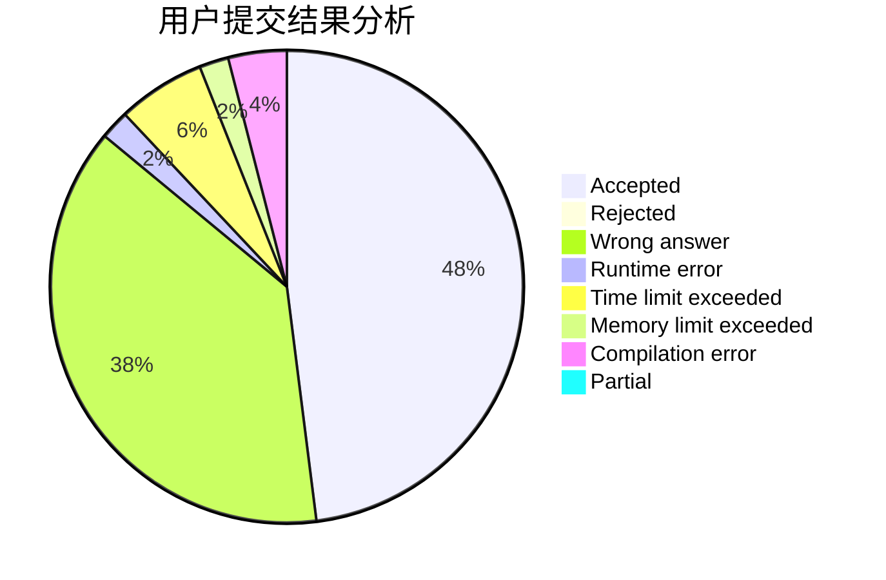
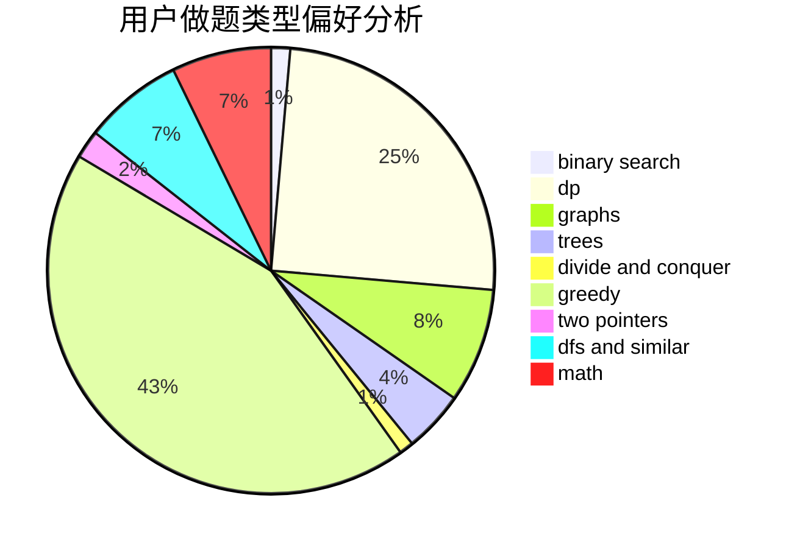

# czyarl

<!-- tabs:start -->

#### **用户提交结果分析**

#### **用户做题类型偏好分析**

<!-- tabs:end -->
# 推荐题目
[1425B](https://codeforces.com/contest/1425/problem/B)
[1225E](https://codeforces.com/contest/1225/problem/E)
[1020A](https://codeforces.com/contest/1020/problem/A)
[11C](https://codeforces.com/contest/11/problem/C)
[17C](https://codeforces.com/contest/17/problem/C)
[1147A](https://codeforces.com/contest/1147/problem/A)
[570A](https://codeforces.com/contest/570/problem/A)
[1246C](https://codeforces.com/contest/1246/problem/C)
[39C](https://codeforces.com/contest/39/problem/C)
[784G](https://codeforces.com/contest/784/problem/G)
