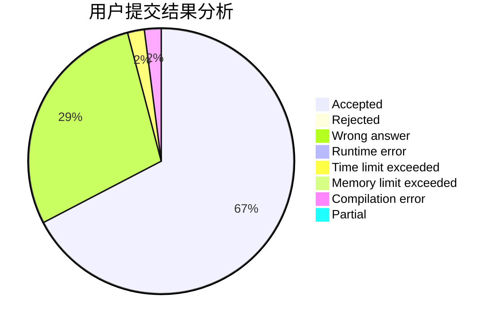
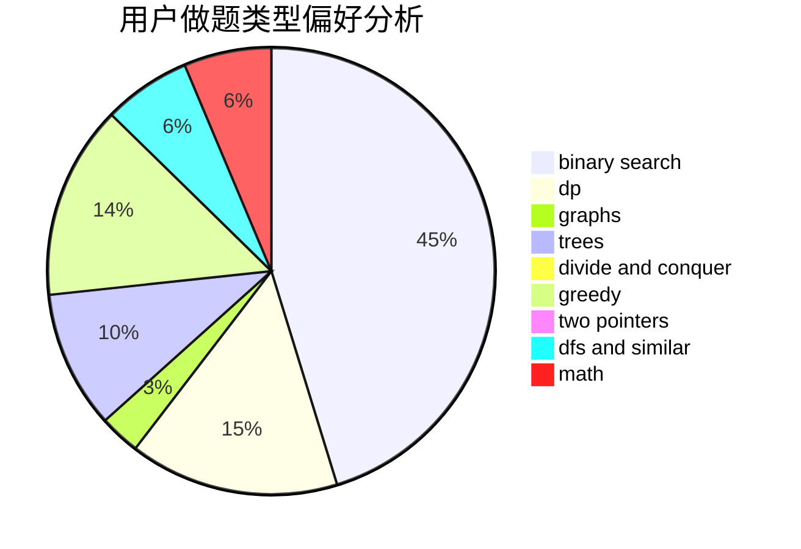

# czyer

<!-- tabs:start -->

#### **用户提交结果分析**

#### **用户做题类型偏好分析**

<!-- tabs:end -->
# 推荐题目
[1445C](https://codeforces.com/contest/1445/problem/C)
[1279A](https://codeforces.com/contest/1279/problem/A)
[1166D](https://codeforces.com/contest/1166/problem/D)
[1336D](https://codeforces.com/contest/1336/problem/D)
[607E](https://codeforces.com/contest/607/problem/E)
[212E](https://codeforces.com/contest/212/problem/E)
[960C](https://codeforces.com/contest/960/problem/C)
[630R](https://codeforces.com/contest/630/problem/R)
[319C](https://codeforces.com/contest/319/problem/C)
[1230D](https://codeforces.com/contest/1230/problem/D)
