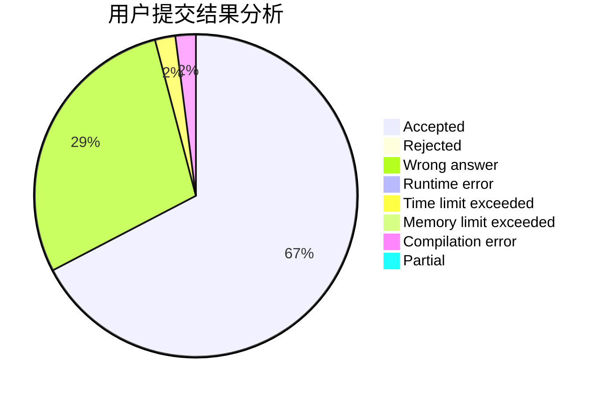
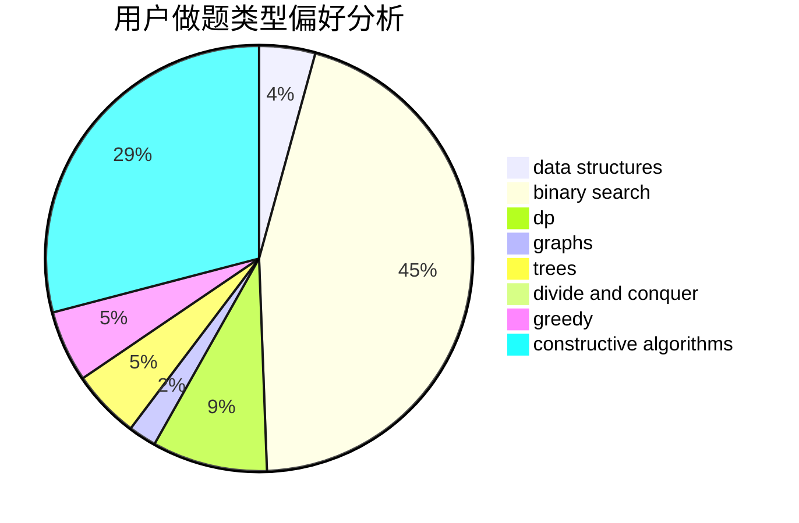
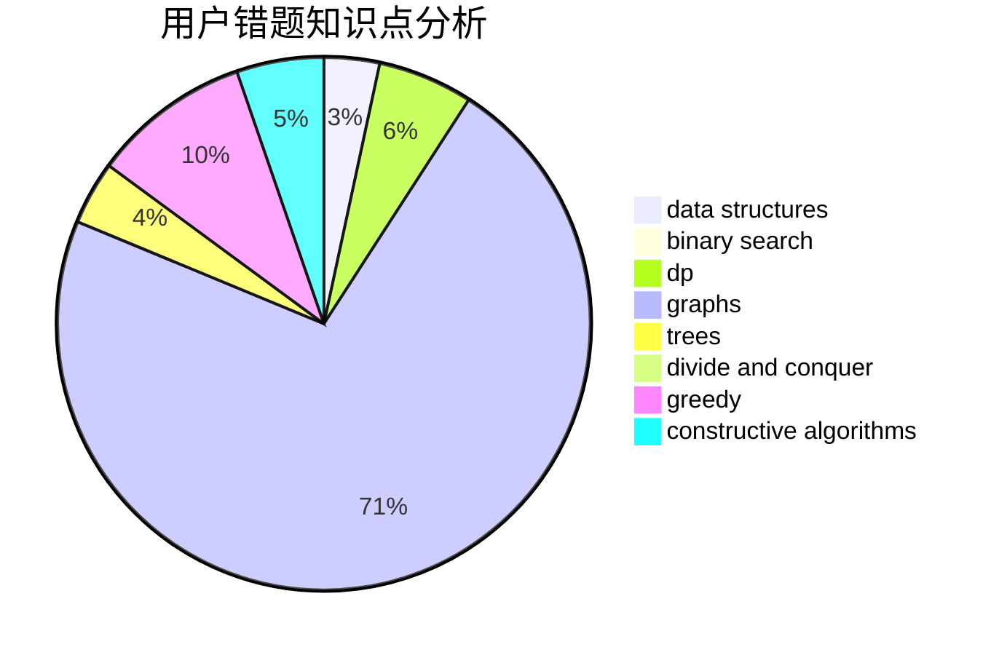

# czyer

<!-- tabs:start -->

#### **用户提交结果分析**

#### **用户做题类型偏好分析**

#### **用户错题知识点分析**

<!-- tabs:end -->
# 推荐题目
[1445C](https://codeforces.com/contest/1445/problem/C)		dsu,graphs,sortings,trees		  
[1279A](https://codeforces.com/contest/1279/problem/A)		math		  
[1166D](https://codeforces.com/contest/1166/problem/D)		binary search,
                        brute force,
                        greedy,
                        math		  
[1336D](https://codeforces.com/contest/1336/problem/D)		constructive algorithms,
                        interactive		  
[607E](https://codeforces.com/contest/607/problem/E)		binary search,
                        geometry		  
[212E](https://codeforces.com/contest/212/problem/E)		dfs and similar,
                        dp,
                        trees		  
[960C](https://codeforces.com/contest/960/problem/C)		bitmasks,
                        constructive algorithms,
                        greedy,
                        implementation		  
[630R](https://codeforces.com/contest/630/problem/R)		games,
                        math		  
[319C](https://codeforces.com/contest/319/problem/C)		dp,
                        geometry		  
[1230D](https://codeforces.com/contest/1230/problem/D)		dsu,graphs,sortings,trees		  
