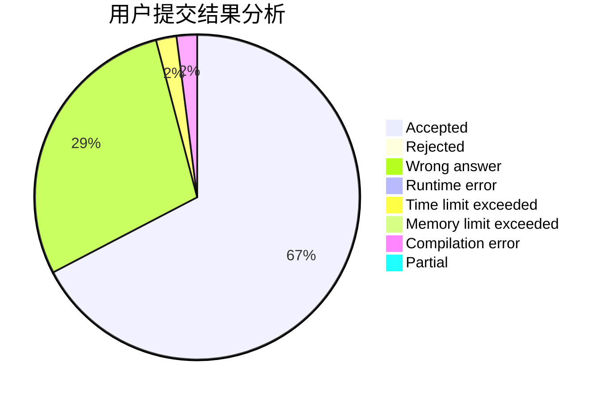
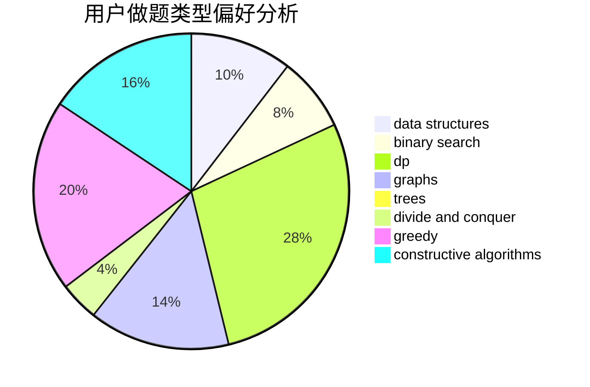
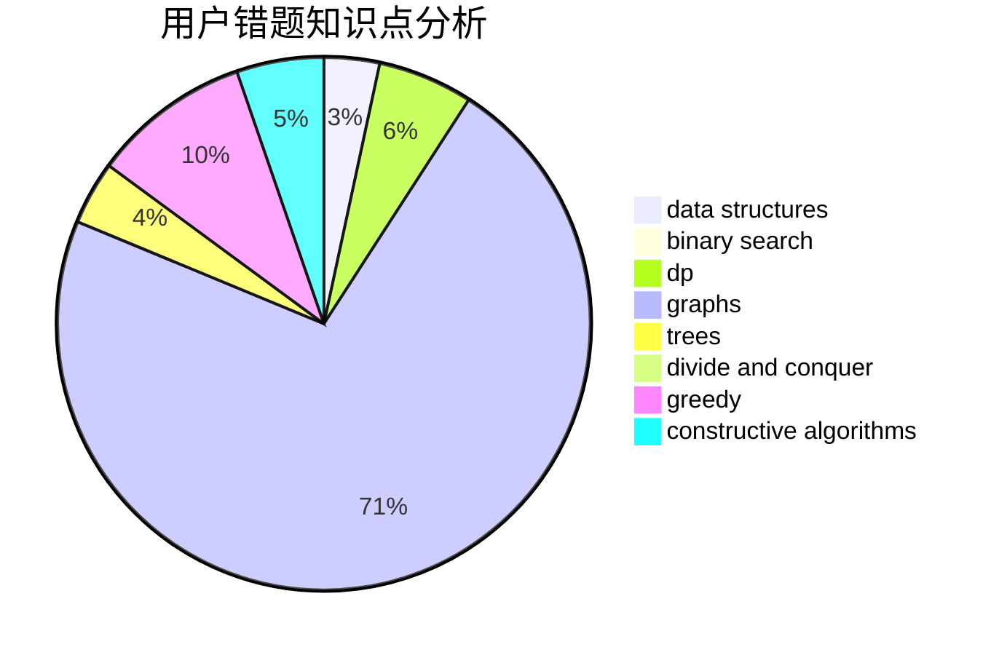

# czyer

<!-- tabs:start -->

#### **用户提交结果分析**

#### **用户做题类型偏好分析**

#### **用户错题知识点分析**

<!-- tabs:end -->
# 推荐题目
[1435C](https://codeforces.com/contest/1435/problem/C)		dsu,graphs,sortings,trees		  
[1270A](https://codeforces.com/contest/1270/problem/A)		games,
                        greedy,
                        math		  
[1164M](https://codeforces.com/contest/1164/problem/M)		dsu,graphs,sortings,trees		  
[1330D](https://codeforces.com/contest/1330/problem/D)		dsu,graphs,sortings,trees		  
[587D](https://codeforces.com/contest/587/problem/D)		2-sat,
                        binary search		  
[189A](https://codeforces.com/contest/189/problem/A)		brute force,
                        dp		  
[938G](https://codeforces.com/contest/938/problem/G)		bitmasks,
                        data structures,
                        dsu,
                        graphs		  
[611G](https://codeforces.com/contest/611/problem/G)		geometry,
                        two pointers		  
[300E](https://codeforces.com/contest/300/problem/E)		binary search,
                        math,
                        number theory		  
[1223E](https://codeforces.com/contest/1223/problem/E)		dp,
                        sortings,
                        trees		  
