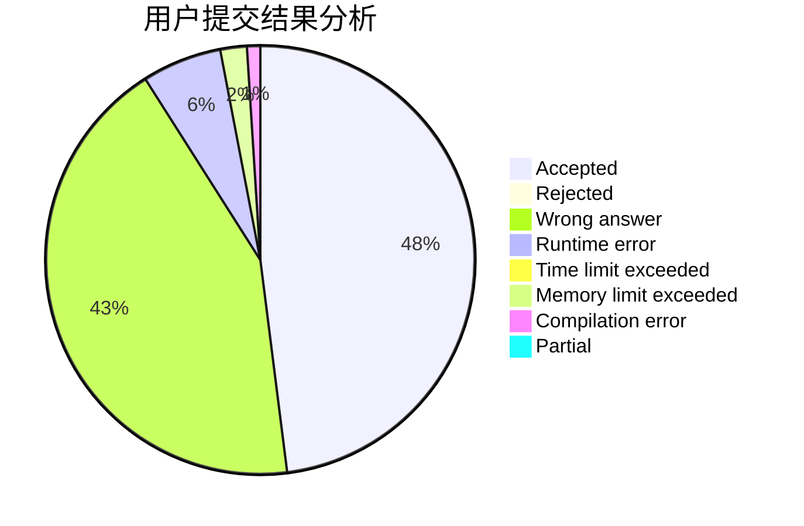
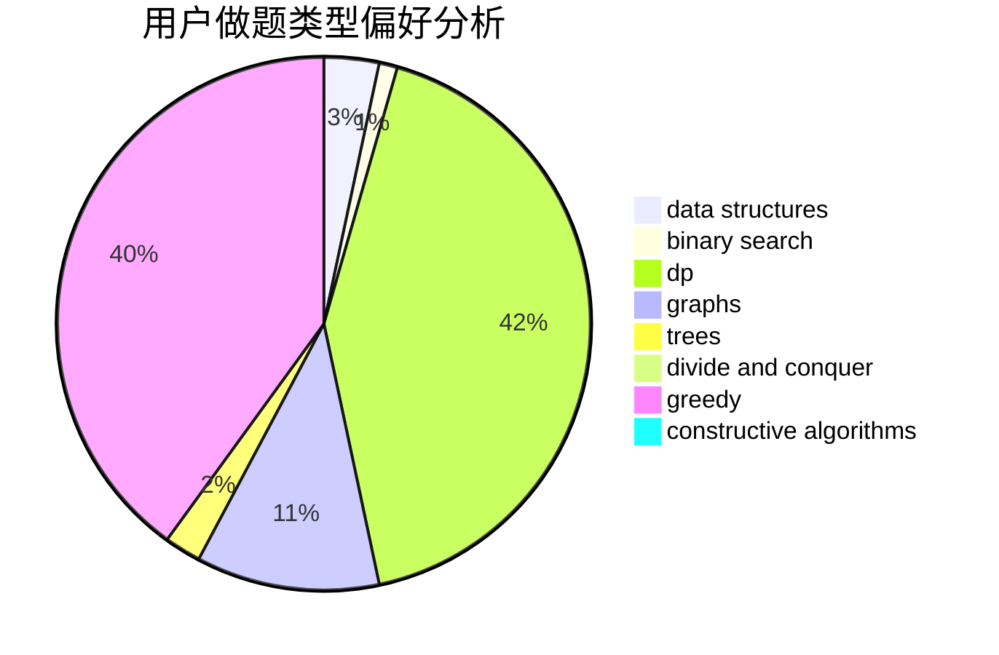
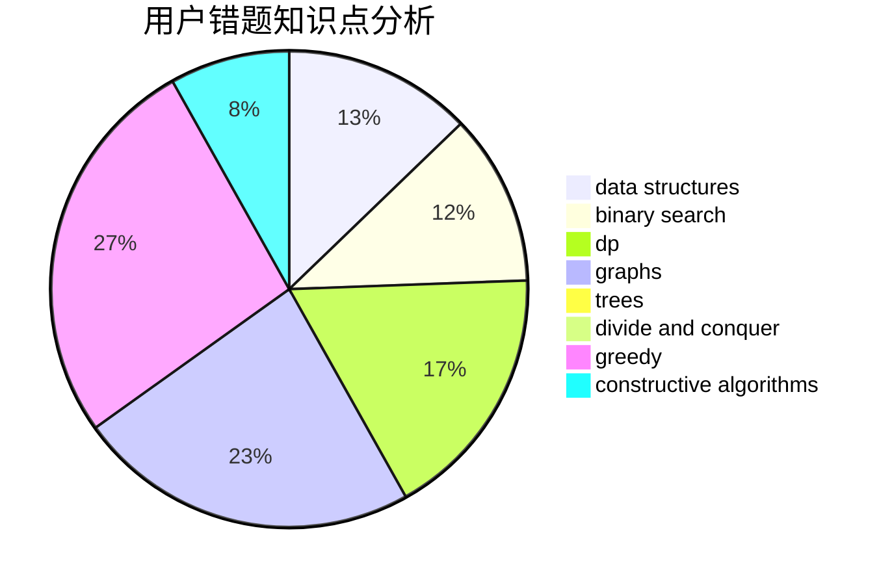

# Arctic_Clam

<!-- tabs:start -->

#### **用户提交结果分析**

#### **用户做题类型偏好分析**

#### **用户错题知识点分析**

<!-- tabs:end -->
# 推荐题目
[1462F](https://codeforces.com/contest/1462/problem/F)		binary search,
                        data structures,
                        greedy		  
[1068C](https://codeforces.com/contest/1068/problem/C)		constructive algorithms,
                        graphs		  
[234A](https://codeforces.com/contest/234/problem/A)		implementation		  
[1256C](https://codeforces.com/contest/1256/problem/C)		greedy		  
[11162](https://codeforces.com/contest/1116/problem/2)		dsu,graphs,sortings,trees		  
[424D](https://codeforces.com/contest/424/problem/D)		binary search,
                        brute force,
                        constructive algorithms,
                        data structures,
                        dp		  
[424B](https://codeforces.com/contest/424/problem/B)		binary search,
                        greedy,
                        implementation,
                        sortings		  
[187C](https://codeforces.com/contest/187/problem/C)		dfs and similar,
                        dsu		  
[424C](https://codeforces.com/contest/424/problem/C)		math		  
[1079A](https://codeforces.com/contest/1079/problem/A)		dsu,graphs,sortings,trees		  
