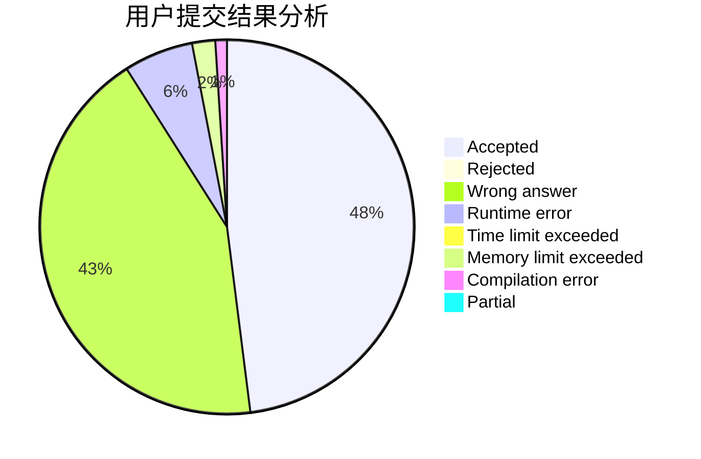
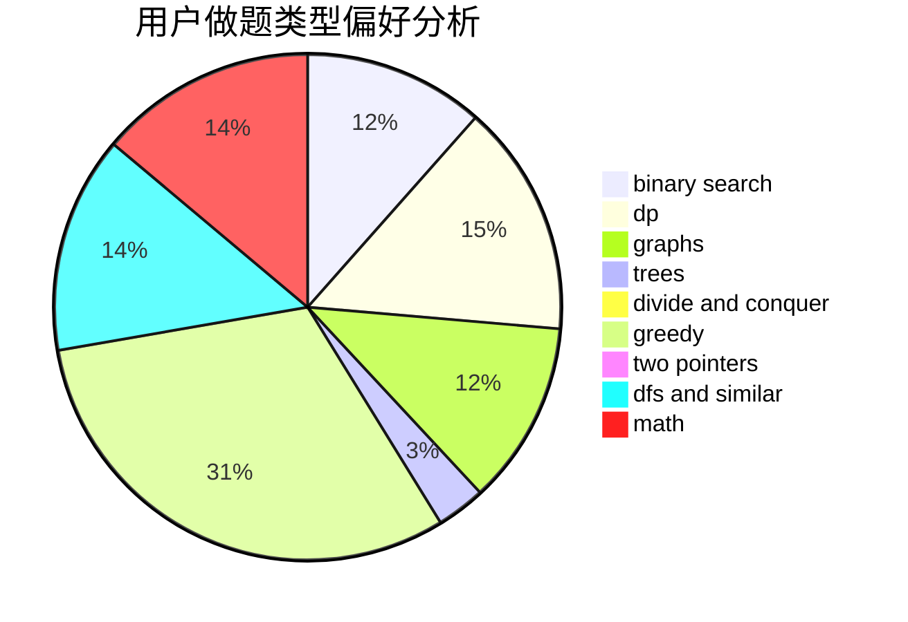

# Arctic_Clam

<!-- tabs:start -->

#### **用户提交结果分析**

#### **用户做题类型偏好分析**

<!-- tabs:end -->
# 推荐题目
[1462F](https://codeforces.com/contest/1462/problem/F)
[1068C](https://codeforces.com/contest/1068/problem/C)
[234A](https://codeforces.com/contest/234/problem/A)
[1256C](https://codeforces.com/contest/1256/problem/C)
[11162](https://codeforces.com/contest/1116/problem/2)
[424D](https://codeforces.com/contest/424/problem/D)
[424B](https://codeforces.com/contest/424/problem/B)
[187C](https://codeforces.com/contest/187/problem/C)
[424C](https://codeforces.com/contest/424/problem/C)
[1079A](https://codeforces.com/contest/1079/problem/A)
