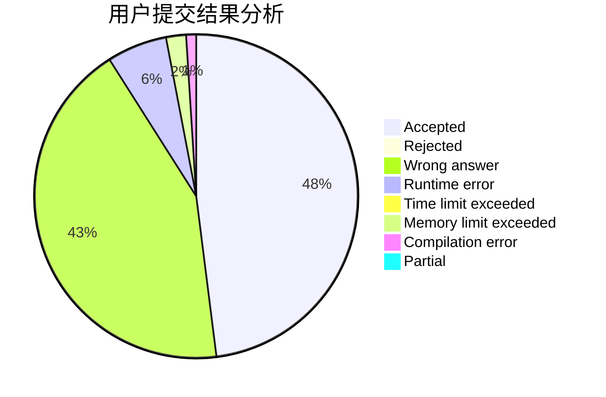
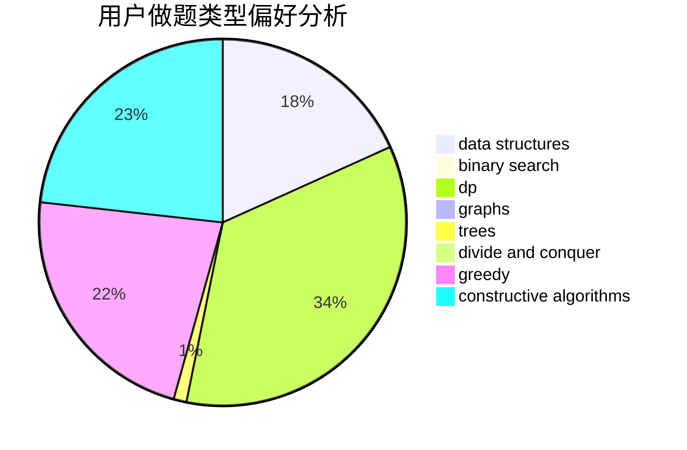
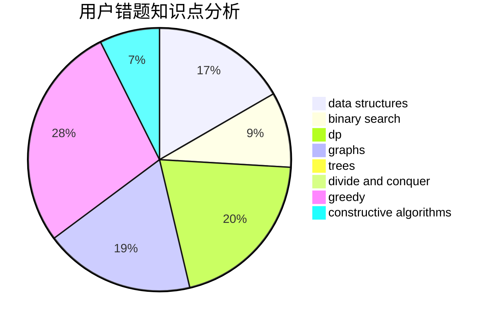

# Arctic_Clam

<!-- tabs:start -->

#### **用户提交结果分析**

#### **用户做题类型偏好分析**

#### **用户错题知识点分析**

<!-- tabs:end -->
# 推荐题目
[1453C](https://codeforces.com/contest/1453/problem/C)		greedy,
                        implementation		  
[1067E](https://codeforces.com/contest/1067/problem/E)		dp,
                        graph matchings,
                        math,
                        trees		  
[215B](https://codeforces.com/contest/215/problem/B)		greedy,
                        math		  
[1251B](https://codeforces.com/contest/1251/problem/B)		greedy,
                        strings		  
[1115G2](https://codeforces.com/contest/1115G/problem/2)		*special problem		  
[398A](https://codeforces.com/contest/398/problem/A)		constructive algorithms,
                        implementation		  
[396C](https://codeforces.com/contest/396/problem/C)		data structures,
                        graphs,
                        trees		  
[161C](https://codeforces.com/contest/161/problem/C)		divide and conquer		  
[397E](https://codeforces.com/contest/397/problem/E)		dsu,graphs,sortings,trees		  
[1078C](https://codeforces.com/contest/1078/problem/C)		dsu,graphs,sortings,trees		  
