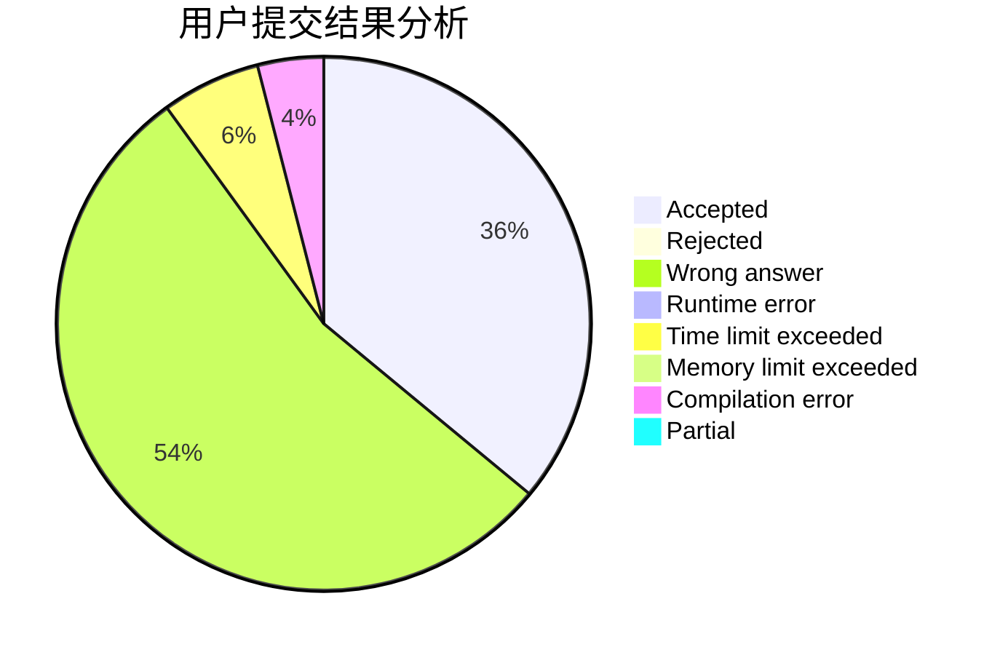
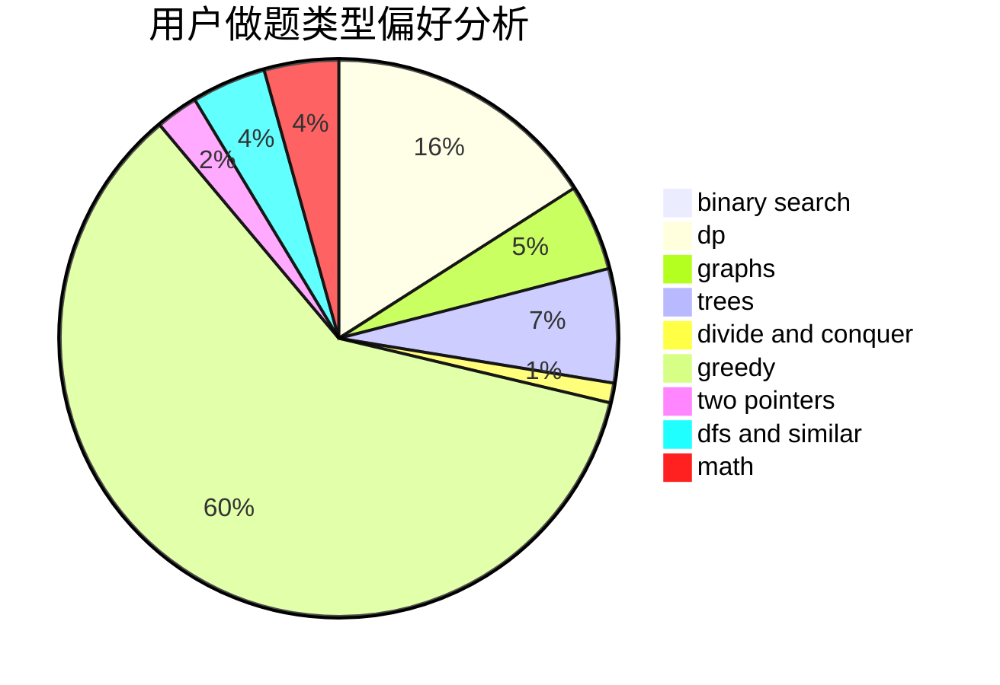

# czynt

<!-- tabs:start -->

#### **用户提交结果分析**

#### **用户做题类型偏好分析**

<!-- tabs:end -->
# 推荐题目
[123E](https://codeforces.com/contest/123/problem/E)
[246D](https://codeforces.com/contest/246/problem/D)
[1353C](https://codeforces.com/contest/1353/problem/C)
[846A](https://codeforces.com/contest/846/problem/A)
[852E](https://codeforces.com/contest/852/problem/E)
[915D](https://codeforces.com/contest/915/problem/D)
[1337E](https://codeforces.com/contest/1337/problem/E)
[704E](https://codeforces.com/contest/704/problem/E)
[672C](https://codeforces.com/contest/672/problem/C)
[12612](https://codeforces.com/contest/1261/problem/2)
