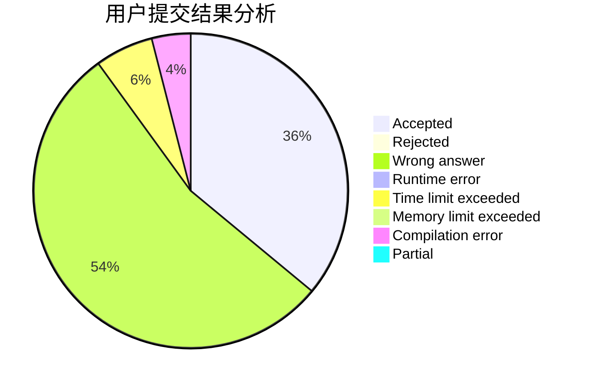
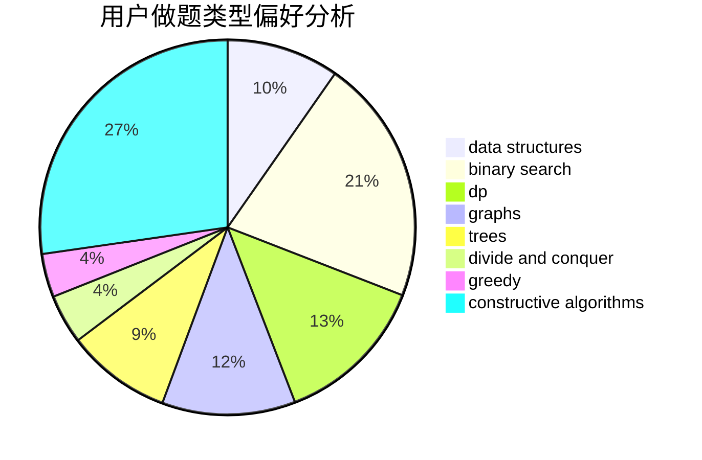
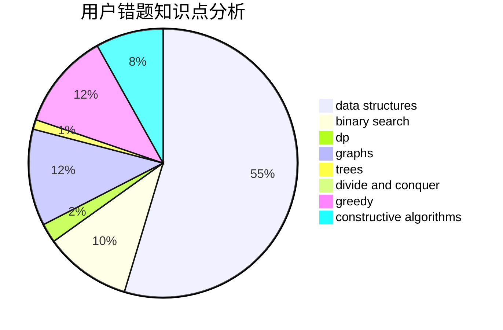

# czynt

<!-- tabs:start -->

#### **用户提交结果分析**

#### **用户做题类型偏好分析**

#### **用户错题知识点分析**

<!-- tabs:end -->
# 推荐题目
[1234C](https://codeforces.com/contest/1234/problem/C)		dp,
                        implementation		  
[228D](https://codeforces.com/contest/228/problem/D)		data structures		  
[1346B](https://codeforces.com/contest/1346/problem/B)		*special problem,
                        greedy		  
[827E](https://codeforces.com/contest/827/problem/E)		fft,
                        math,
                        strings		  
[834D](https://codeforces.com/contest/834/problem/D)		dsu,graphs,sortings,trees		  
[899D](https://codeforces.com/contest/899/problem/D)		constructive algorithms,
                        math		  
[1331F](https://codeforces.com/contest/1331/problem/F)		brute force,
                        dp,
                        strings		  
[681A](https://codeforces.com/contest/681/problem/A)		implementation		  
[645G](https://codeforces.com/contest/645/problem/G)		binary search,
                        geometry		  
[1253F](https://codeforces.com/contest/1253/problem/F)		binary search,
                        dsu,
                        graphs,
                        shortest paths,
                        trees		  
