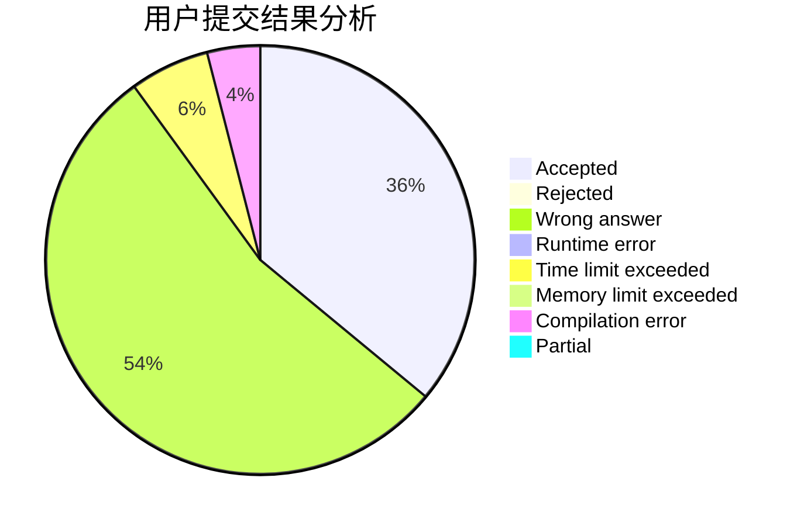
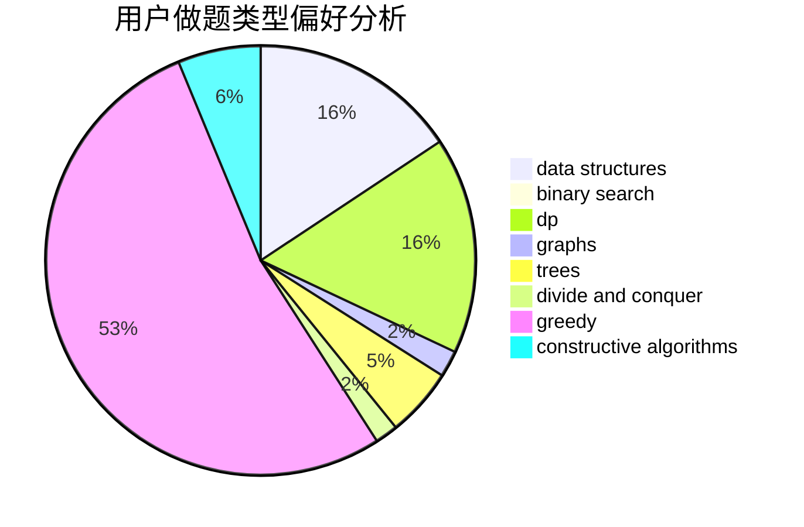
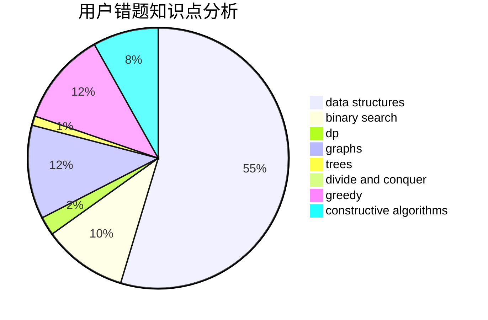

# czynt

<!-- tabs:start -->

#### **用户提交结果分析**

#### **用户做题类型偏好分析**

#### **用户错题知识点分析**

<!-- tabs:end -->
# 推荐题目
[123E](https://codeforces.com/contest/123/problem/E)		dfs and similar,
                        dp,
                        probabilities,
                        trees		  
[246D](https://codeforces.com/contest/246/problem/D)		brute force,
                        dfs and similar,
                        graphs		  
[1353C](https://codeforces.com/contest/1353/problem/C)		math		  
[846A](https://codeforces.com/contest/846/problem/A)		brute force,
                        implementation		  
[852E](https://codeforces.com/contest/852/problem/E)		dp		  
[915D](https://codeforces.com/contest/915/problem/D)		dfs and similar,
                        graphs		  
[1337E](https://codeforces.com/contest/1337/problem/E)		dsu,graphs,sortings,trees		  
[704E](https://codeforces.com/contest/704/problem/E)		data structures,
                        geometry,
                        trees		  
[672C](https://codeforces.com/contest/672/problem/C)		dsu,graphs,sortings,trees		  
[12612](https://codeforces.com/contest/1261/problem/2)		dsu,graphs,sortings,trees		  
