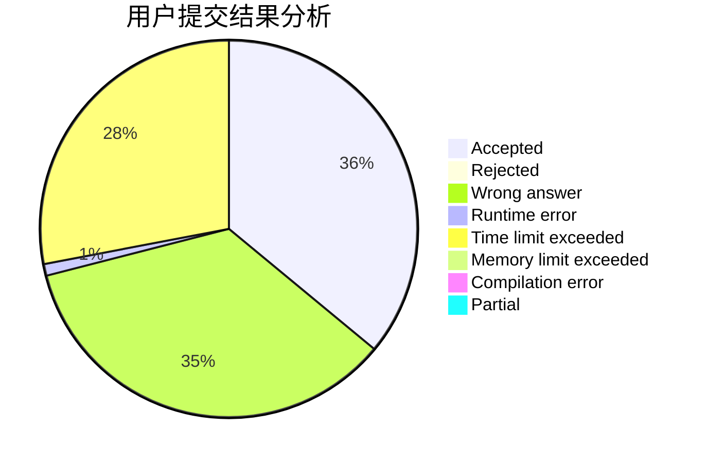
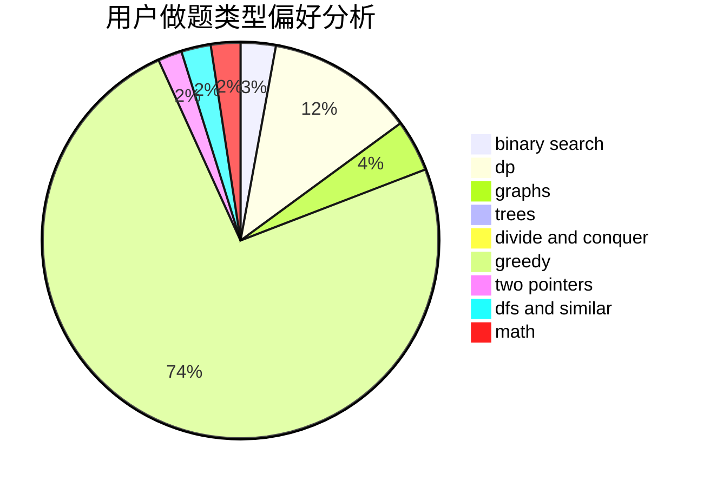

# dXqwq

<!-- tabs:start -->

#### **用户提交结果分析**

#### **用户做题类型偏好分析**

<!-- tabs:end -->
# 推荐题目
[946G](https://codeforces.com/contest/946/problem/G)
[136C](https://codeforces.com/contest/136/problem/C)
[1432F](https://codeforces.com/contest/1432/problem/F)
[386C](https://codeforces.com/contest/386/problem/C)
[954C](https://codeforces.com/contest/954/problem/C)
[723D](https://codeforces.com/contest/723/problem/D)
[1060D](https://codeforces.com/contest/1060/problem/D)
[660B](https://codeforces.com/contest/660/problem/B)
[204E](https://codeforces.com/contest/204/problem/E)
[240E](https://codeforces.com/contest/240/problem/E)
