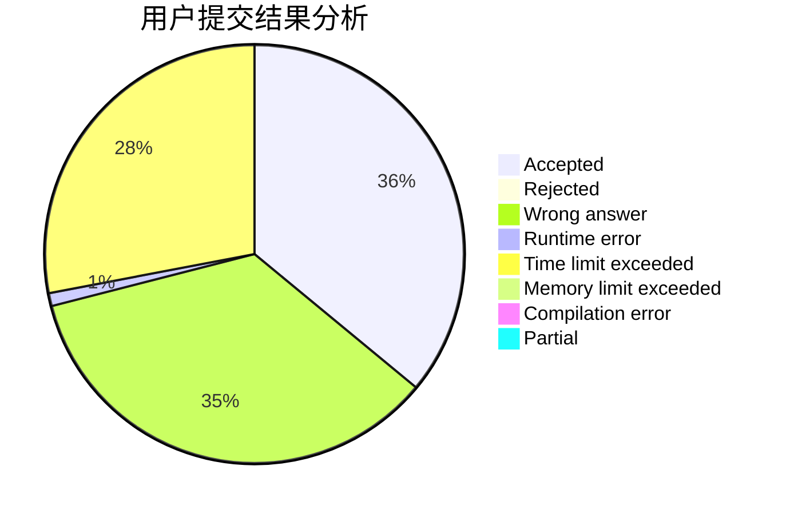
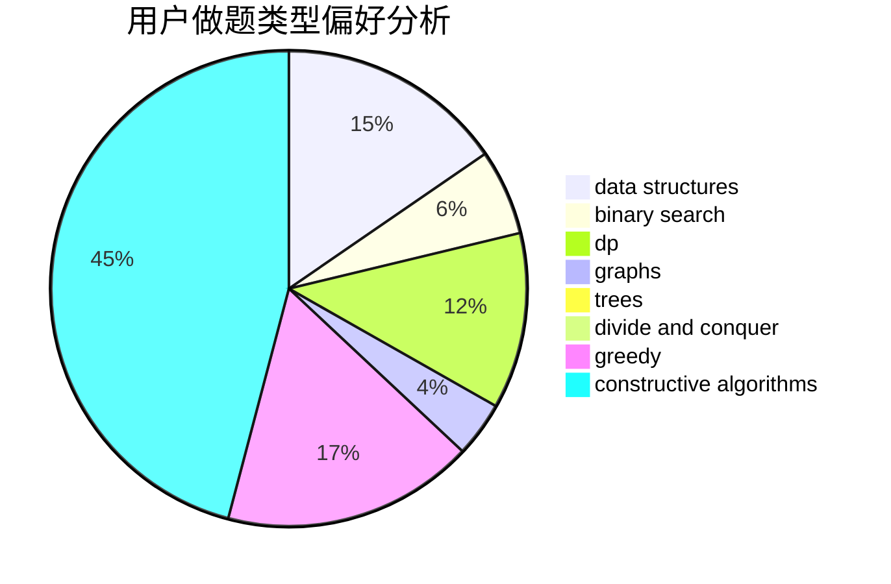
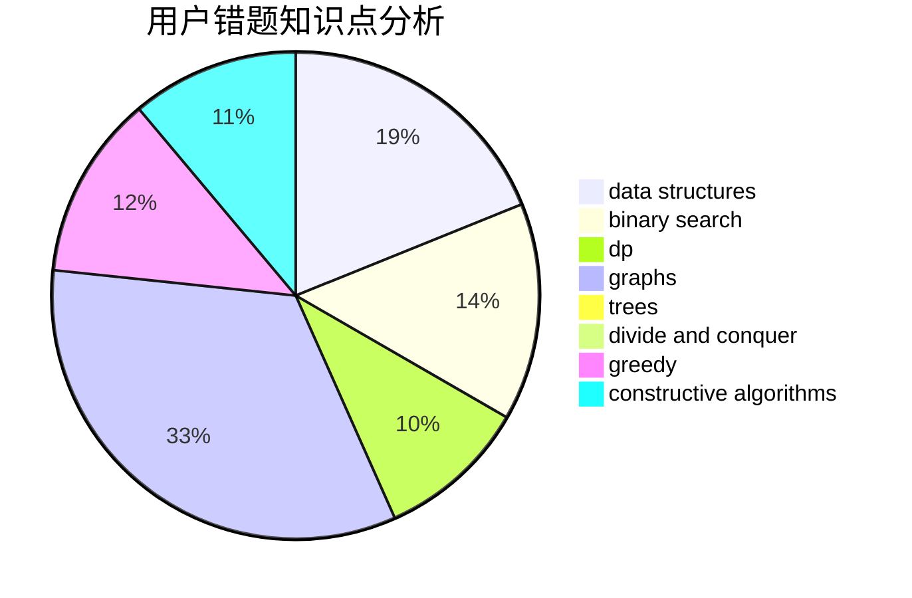

# dXqwq

<!-- tabs:start -->

#### **用户提交结果分析**

#### **用户做题类型偏好分析**

#### **用户错题知识点分析**

<!-- tabs:end -->
# 推荐题目
[946G](https://codeforces.com/contest/946/problem/G)		data structures,
                        dp		  
[136C](https://codeforces.com/contest/136/problem/C)		dsu,graphs,sortings,trees		  
[1432F](https://codeforces.com/contest/1432/problem/F)		dsu,graphs,sortings,trees		  
[386C](https://codeforces.com/contest/386/problem/C)		dp,
                        strings,
                        two pointers		  
[954C](https://codeforces.com/contest/954/problem/C)		implementation		  
[723D](https://codeforces.com/contest/723/problem/D)		dfs and similar,
                        dsu,
                        graphs,
                        greedy,
                        implementation		  
[1060D](https://codeforces.com/contest/1060/problem/D)		greedy,
                        math		  
[660B](https://codeforces.com/contest/660/problem/B)		implementation		  
[204E](https://codeforces.com/contest/204/problem/E)		data structures,
                        implementation,
                        string suffix structures,
                        two pointers		  
[240E](https://codeforces.com/contest/240/problem/E)		dfs and similar,
                        graphs,
                        greedy		  
