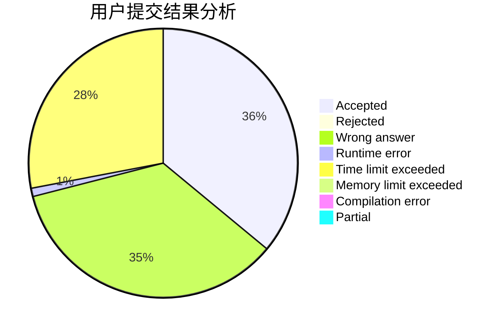
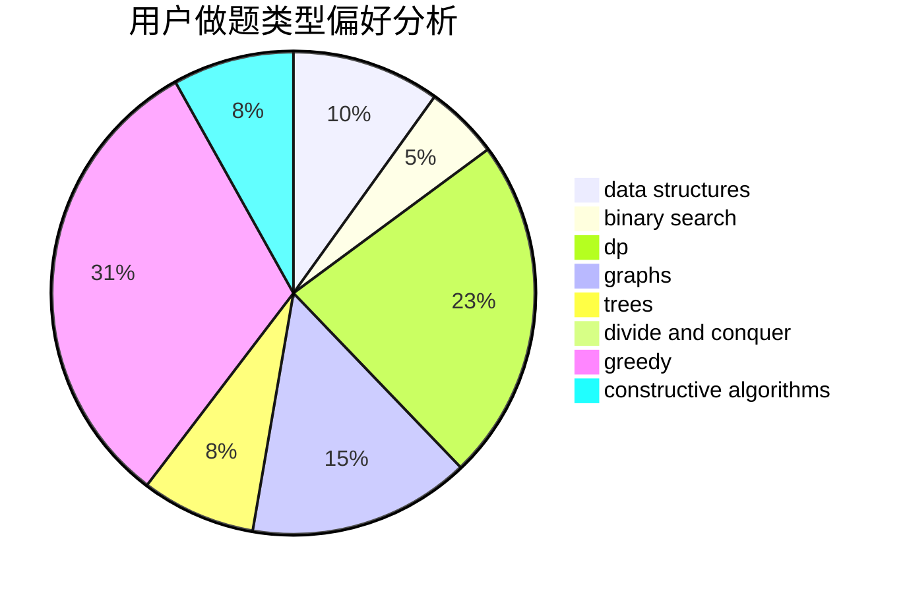
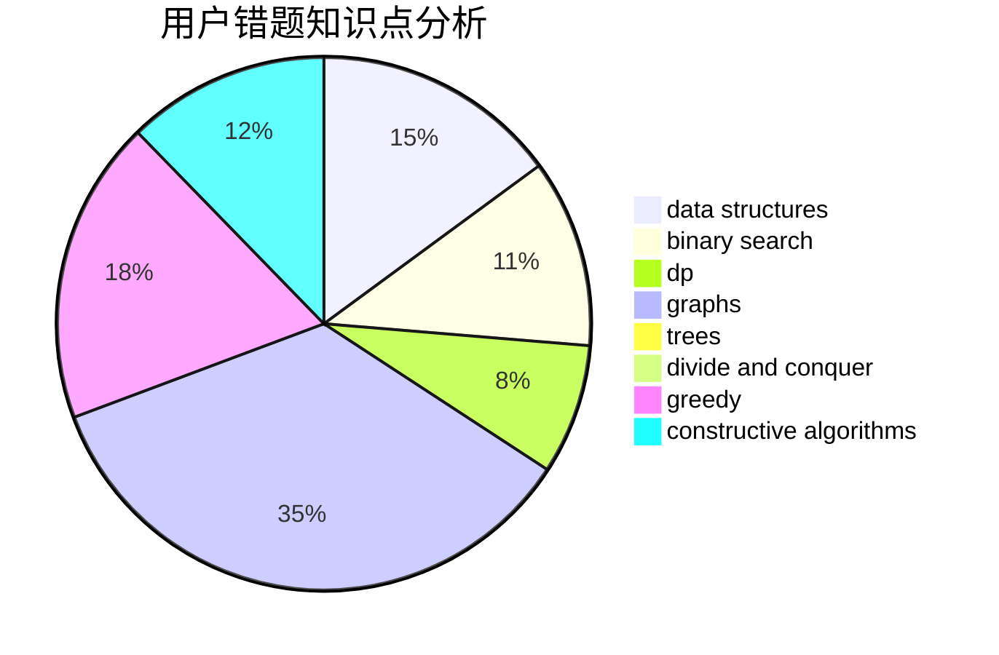

# dXqwq

<!-- tabs:start -->

#### **用户提交结果分析**

#### **用户做题类型偏好分析**

#### **用户错题知识点分析**

<!-- tabs:end -->
# 推荐题目
[923B](https://codeforces.com/contest/923/problem/B)		binary search,
                        data structures		  
[1362D](https://codeforces.com/contest/1362/problem/D)		dsu,graphs,sortings,trees		  
[1424G](https://codeforces.com/contest/1424/problem/G)		data structures,
                        sortings		  
[359C](https://codeforces.com/contest/359/problem/C)		math,
                        number theory		  
[932C](https://codeforces.com/contest/932/problem/C)		brute force,
                        constructive algorithms		  
[704D](https://codeforces.com/contest/704/problem/D)		flows,
                        greedy		  
[1060A](https://codeforces.com/contest/1060/problem/A)		brute force		  
[630F](https://codeforces.com/contest/630/problem/F)		combinatorics,
                        math		  
[178F2](https://codeforces.com/contest/178F/problem/2)		dp,
                        sortings,
                        strings		  
[220E](https://codeforces.com/contest/220/problem/E)		data structures,
                        two pointers		  
