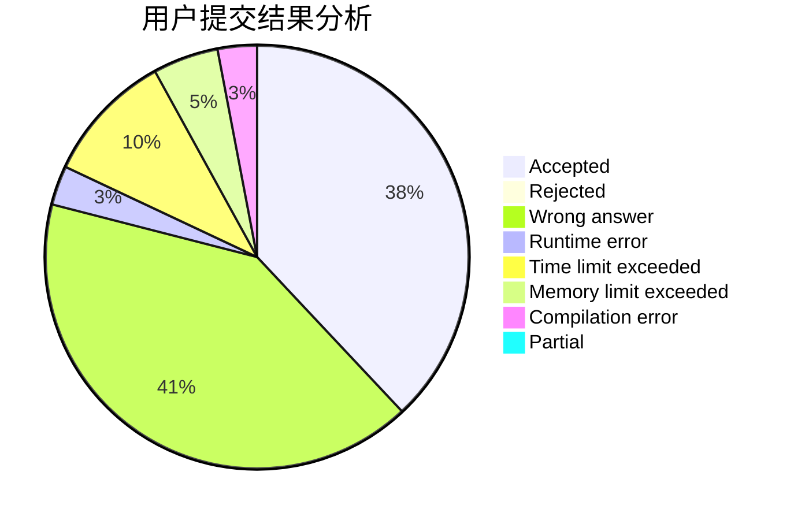
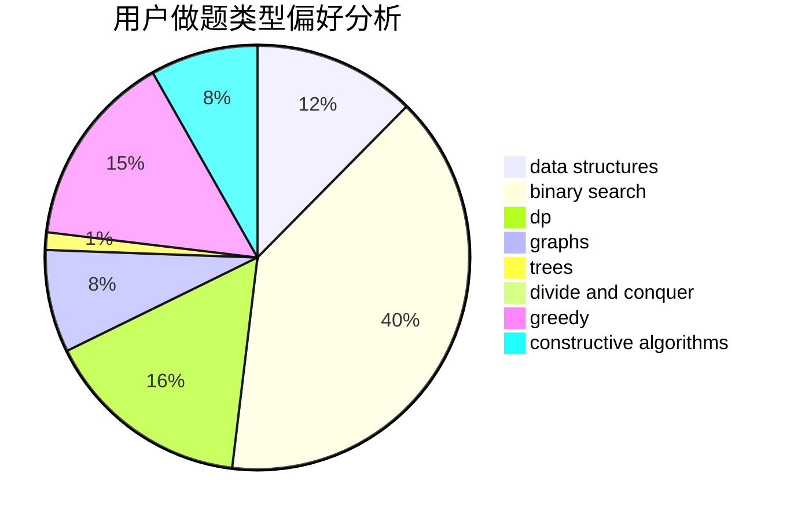
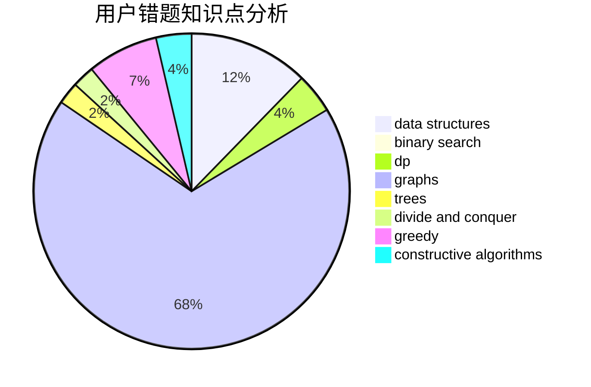

# daidao

<!-- tabs:start -->

#### **用户提交结果分析**

#### **用户做题类型偏好分析**

#### **用户错题知识点分析**

<!-- tabs:end -->
# 推荐题目
[1260F](https://codeforces.com/contest/1260/problem/F)		data structures,
                        trees		  
[13771](https://codeforces.com/contest/1377/problem/1)		dsu,graphs,sortings,trees		  
[11961](https://codeforces.com/contest/1196/problem/1)		dsu,graphs,sortings,trees		  
[978G](https://codeforces.com/contest/978/problem/G)		greedy,
                        implementation,
                        sortings		  
[925F](https://codeforces.com/contest/925/problem/F)		binary search,
                        flows		  
[377D](https://codeforces.com/contest/377/problem/D)		data structures		  
[601B](https://codeforces.com/contest/601/problem/B)		data structures,
                        math		  
[633G](https://codeforces.com/contest/633/problem/G)		bitmasks,
                        data structures,
                        dfs and similar,
                        math,
                        number theory		  
[681E](https://codeforces.com/contest/681/problem/E)		geometry,
                        sortings		  
[591D](https://codeforces.com/contest/591/problem/D)		dsu,graphs,sortings,trees		  
