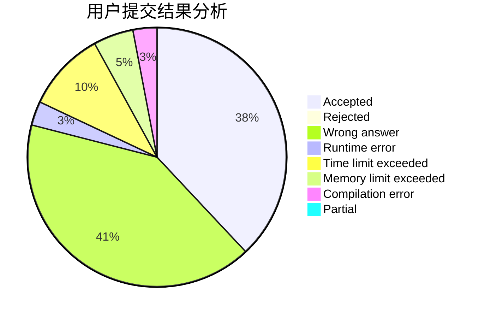
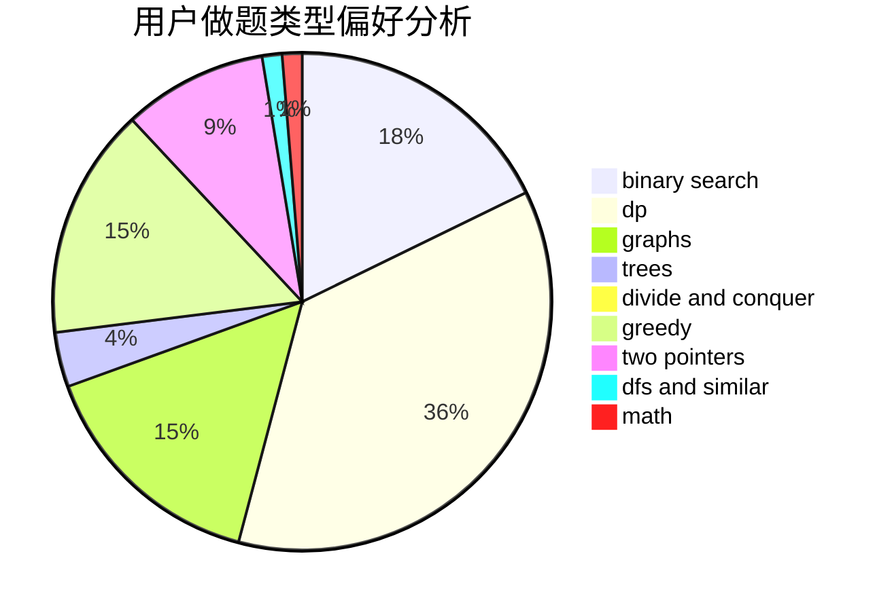

# daidao

<!-- tabs:start -->

#### **用户提交结果分析**

#### **用户做题类型偏好分析**

<!-- tabs:end -->
# 推荐题目
[1260F](https://codeforces.com/contest/1260/problem/F)
[13771](https://codeforces.com/contest/1377/problem/1)
[11961](https://codeforces.com/contest/1196/problem/1)
[978G](https://codeforces.com/contest/978/problem/G)
[925F](https://codeforces.com/contest/925/problem/F)
[377D](https://codeforces.com/contest/377/problem/D)
[601B](https://codeforces.com/contest/601/problem/B)
[633G](https://codeforces.com/contest/633/problem/G)
[681E](https://codeforces.com/contest/681/problem/E)
[591D](https://codeforces.com/contest/591/problem/D)
