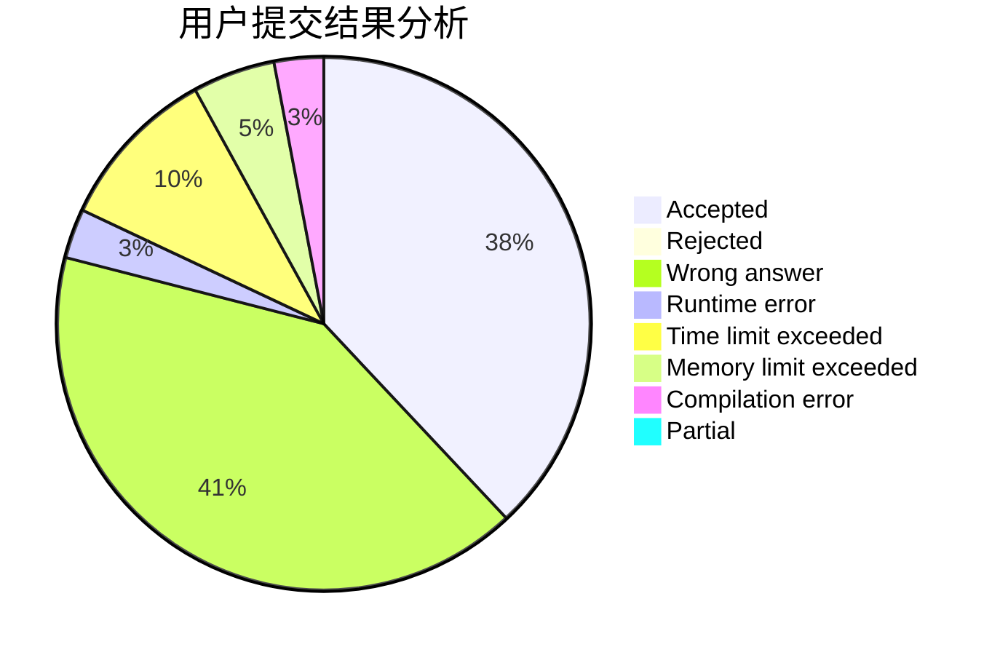
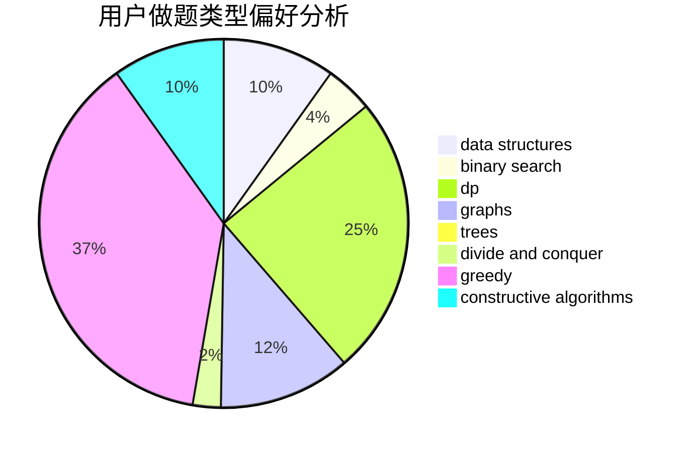
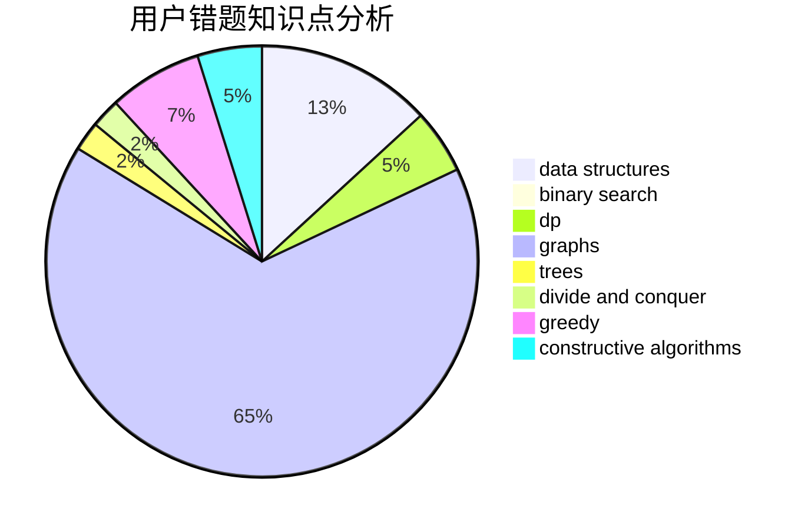

# daidao

<!-- tabs:start -->

#### **用户提交结果分析**

#### **用户做题类型偏好分析**

#### **用户错题知识点分析**

<!-- tabs:end -->
# 推荐题目
[1253D](https://codeforces.com/contest/1253/problem/D)		constructive algorithms,
                        dfs and similar,
                        dsu,
                        graphs,
                        greedy,
                        sortings		  
[1369F](https://codeforces.com/contest/1369/problem/F)		dfs and similar,
                        dp,
                        games		  
[1190A](https://codeforces.com/contest/1190/problem/A)		implementation,
                        two pointers		  
[957D](https://codeforces.com/contest/957/problem/D)		dsu,graphs,sortings,trees		  
[911A](https://codeforces.com/contest/911/problem/A)		implementation		  
[351B](https://codeforces.com/contest/351/problem/B)		combinatorics,
                        dp,
                        probabilities		  
[581A](https://codeforces.com/contest/581/problem/A)		implementation,
                        math		  
[616B](https://codeforces.com/contest/616/problem/B)		games,
                        greedy		  
[660F](https://codeforces.com/contest/660/problem/F)		binary search,
                        data structures,
                        geometry,
                        ternary search		  
[571C](https://codeforces.com/contest/571/problem/C)		constructive algorithms,
                        dfs and similar,
                        graphs,
                        greedy		  
