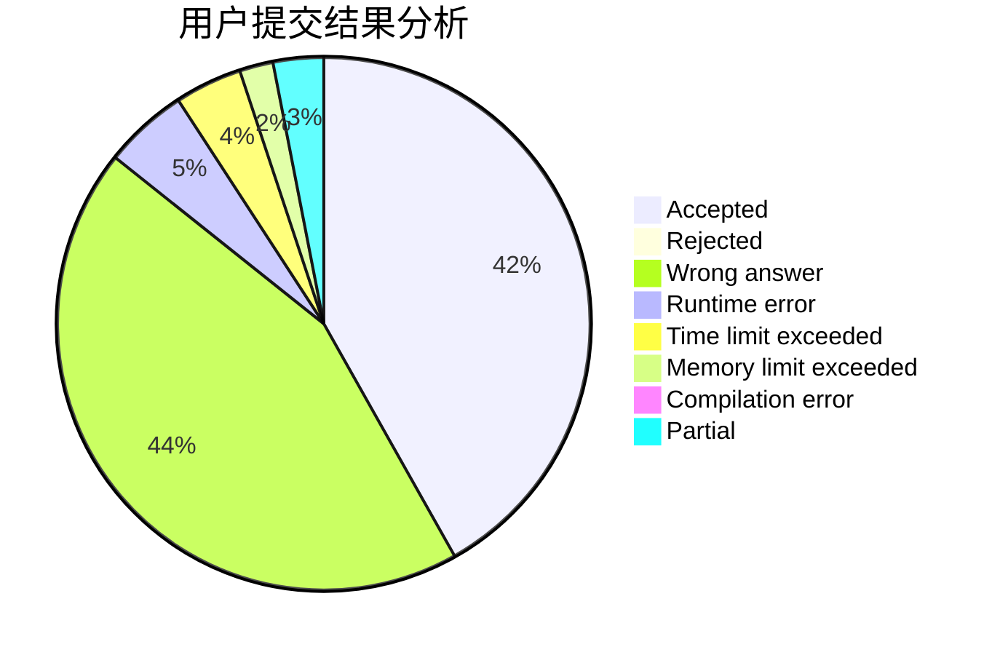
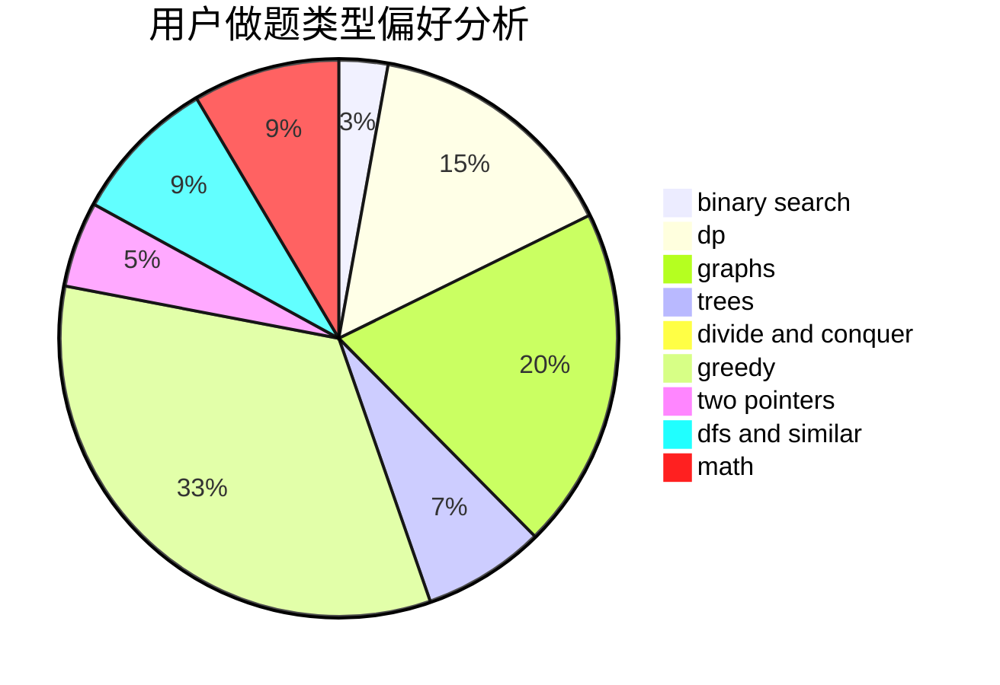

# daklqw

<!-- tabs:start -->

#### **用户提交结果分析**

#### **用户做题类型偏好分析**

<!-- tabs:end -->
# 推荐题目
[1465F](https://codeforces.com/contest/1465/problem/F)
[919D](https://codeforces.com/contest/919/problem/D)
[667B](https://codeforces.com/contest/667/problem/B)
[810A](https://codeforces.com/contest/810/problem/A)
[1482B](https://codeforces.com/contest/1482/problem/B)
[148E](https://codeforces.com/contest/148/problem/E)
[1320E](https://codeforces.com/contest/1320/problem/E)
[618A](https://codeforces.com/contest/618/problem/A)
[11852](https://codeforces.com/contest/1185/problem/2)
[1218H](https://codeforces.com/contest/1218/problem/H)
