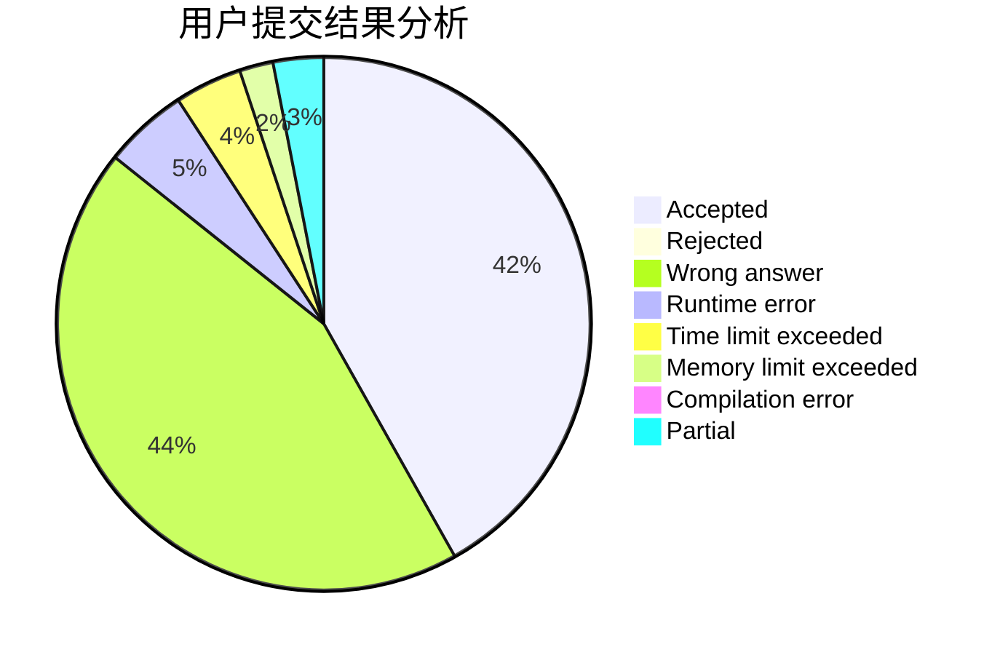
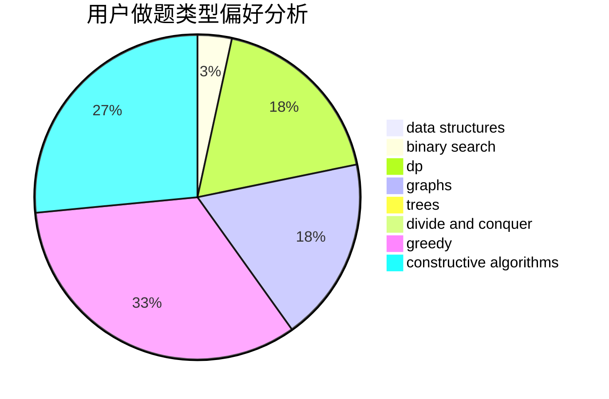
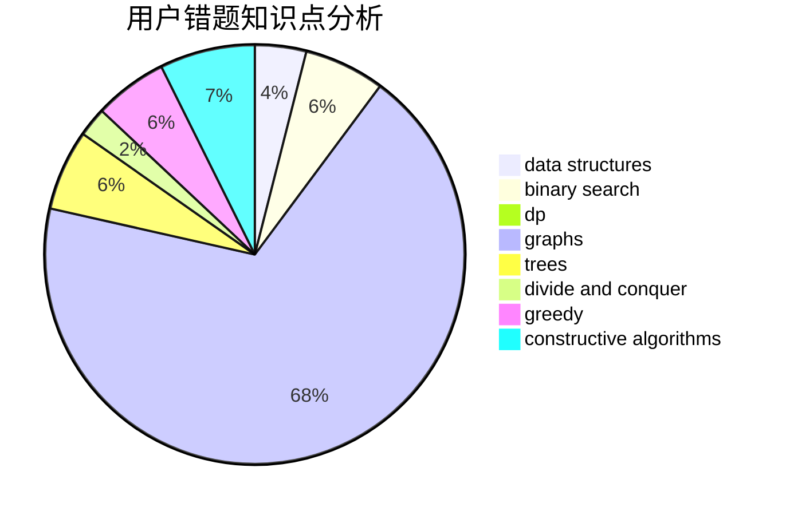

# daklqw

<!-- tabs:start -->

#### **用户提交结果分析**

#### **用户做题类型偏好分析**

#### **用户错题知识点分析**

<!-- tabs:end -->
# 推荐题目
[1456B](https://codeforces.com/contest/1456/problem/B)		dsu,graphs,sortings,trees		  
[903D](https://codeforces.com/contest/903/problem/D)		data structures,
                        math		  
[634F](https://codeforces.com/contest/634/problem/F)		dsu,graphs,sortings,trees		  
[795K](https://codeforces.com/contest/795/problem/K)		dsu,graphs,sortings,trees		  
[1473E](https://codeforces.com/contest/1473/problem/E)		graphs,
                        shortest paths		  
[1482B](https://codeforces.com/contest/1482/problem/B)		implementation,
                        math		  
[1311D](https://codeforces.com/contest/1311/problem/D)		brute force,
                        math		  
[599E](https://codeforces.com/contest/599/problem/E)		bitmasks,
                        dp,
                        trees		  
[1182D](https://codeforces.com/contest/1182/problem/D)		constructive algorithms,
                        dfs and similar,
                        dp,
                        hashing,
                        implementation,
                        trees		  
[1213E](https://codeforces.com/contest/1213/problem/E)		brute force,
                        constructive algorithms		  
