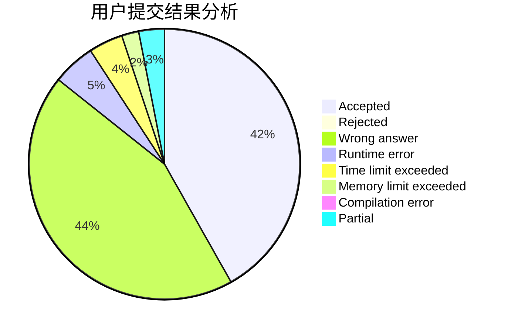
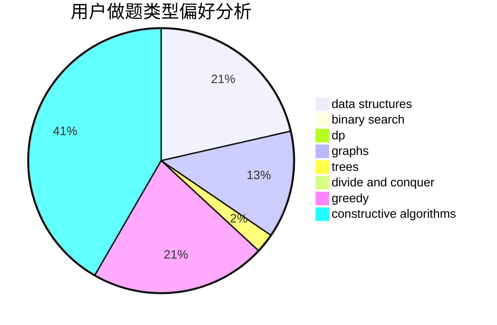
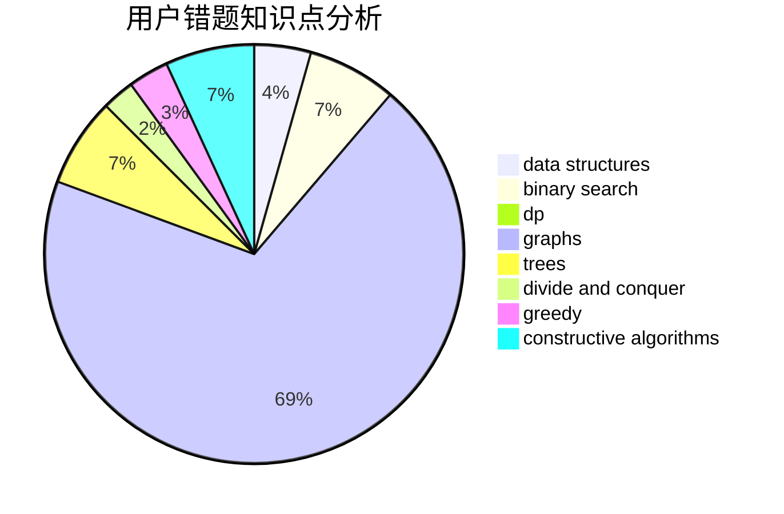

# daklqw

<!-- tabs:start -->

#### **用户提交结果分析**

#### **用户做题类型偏好分析**

#### **用户错题知识点分析**

<!-- tabs:end -->
# 推荐题目
[1465F](https://codeforces.com/contest/1465/problem/F)		dsu,graphs,sortings,trees		  
[919D](https://codeforces.com/contest/919/problem/D)		dfs and similar,
                        dp,
                        graphs		  
[667B](https://codeforces.com/contest/667/problem/B)		constructive algorithms,
                        geometry		  
[810A](https://codeforces.com/contest/810/problem/A)		implementation,
                        math		  
[1482B](https://codeforces.com/contest/1482/problem/B)		implementation,
                        math		  
[148E](https://codeforces.com/contest/148/problem/E)		dp		  
[1320E](https://codeforces.com/contest/1320/problem/E)		data structures,
                        dfs and similar,
                        dp,
                        shortest paths,
                        trees		  
[618A](https://codeforces.com/contest/618/problem/A)		implementation		  
[11852](https://codeforces.com/contest/1185/problem/2)		dsu,graphs,sortings,trees		  
[1218H](https://codeforces.com/contest/1218/problem/H)		dfs and similar		  
