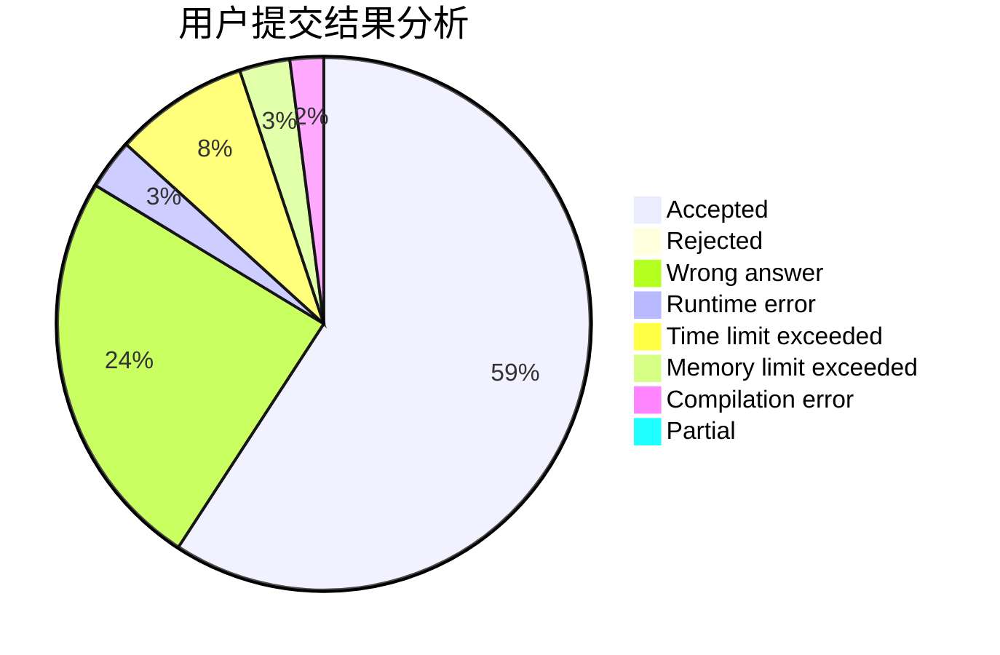
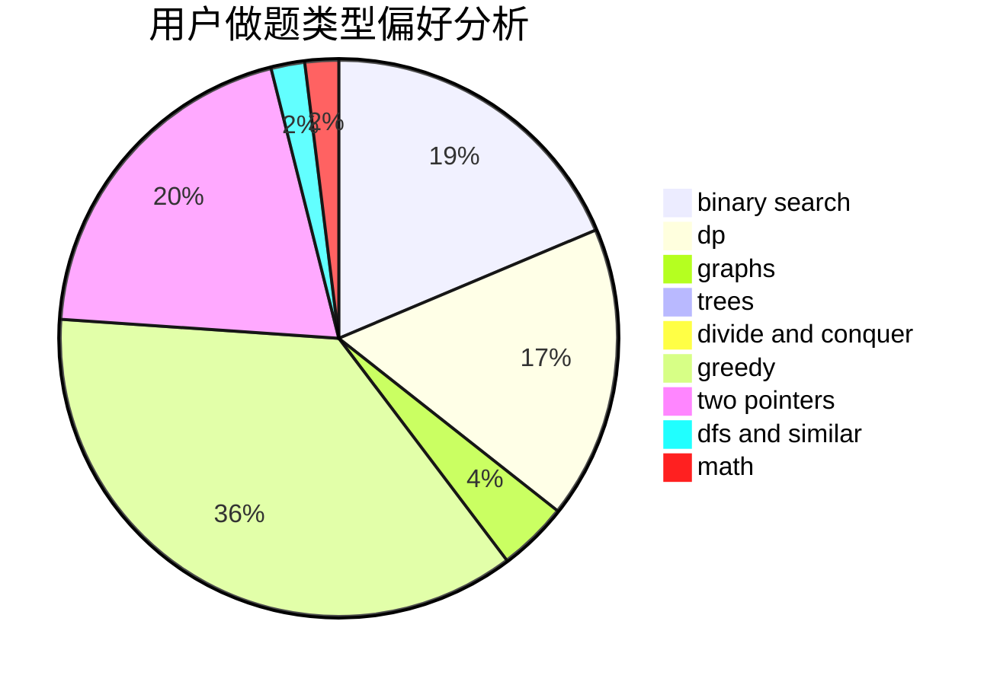

# dalt

<!-- tabs:start -->

#### **用户提交结果分析**

#### **用户做题类型偏好分析**

<!-- tabs:end -->
# 推荐题目
[1268B](https://codeforces.com/contest/1268/problem/B)
[327A](https://codeforces.com/contest/327/problem/A)
[1113D](https://codeforces.com/contest/1113/problem/D)
[835A](https://codeforces.com/contest/835/problem/A)
[12B](https://codeforces.com/contest/12/problem/B)
[148E](https://codeforces.com/contest/148/problem/E)
[377B](https://codeforces.com/contest/377/problem/B)
[1161D](https://codeforces.com/contest/1161/problem/D)
[477B](https://codeforces.com/contest/477/problem/B)
[490E](https://codeforces.com/contest/490/problem/E)
