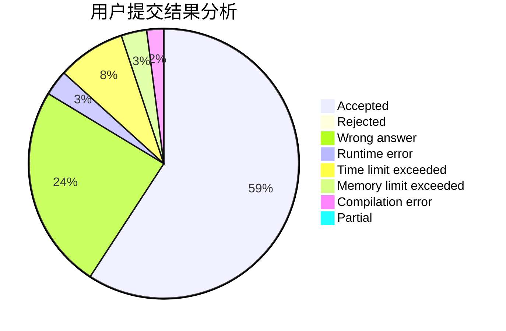
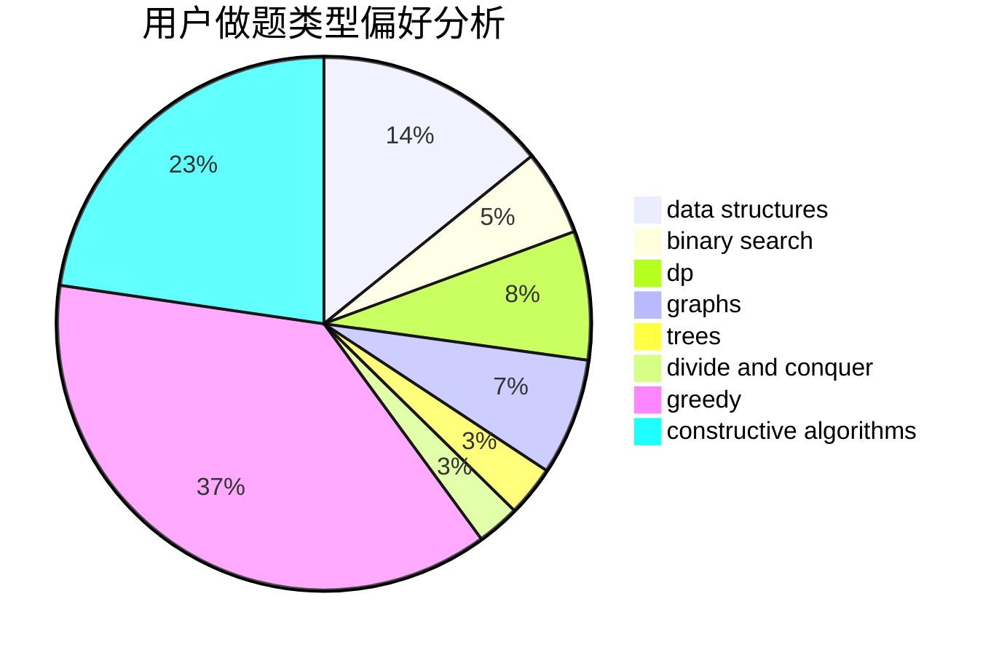
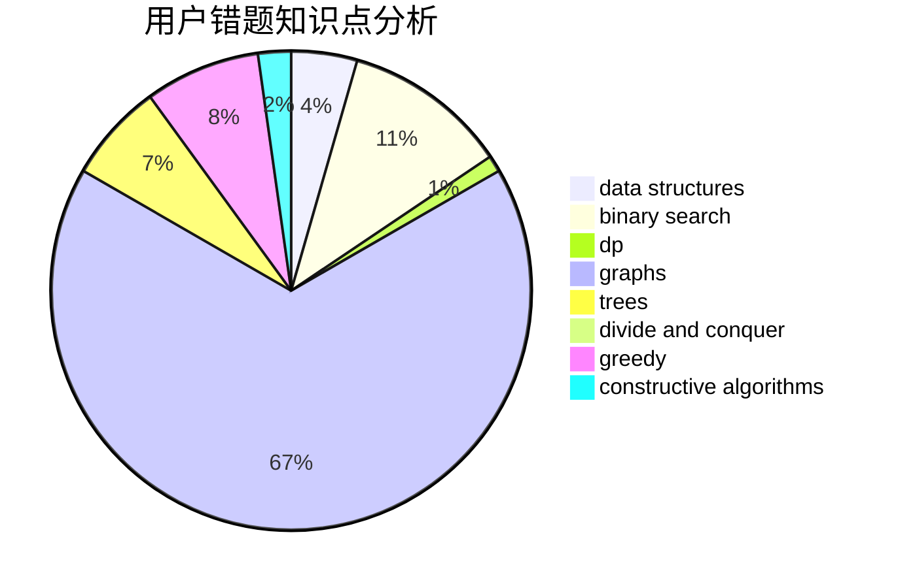

# dalt

<!-- tabs:start -->

#### **用户提交结果分析**

#### **用户做题类型偏好分析**

#### **用户错题知识点分析**

<!-- tabs:end -->
# 推荐题目
[1262E](https://codeforces.com/contest/1262/problem/E)		dsu,graphs,sortings,trees		  
[305D](https://codeforces.com/contest/305/problem/D)		combinatorics,
                        math		  
[1113A](https://codeforces.com/contest/1113/problem/A)		dp,
                        greedy,
                        math		  
[815E](https://codeforces.com/contest/815/problem/E)		binary search,
                        constructive algorithms,
                        implementation		  
[1293A](https://codeforces.com/contest/1293/problem/A)		binary search,
                        brute force,
                        implementation		  
[1482B](https://codeforces.com/contest/1482/problem/B)		implementation,
                        math		  
[34D](https://codeforces.com/contest/34/problem/D)		dfs and similar,
                        graphs		  
[1158F](https://codeforces.com/contest/1158/problem/F)		dp,
                        math		  
[456B](https://codeforces.com/contest/456/problem/B)		math,
                        number theory		  
[472B](https://codeforces.com/contest/472/problem/B)		nan		  
