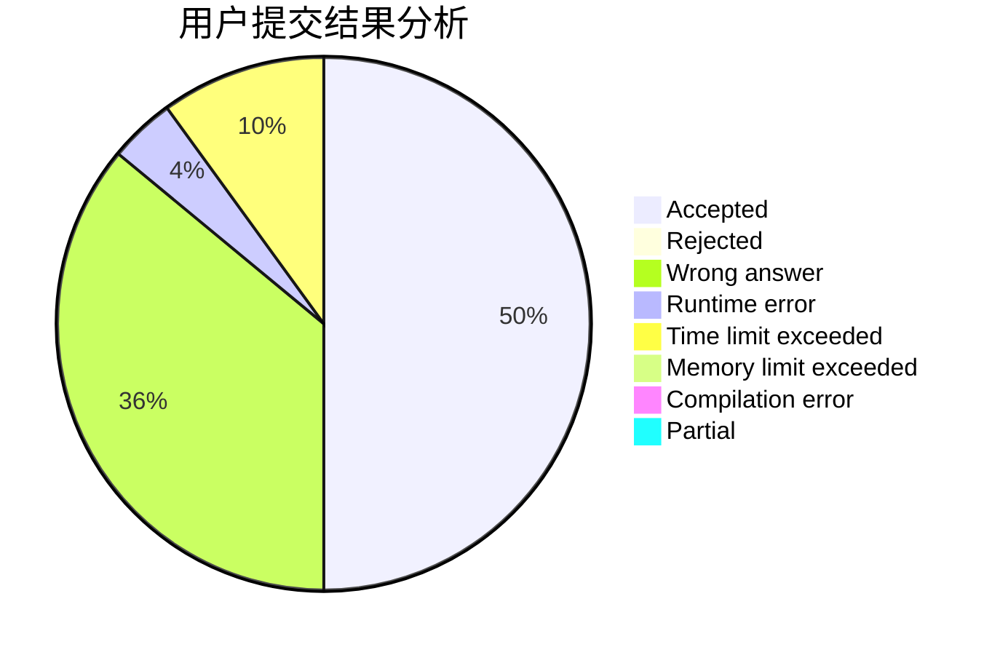
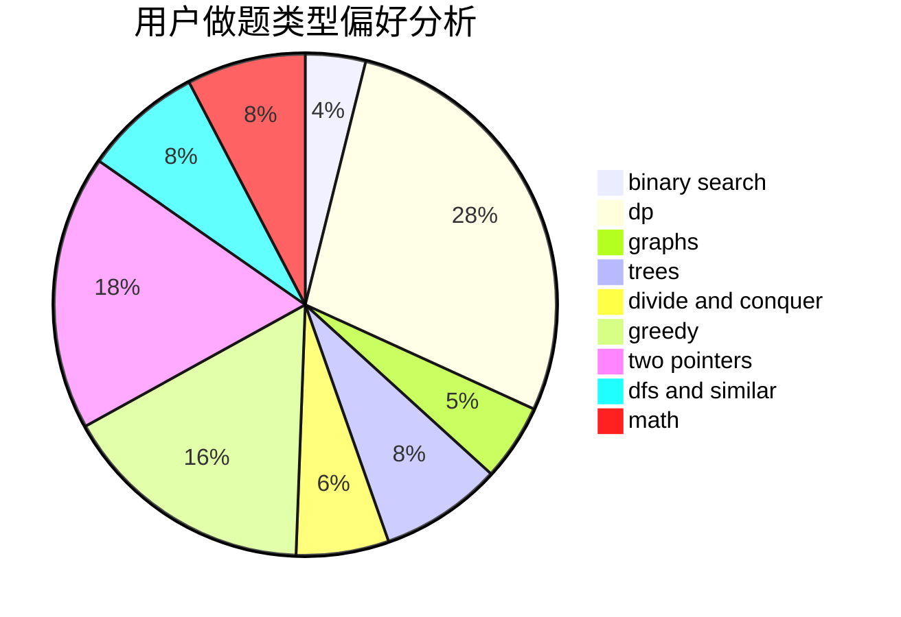

# dandan_sama

<!-- tabs:start -->

#### **用户提交结果分析**

#### **用户做题类型偏好分析**

<!-- tabs:end -->
# 推荐题目
[1279A](https://codeforces.com/contest/1279/problem/A)
[1310B](https://codeforces.com/contest/1310/problem/B)
[1148B](https://codeforces.com/contest/1148/problem/B)
[913G](https://codeforces.com/contest/913/problem/G)
[908H](https://codeforces.com/contest/908/problem/H)
[1509F](https://codeforces.com/contest/1509/problem/F)
[582A](https://codeforces.com/contest/582/problem/A)
[1227A](https://codeforces.com/contest/1227/problem/A)
[723D](https://codeforces.com/contest/723/problem/D)
[1407E](https://codeforces.com/contest/1407/problem/E)
