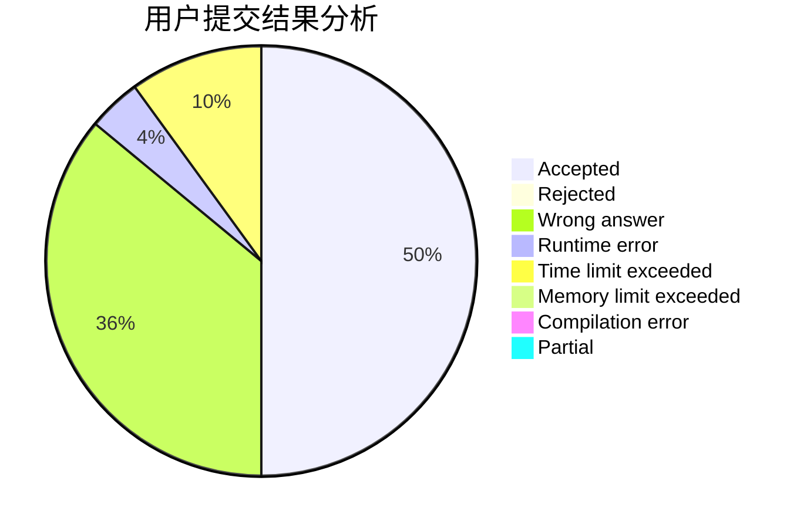
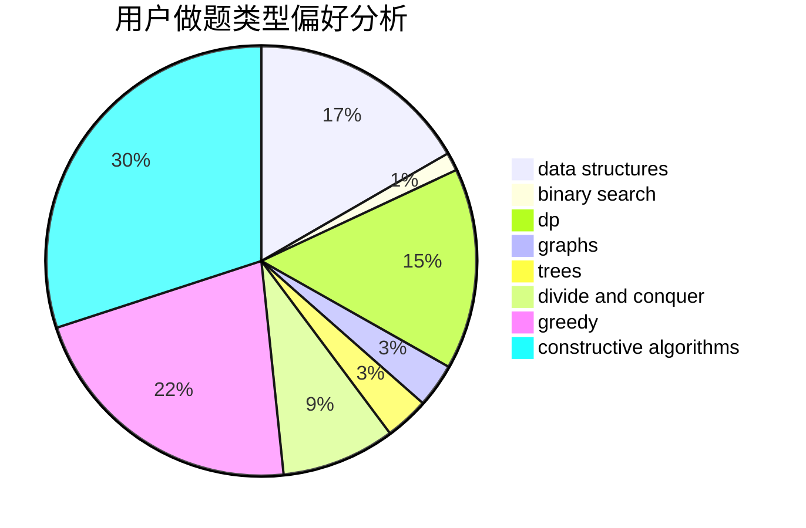

# dandan_sama

<!-- tabs:start -->

#### **用户提交结果分析**

#### **用户做题类型偏好分析**

#### **用户错题知识点分析**

<!-- tabs:end -->
# 推荐题目
[1279A](https://codeforces.com/contest/1279/problem/A)		math		  
[1310B](https://codeforces.com/contest/1310/problem/B)		dp,
                        implementation		  
[1148B](https://codeforces.com/contest/1148/problem/B)		binary search,
                        brute force,
                        two pointers		  
[913G](https://codeforces.com/contest/913/problem/G)		math,
                        number theory		  
[908H](https://codeforces.com/contest/908/problem/H)		nan		  
[1509F](https://codeforces.com/contest/1509/problem/F)		dsu,graphs,sortings,trees		  
[582A](https://codeforces.com/contest/582/problem/A)		constructive algorithms,
                        greedy,
                        number theory		  
[1227A](https://codeforces.com/contest/1227/problem/A)		math		  
[723D](https://codeforces.com/contest/723/problem/D)		dfs and similar,
                        dsu,
                        graphs,
                        greedy,
                        implementation		  
[1407E](https://codeforces.com/contest/1407/problem/E)		constructive algorithms,
                        dfs and similar,
                        dp,
                        graphs,
                        greedy,
                        shortest paths		  
