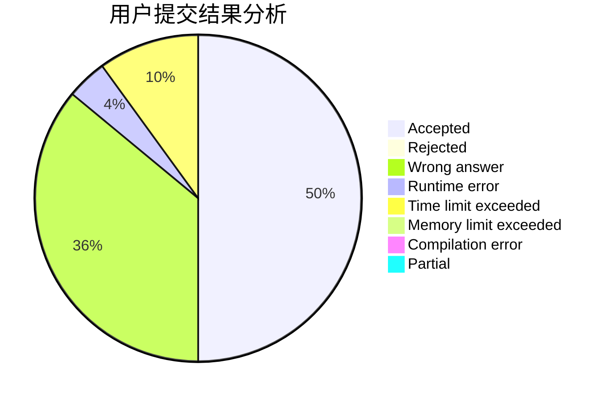
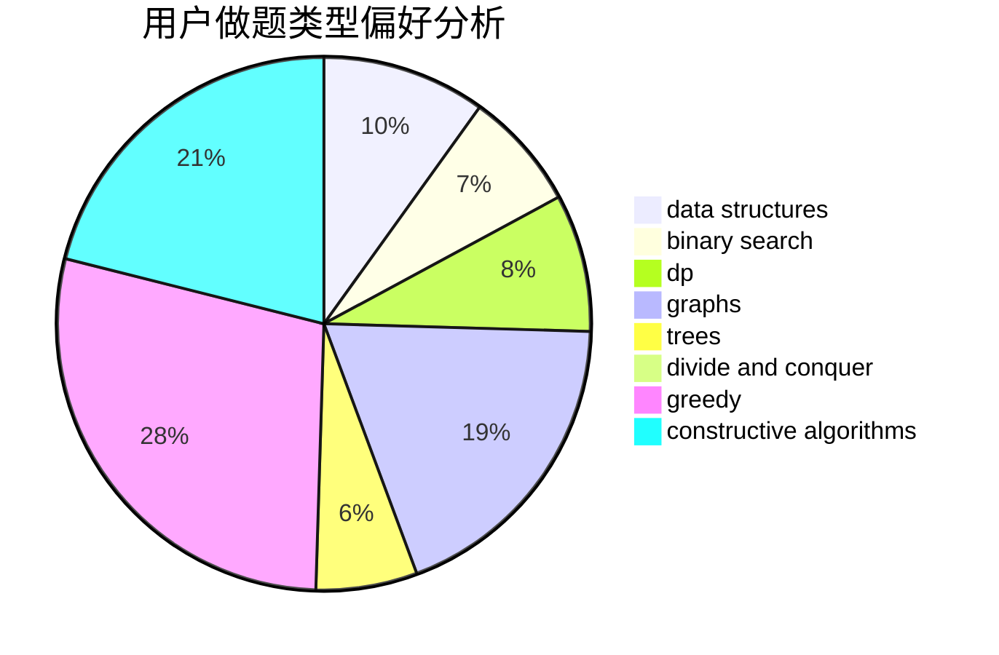

# dandan_sama

<!-- tabs:start -->

#### **用户提交结果分析**

#### **用户做题类型偏好分析**

#### **用户错题知识点分析**

<!-- tabs:end -->
# 推荐题目
[1270A](https://codeforces.com/contest/1270/problem/A)		games,
                        greedy,
                        math		  
[1300D](https://codeforces.com/contest/1300/problem/D)		dsu,graphs,sortings,trees		  
[1146B](https://codeforces.com/contest/1146/problem/B)		implementation,
                        strings		  
[896D](https://codeforces.com/contest/896/problem/D)		chinese remainder theorem,
                        combinatorics,
                        math,
                        number theory		  
[889E](https://codeforces.com/contest/889/problem/E)		binary search,
                        dp,
                        math		  
[1499F](https://codeforces.com/contest/1499/problem/F)		combinatorics,
                        dfs and similar,
                        dp,
                        trees		  
[559C](https://codeforces.com/contest/559/problem/C)		combinatorics,
                        dp,
                        math,
                        number theory		  
[121C](https://codeforces.com/contest/121/problem/C)		brute force,
                        combinatorics,
                        number theory		  
[704D](https://codeforces.com/contest/704/problem/D)		flows,
                        greedy		  
[1398F](https://codeforces.com/contest/1398/problem/F)		binary search,
                        data structures,
                        dp,
                        greedy,
                        two pointers		  
