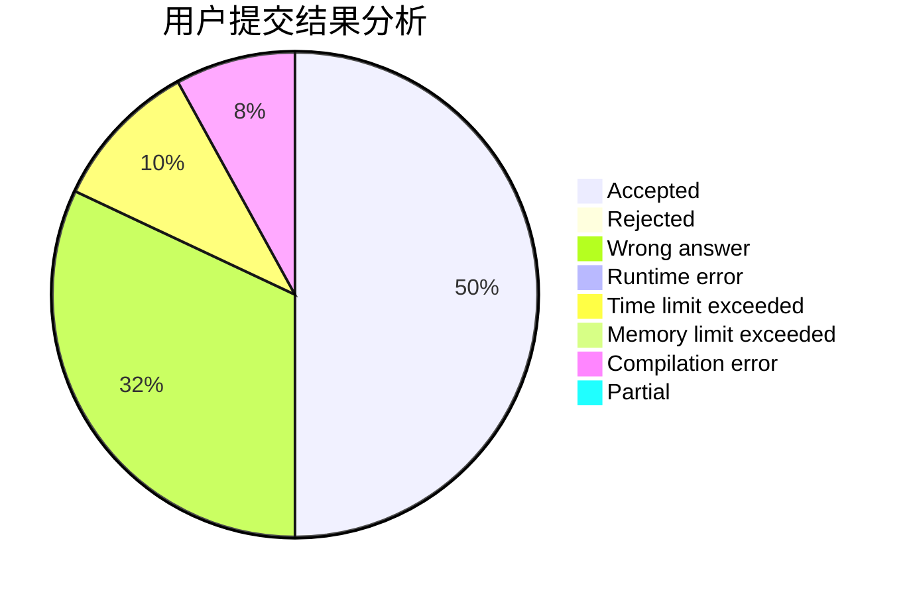
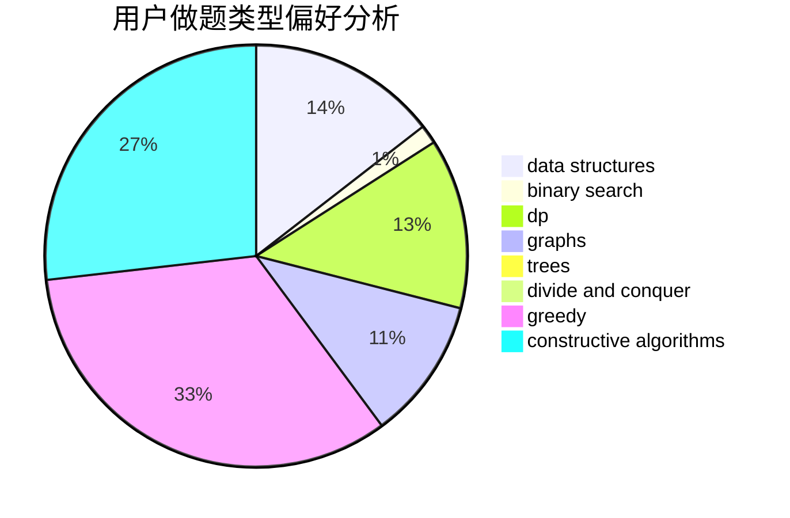
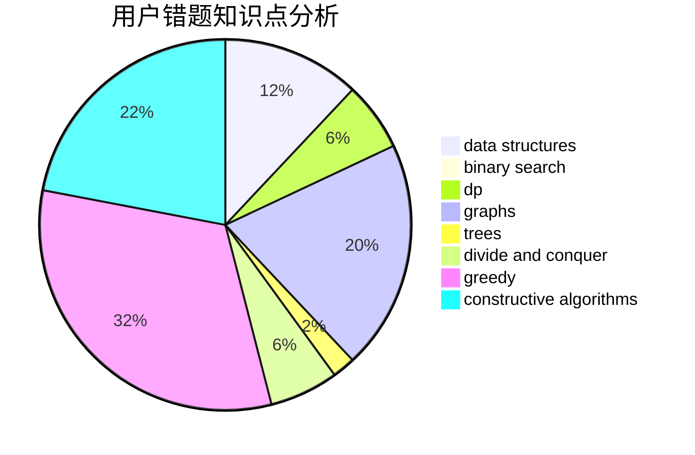

# dandelight

<!-- tabs:start -->

#### **用户提交结果分析**

#### **用户做题类型偏好分析**

#### **用户错题知识点分析**

<!-- tabs:end -->
# 推荐题目
[1108A](https://codeforces.com/contest/1108/problem/A)		implementation		  
[901C](https://codeforces.com/contest/901/problem/C)		binary search,
                        data structures,
                        dfs and similar,
                        dsu,
                        graphs,
                        two pointers		  
[218B](https://codeforces.com/contest/218/problem/B)		implementation		  
[1167D](https://codeforces.com/contest/1167/problem/D)		constructive algorithms,
                        greedy		  
[514B](https://codeforces.com/contest/514/problem/B)		brute force,
                        data structures,
                        geometry,
                        implementation,
                        math		  
[845F](https://codeforces.com/contest/845/problem/F)		bitmasks,
                        dp		  
[1102F](https://codeforces.com/contest/1102/problem/F)		binary search,
                        bitmasks,
                        brute force,
                        dp,
                        graphs		  
[801B](https://codeforces.com/contest/801/problem/B)		constructive algorithms,
                        greedy,
                        strings		  
[416E](https://codeforces.com/contest/416/problem/E)		dp,
                        graphs,
                        shortest paths		  
[1316F](https://codeforces.com/contest/1316/problem/F)		data structures,
                        divide and conquer,
                        probabilities		  
