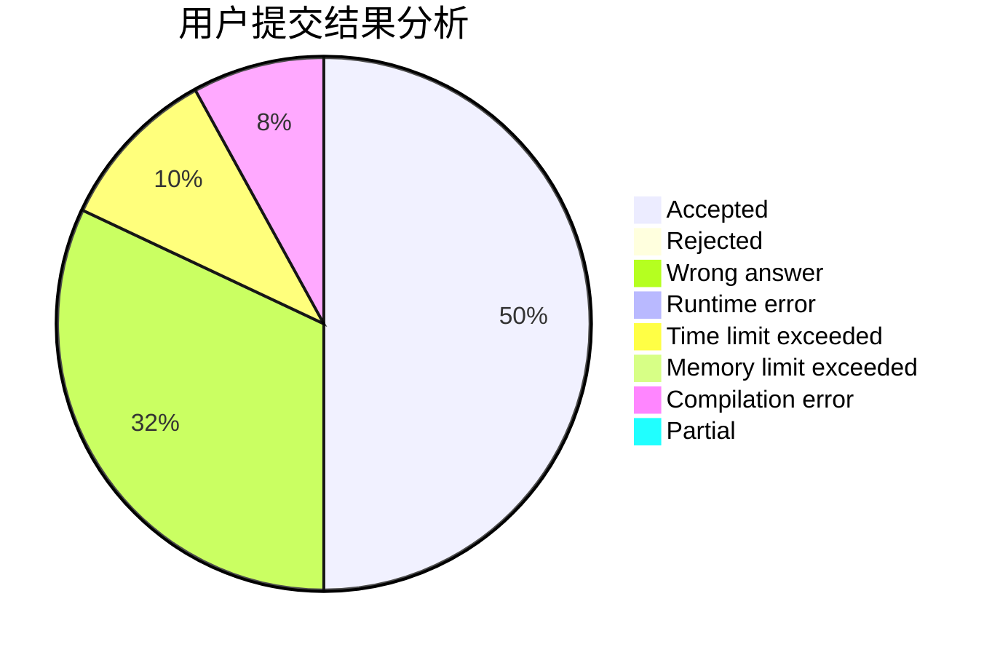
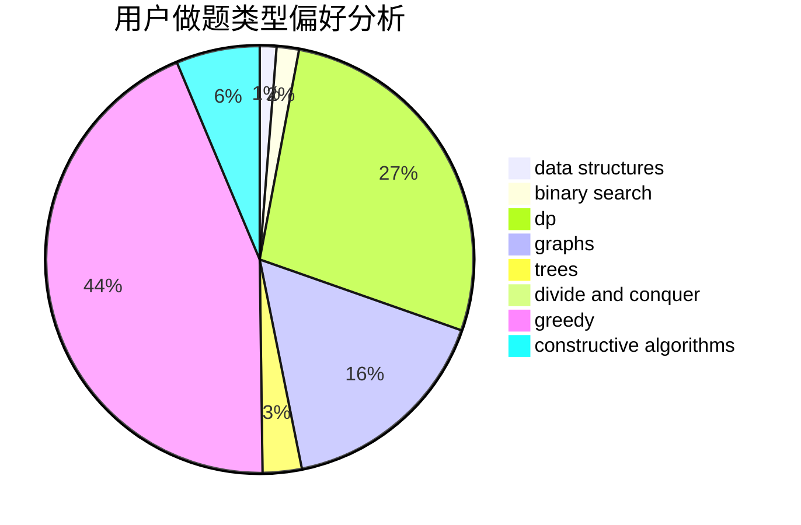
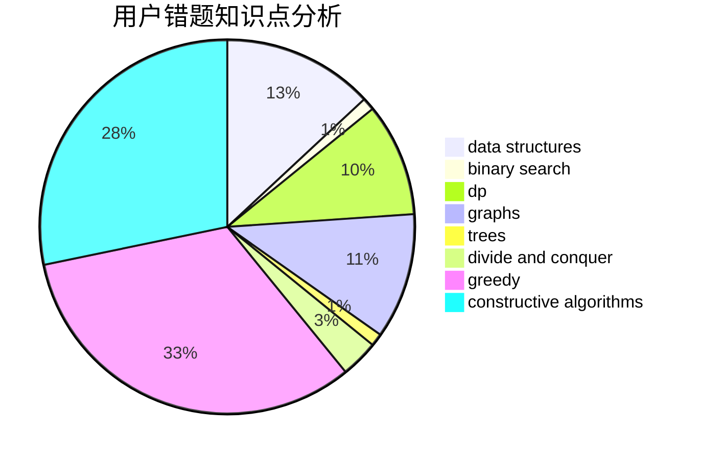

# dandelight

<!-- tabs:start -->

#### **用户提交结果分析**

#### **用户做题类型偏好分析**

#### **用户错题知识点分析**

<!-- tabs:end -->
# 推荐题目
[1107F](https://codeforces.com/contest/1107/problem/F)		dp,
                        flows,
                        graph matchings,
                        graphs,
                        sortings		  
[883I](https://codeforces.com/contest/883/problem/I)		binary search,
                        dp		  
[195B](https://codeforces.com/contest/195/problem/B)		data structures,
                        implementation,
                        math		  
[1165B](https://codeforces.com/contest/1165/problem/B)		data structures,
                        greedy,
                        sortings		  
[494A](https://codeforces.com/contest/494/problem/A)		greedy		  
[827C](https://codeforces.com/contest/827/problem/C)		data structures,
                        strings		  
[1102C](https://codeforces.com/contest/1102/problem/C)		games		  
[784B](https://codeforces.com/contest/784/problem/B)		*special problem		  
[387D](https://codeforces.com/contest/387/problem/D)		graph matchings		  
[1310C](https://codeforces.com/contest/1310/problem/C)		binary search,
                        dp,
                        strings		  
