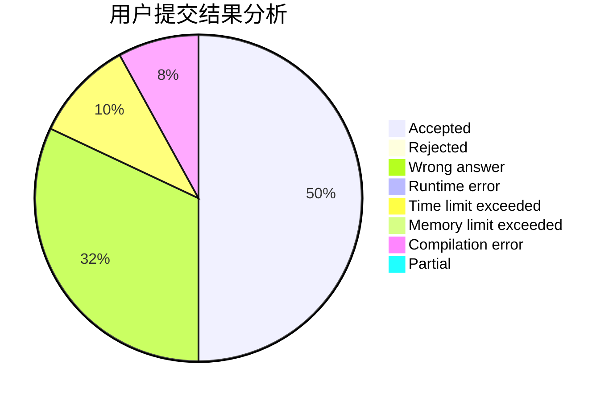
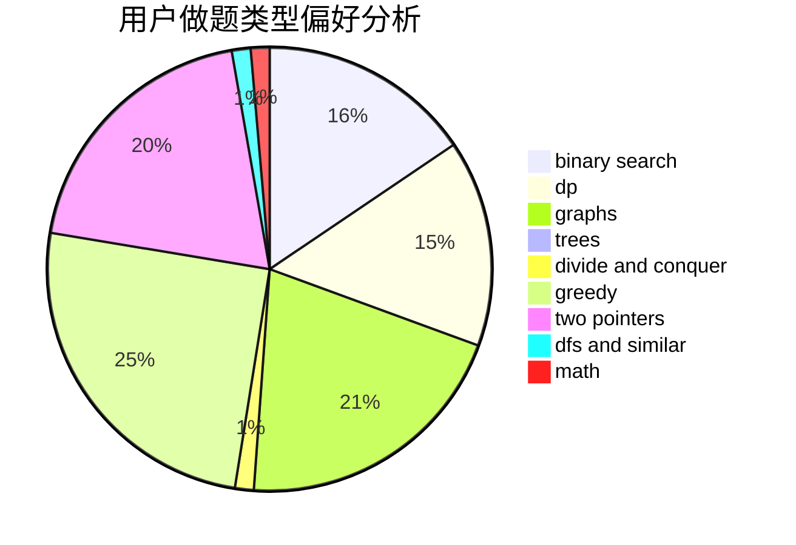

# dandelight

<!-- tabs:start -->

#### **用户提交结果分析**

#### **用户做题类型偏好分析**

<!-- tabs:end -->
# 推荐题目
[1108A](https://codeforces.com/contest/1108/problem/A)
[901C](https://codeforces.com/contest/901/problem/C)
[218B](https://codeforces.com/contest/218/problem/B)
[1167D](https://codeforces.com/contest/1167/problem/D)
[514B](https://codeforces.com/contest/514/problem/B)
[845F](https://codeforces.com/contest/845/problem/F)
[1102F](https://codeforces.com/contest/1102/problem/F)
[801B](https://codeforces.com/contest/801/problem/B)
[416E](https://codeforces.com/contest/416/problem/E)
[1316F](https://codeforces.com/contest/1316/problem/F)
