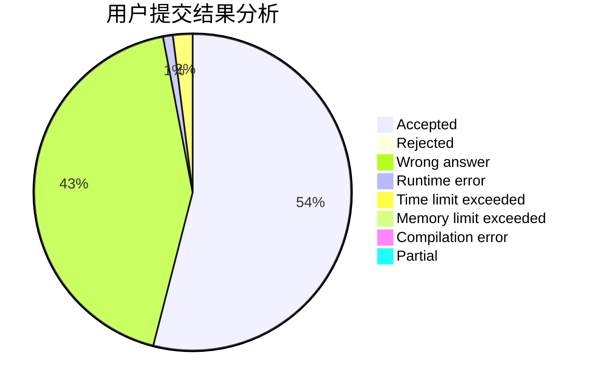
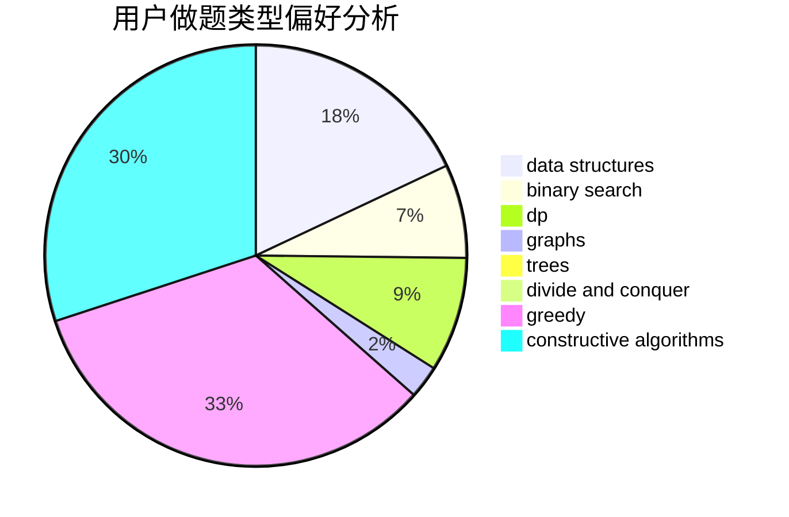
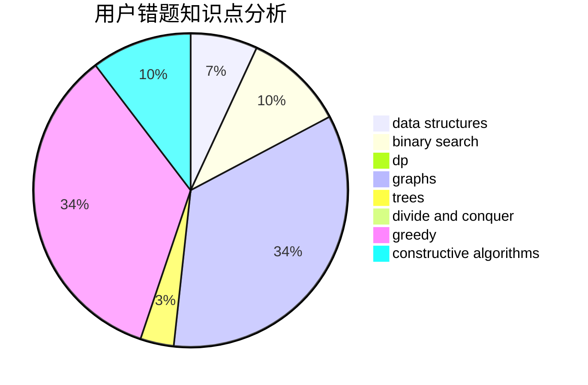

# danxmz2006

<!-- tabs:start -->

#### **用户提交结果分析**

#### **用户做题类型偏好分析**

#### **用户错题知识点分析**

<!-- tabs:end -->
# 推荐题目
[1413A](https://codeforces.com/contest/1413/problem/A)		constructive algorithms,
                        math		  
[1139D](https://codeforces.com/contest/1139/problem/D)		dp,
                        math,
                        number theory,
                        probabilities		  
[494E](https://codeforces.com/contest/494/problem/E)		data structures,
                        games		  
[1163C1](https://codeforces.com/contest/1163C/problem/1)		brute force,
                        geometry		  
[313D](https://codeforces.com/contest/313/problem/D)		dp		  
[1385A](https://codeforces.com/contest/1385/problem/A)		math		  
[1136D](https://codeforces.com/contest/1136/problem/D)		greedy		  
[445B](https://codeforces.com/contest/445/problem/B)		dfs and similar,
                        dsu,
                        greedy		  
[1227D2](https://codeforces.com/contest/1227D/problem/2)		data structures,
                        greedy		  
[348C](https://codeforces.com/contest/348/problem/C)		brute force,
                        data structures		  
