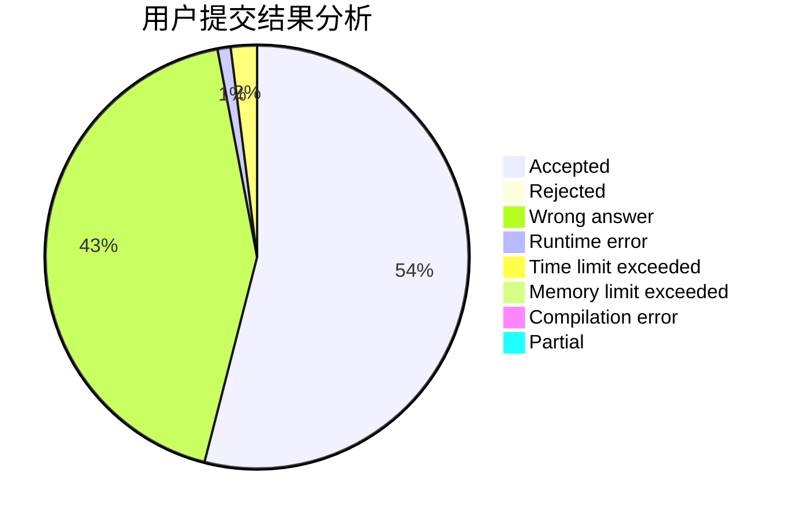
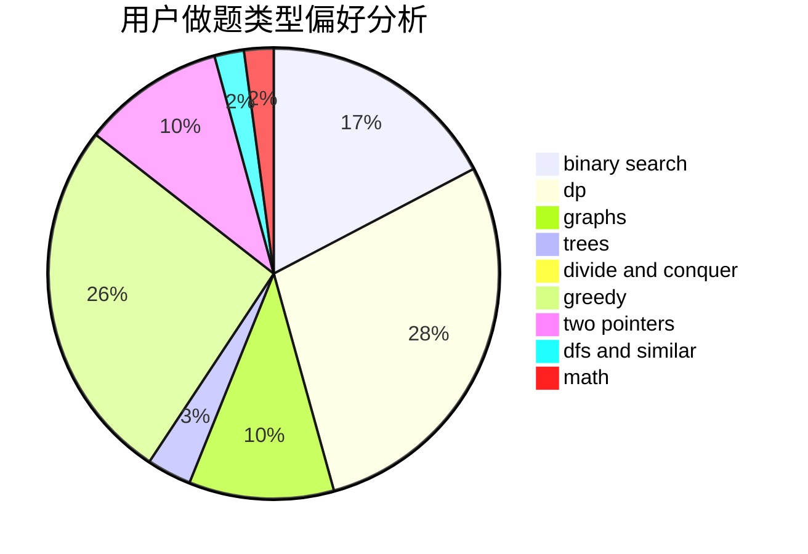

# danxmz2006

<!-- tabs:start -->

#### **用户提交结果分析**

#### **用户做题类型偏好分析**

<!-- tabs:end -->
# 推荐题目
[1422C](https://codeforces.com/contest/1422/problem/C)
[11411](https://codeforces.com/contest/1141/problem/1)
[515A](https://codeforces.com/contest/515/problem/A)
[1164S](https://codeforces.com/contest/1164/problem/S)
[337D](https://codeforces.com/contest/337/problem/D)
[1395A](https://codeforces.com/contest/1395/problem/A)
[1138F](https://codeforces.com/contest/1138/problem/F)
[465D](https://codeforces.com/contest/465/problem/D)
[1236B](https://codeforces.com/contest/1236/problem/B)
[375C](https://codeforces.com/contest/375/problem/C)
