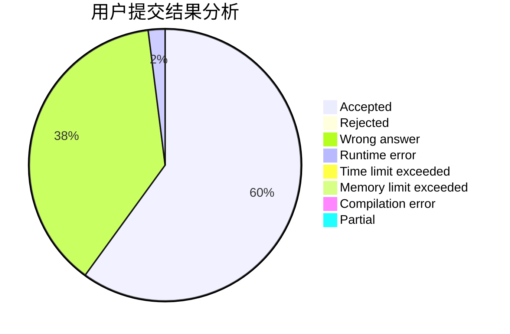
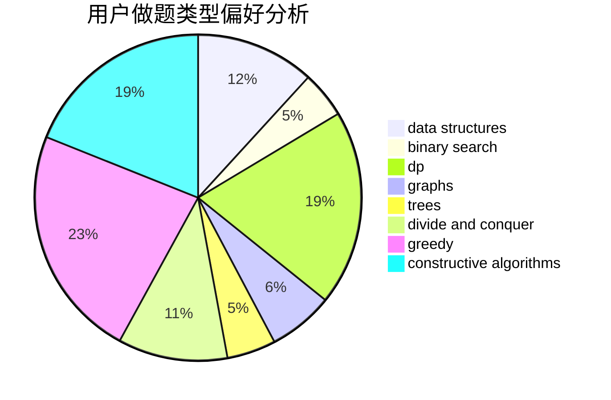
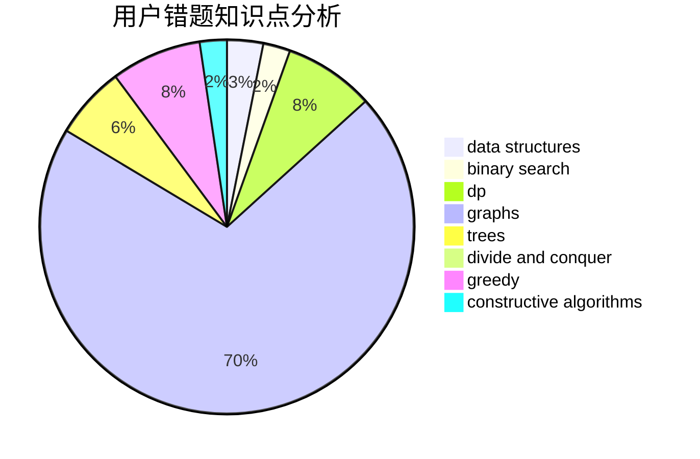

# dargoncat

<!-- tabs:start -->

#### **用户提交结果分析**

#### **用户做题类型偏好分析**

#### **用户错题知识点分析**

<!-- tabs:end -->
# 推荐题目
[357B](https://codeforces.com/contest/357/problem/B)		constructive algorithms,
                        implementation		  
[567A](https://codeforces.com/contest/567/problem/A)		greedy,
                        implementation		  
[900C](https://codeforces.com/contest/900/problem/C)		brute force,
                        data structures,
                        math		  
[204E](https://codeforces.com/contest/204/problem/E)		data structures,
                        implementation,
                        string suffix structures,
                        two pointers		  
[476B](https://codeforces.com/contest/476/problem/B)		bitmasks,
                        brute force,
                        combinatorics,
                        dp,
                        math,
                        probabilities		  
[893D](https://codeforces.com/contest/893/problem/D)		data structures,
                        dp,
                        greedy,
                        implementation		  
[102B](https://codeforces.com/contest/102/problem/B)		implementation		  
[588A](https://codeforces.com/contest/588/problem/A)		greedy		  
[817F](https://codeforces.com/contest/817/problem/F)		binary search,
                        data structures,
                        trees		  
[277B](https://codeforces.com/contest/277/problem/B)		constructive algorithms,
                        geometry		  
