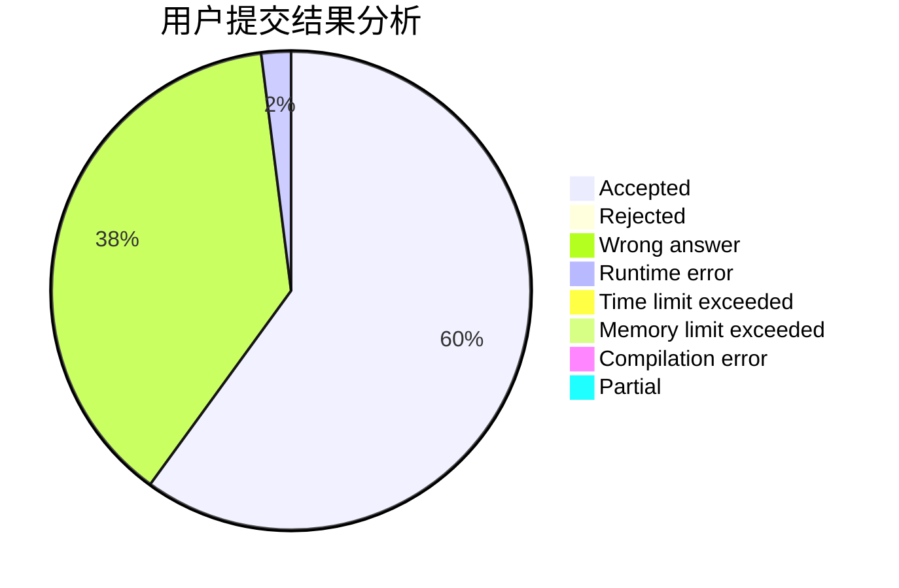
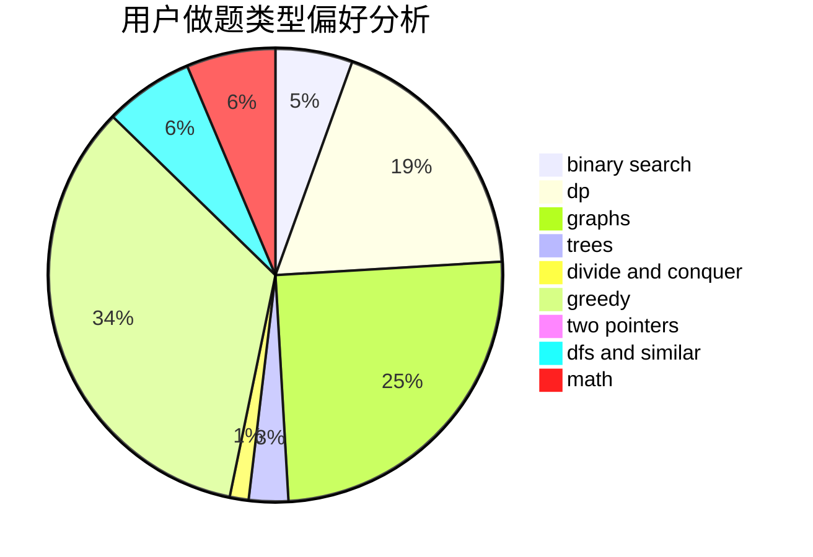

# dargoncat

<!-- tabs:start -->

#### **用户提交结果分析**

#### **用户做题类型偏好分析**

<!-- tabs:end -->
# 推荐题目
[383C](https://codeforces.com/contest/383/problem/C)
[585F](https://codeforces.com/contest/585/problem/F)
[917A](https://codeforces.com/contest/917/problem/A)
[228E](https://codeforces.com/contest/228/problem/E)
[495B](https://codeforces.com/contest/495/problem/B)
[911D](https://codeforces.com/contest/911/problem/D)
[1030C](https://codeforces.com/contest/1030/problem/C)
[608C](https://codeforces.com/contest/608/problem/C)
[837F](https://codeforces.com/contest/837/problem/F)
[292A](https://codeforces.com/contest/292/problem/A)
