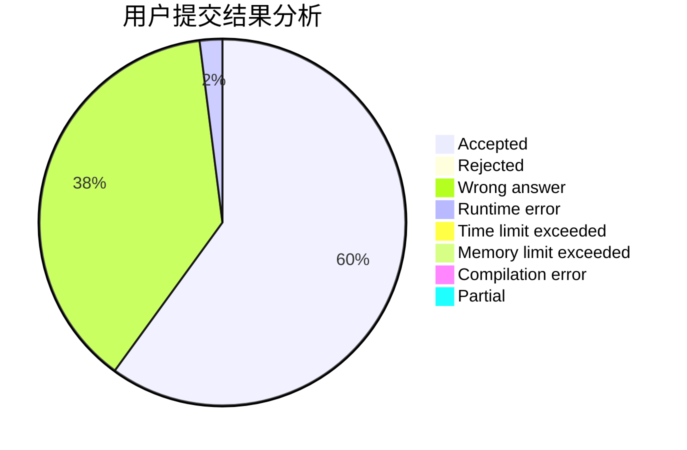
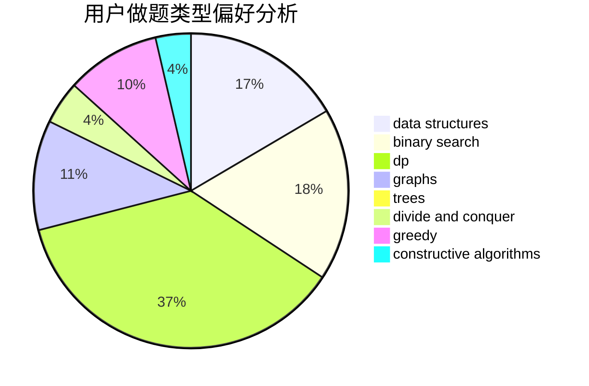
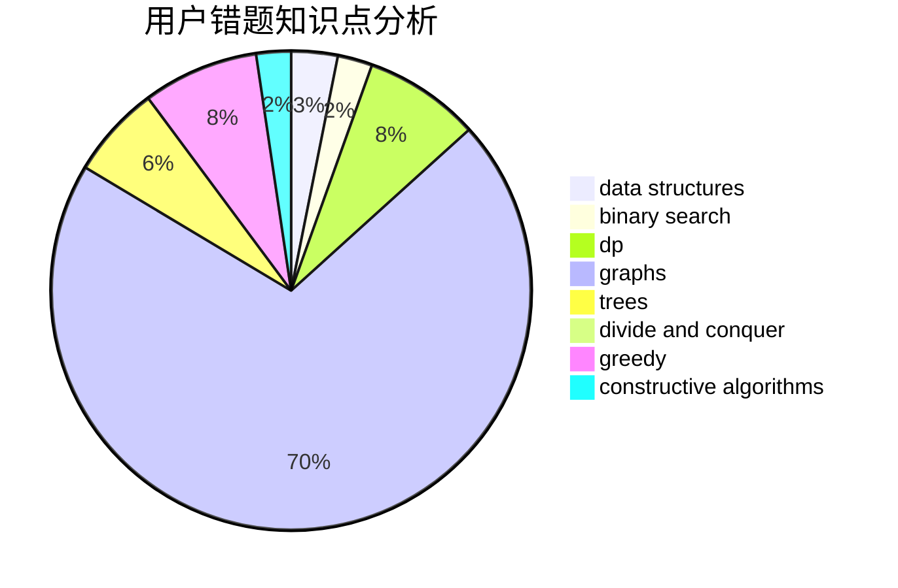

# dargoncat

<!-- tabs:start -->

#### **用户提交结果分析**

#### **用户做题类型偏好分析**

#### **用户错题知识点分析**

<!-- tabs:end -->
# 推荐题目
[383C](https://codeforces.com/contest/383/problem/C)		data structures,
                        dfs and similar,
                        trees		  
[585F](https://codeforces.com/contest/585/problem/F)		dp,
                        implementation,
                        strings		  
[917A](https://codeforces.com/contest/917/problem/A)		dp,
                        greedy,
                        implementation,
                        math		  
[228E](https://codeforces.com/contest/228/problem/E)		2-sat,
                        dfs and similar,
                        dsu,
                        graphs		  
[495B](https://codeforces.com/contest/495/problem/B)		math,
                        number theory		  
[911D](https://codeforces.com/contest/911/problem/D)		brute force,
                        math		  
[1030C](https://codeforces.com/contest/1030/problem/C)		implementation		  
[608C](https://codeforces.com/contest/608/problem/C)		dsu,graphs,sortings,trees		  
[837F](https://codeforces.com/contest/837/problem/F)		binary search,
                        brute force,
                        combinatorics,
                        math,
                        matrices		  
[292A](https://codeforces.com/contest/292/problem/A)		implementation		  
