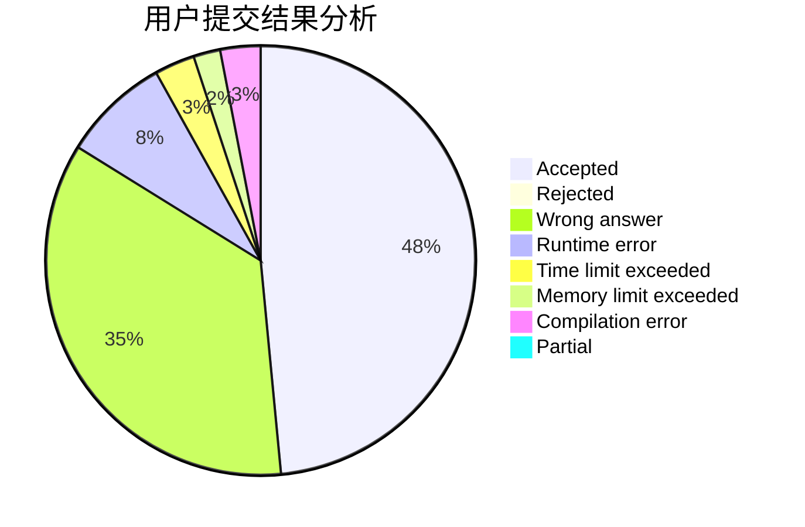
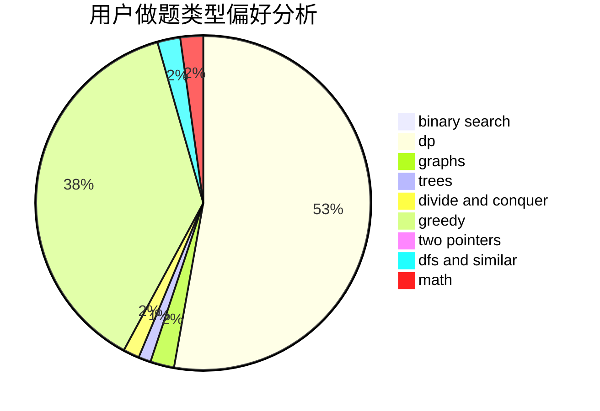

# davidlee1999WTK

<!-- tabs:start -->

#### **用户提交结果分析**

#### **用户做题类型偏好分析**

<!-- tabs:end -->
# 推荐题目
[1016B](https://codeforces.com/contest/1016/problem/B)
[1082B](https://codeforces.com/contest/1082/problem/B)
[1413D](https://codeforces.com/contest/1413/problem/D)
[939E](https://codeforces.com/contest/939/problem/E)
[13783](https://codeforces.com/contest/1378/problem/3)
[572A](https://codeforces.com/contest/572/problem/A)
[1150D](https://codeforces.com/contest/1150/problem/D)
[850B](https://codeforces.com/contest/850/problem/B)
[1468F](https://codeforces.com/contest/1468/problem/F)
[1025E](https://codeforces.com/contest/1025/problem/E)
