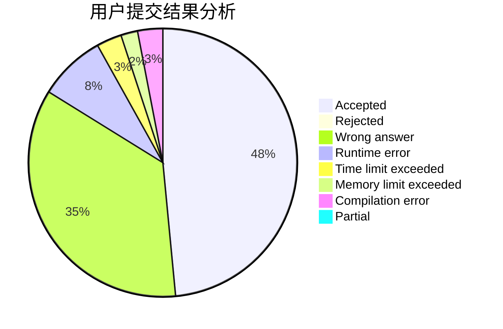
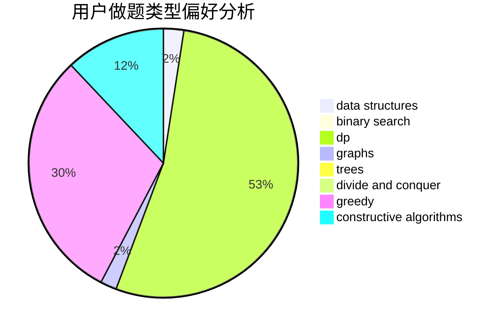
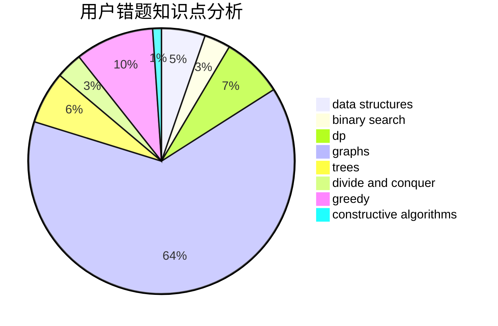

# davidlee1999WTK

<!-- tabs:start -->

#### **用户提交结果分析**

#### **用户做题类型偏好分析**

#### **用户错题知识点分析**

<!-- tabs:end -->
# 推荐题目
[1016B](https://codeforces.com/contest/1016/problem/B)		brute force,
                        implementation		  
[1082B](https://codeforces.com/contest/1082/problem/B)		greedy		  
[1413D](https://codeforces.com/contest/1413/problem/D)		data structures,
                        greedy,
                        implementation		  
[939E](https://codeforces.com/contest/939/problem/E)		binary search,
                        greedy,
                        ternary search,
                        two pointers		  
[13783](https://codeforces.com/contest/1378/problem/3)		dsu,graphs,sortings,trees		  
[572A](https://codeforces.com/contest/572/problem/A)		sortings		  
[1150D](https://codeforces.com/contest/1150/problem/D)		dsu,graphs,sortings,trees		  
[850B](https://codeforces.com/contest/850/problem/B)		implementation,
                        number theory		  
[1468F](https://codeforces.com/contest/1468/problem/F)		geometry,
                        hashing,
                        number theory		  
[1025E](https://codeforces.com/contest/1025/problem/E)		constructive algorithms,
                        implementation,
                        matrices		  
