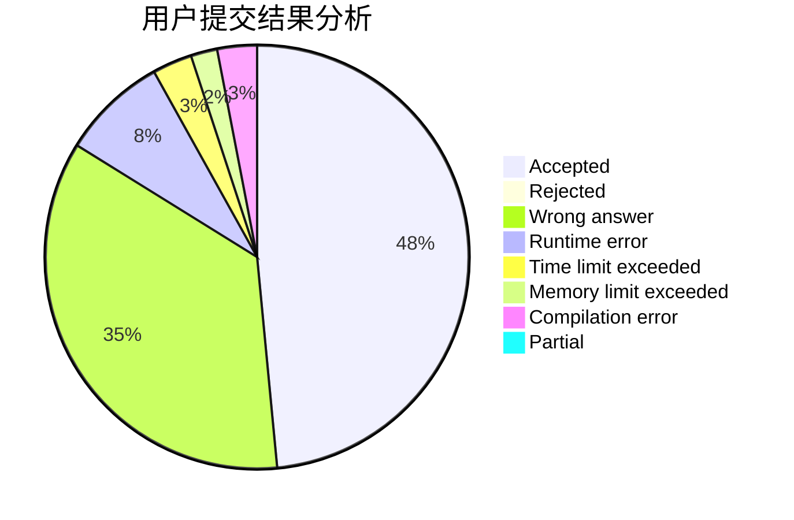
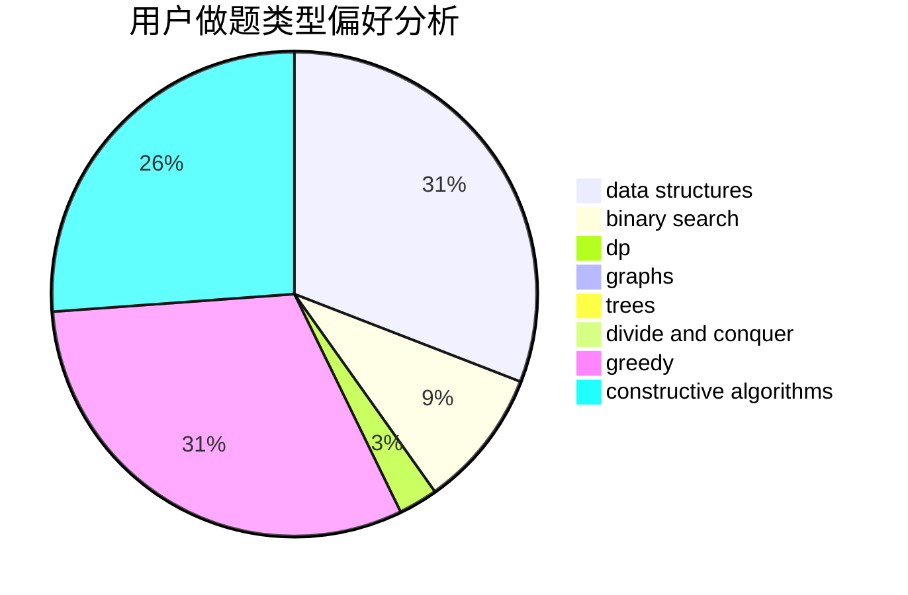
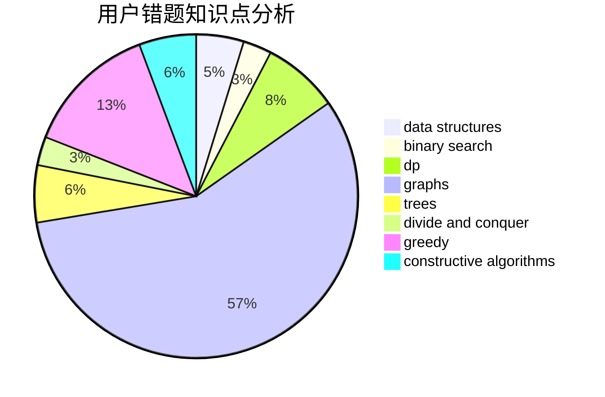

# davidlee1999WTK

<!-- tabs:start -->

#### **用户提交结果分析**

#### **用户做题类型偏好分析**

#### **用户错题知识点分析**

<!-- tabs:end -->
# 推荐题目
[1015E2](https://codeforces.com/contest/1015E/problem/2)		binary search,
                        dp,
                        greedy		  
[1081F](https://codeforces.com/contest/1081/problem/F)		constructive algorithms,
                        implementation,
                        interactive		  
[1402B](https://codeforces.com/contest/1402/problem/B)		*special problem,
                        geometry,
                        sortings		  
[919D](https://codeforces.com/contest/919/problem/D)		dfs and similar,
                        dp,
                        graphs		  
[1370A](https://codeforces.com/contest/1370/problem/A)		greedy,
                        implementation,
                        math,
                        number theory		  
[547D](https://codeforces.com/contest/547/problem/D)		constructive algorithms,
                        dfs and similar,
                        graphs		  
[1149A](https://codeforces.com/contest/1149/problem/A)		constructive algorithms,
                        greedy,
                        math,
                        number theory		  
[831F](https://codeforces.com/contest/831/problem/F)		dsu,graphs,sortings,trees		  
[1459F](https://codeforces.com/contest/1459/problem/F)		dsu,graphs,sortings,trees		  
[1025B](https://codeforces.com/contest/1025/problem/B)		brute force,
                        greedy,
                        number theory		  
