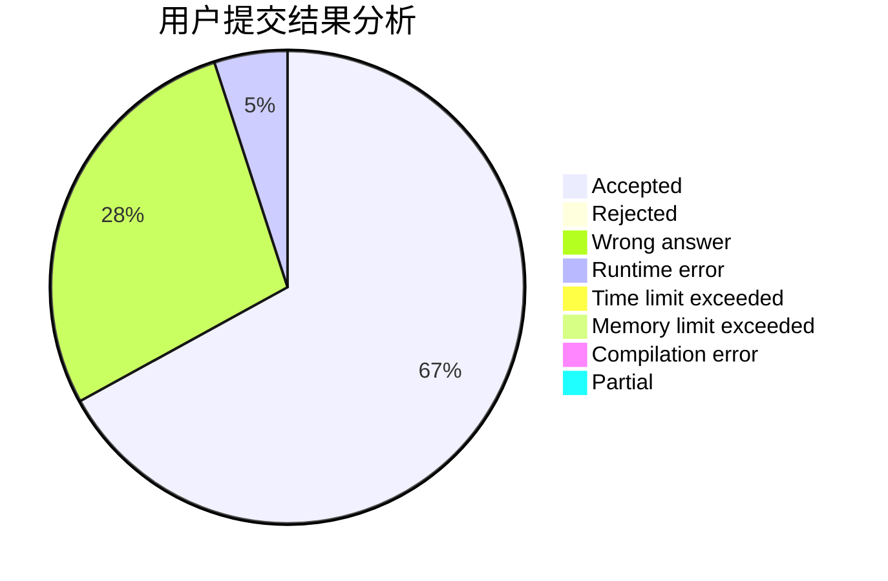
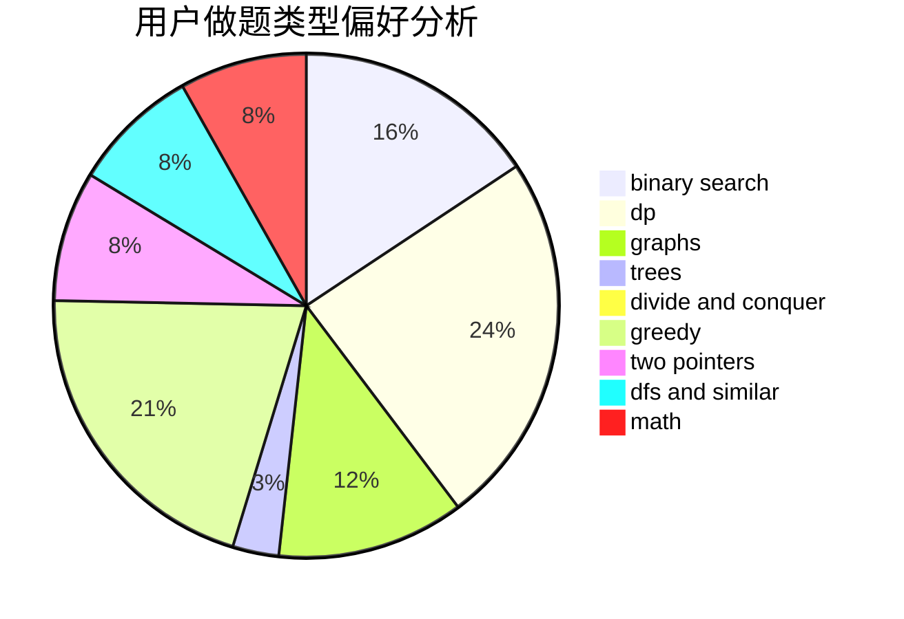

# Ardor

<!-- tabs:start -->

#### **用户提交结果分析**

#### **用户做题类型偏好分析**

<!-- tabs:end -->
# 推荐题目
[427D](https://codeforces.com/contest/427/problem/D)
[1505F](https://codeforces.com/contest/1505/problem/F)
[42C](https://codeforces.com/contest/42/problem/C)
[429D](https://codeforces.com/contest/429/problem/D)
[1290A](https://codeforces.com/contest/1290/problem/A)
[429B](https://codeforces.com/contest/429/problem/B)
[1292F](https://codeforces.com/contest/1292/problem/F)
[425C](https://codeforces.com/contest/425/problem/C)
[1162E](https://codeforces.com/contest/1162/problem/E)
[1227A](https://codeforces.com/contest/1227/problem/A)
