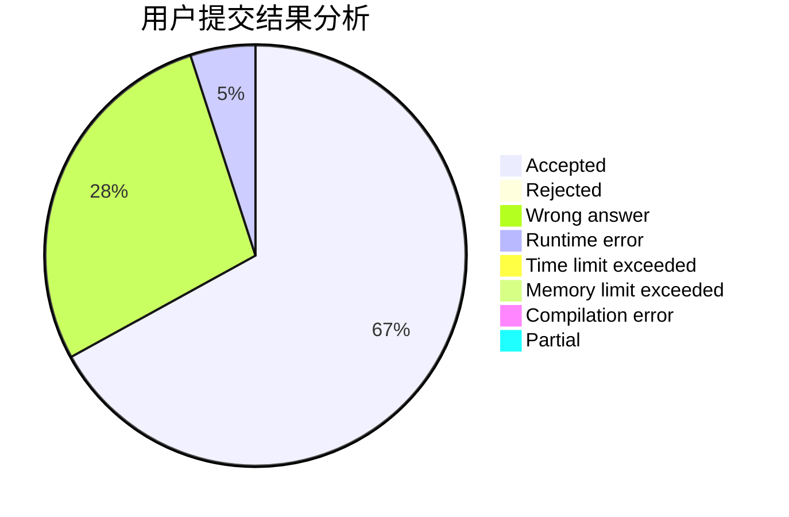
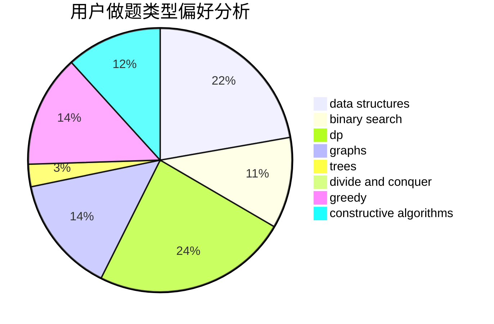
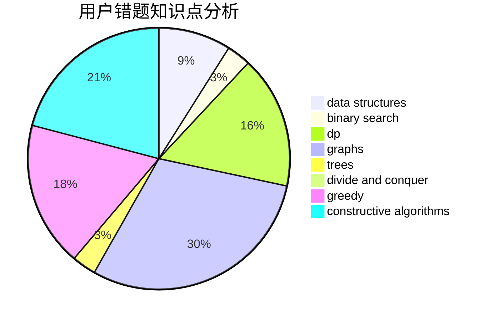

# Ardor

<!-- tabs:start -->

#### **用户提交结果分析**

#### **用户做题类型偏好分析**

#### **用户错题知识点分析**

<!-- tabs:end -->
# 推荐题目
[427D](https://codeforces.com/contest/427/problem/D)		dp,
                        string suffix structures,
                        strings		  
[1505F](https://codeforces.com/contest/1505/problem/F)		math		  
[42C](https://codeforces.com/contest/42/problem/C)		brute force,
                        constructive algorithms		  
[429D](https://codeforces.com/contest/429/problem/D)		data structures,
                        divide and conquer,
                        geometry		  
[1290A](https://codeforces.com/contest/1290/problem/A)		brute force,
                        data structures,
                        implementation		  
[429B](https://codeforces.com/contest/429/problem/B)		dp		  
[1292F](https://codeforces.com/contest/1292/problem/F)		bitmasks,
                        combinatorics,
                        dp		  
[425C](https://codeforces.com/contest/425/problem/C)		data structures,
                        dp		  
[1162E](https://codeforces.com/contest/1162/problem/E)		dsu,graphs,sortings,trees		  
[1227A](https://codeforces.com/contest/1227/problem/A)		math		  
