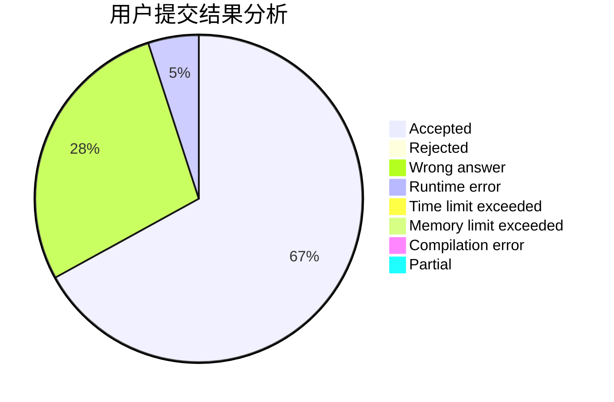
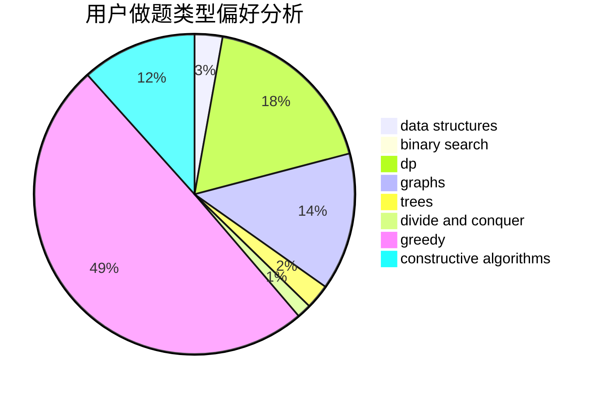
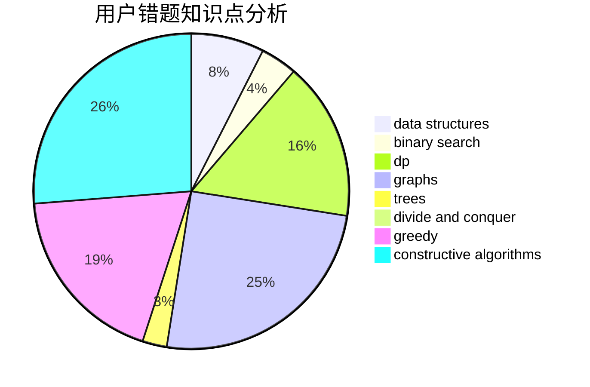

# Ardor

<!-- tabs:start -->

#### **用户提交结果分析**

#### **用户做题类型偏好分析**

#### **用户错题知识点分析**

<!-- tabs:end -->
# 推荐题目
[39H](https://codeforces.com/contest/39/problem/H)		implementation		  
[1496F](https://codeforces.com/contest/1496/problem/F)		dsu,graphs,sortings,trees		  
[401C](https://codeforces.com/contest/401/problem/C)		constructive algorithms,
                        greedy,
                        implementation		  
[3C](https://codeforces.com/contest/3/problem/C)		brute force,
                        games,
                        implementation		  
[1283A](https://codeforces.com/contest/1283/problem/A)		math		  
[3A](https://codeforces.com/contest/3/problem/A)		greedy,
                        shortest paths		  
[1285E](https://codeforces.com/contest/1285/problem/E)		brute force,
                        constructive algorithms,
                        data structures,
                        dp,
                        graphs,
                        sortings,
                        trees,
                        two pointers		  
[39B](https://codeforces.com/contest/39/problem/B)		greedy		  
[115A](https://codeforces.com/contest/115/problem/A)		dfs and similar,
                        graphs,
                        trees		  
[121C](https://codeforces.com/contest/121/problem/C)		brute force,
                        combinatorics,
                        number theory		  
