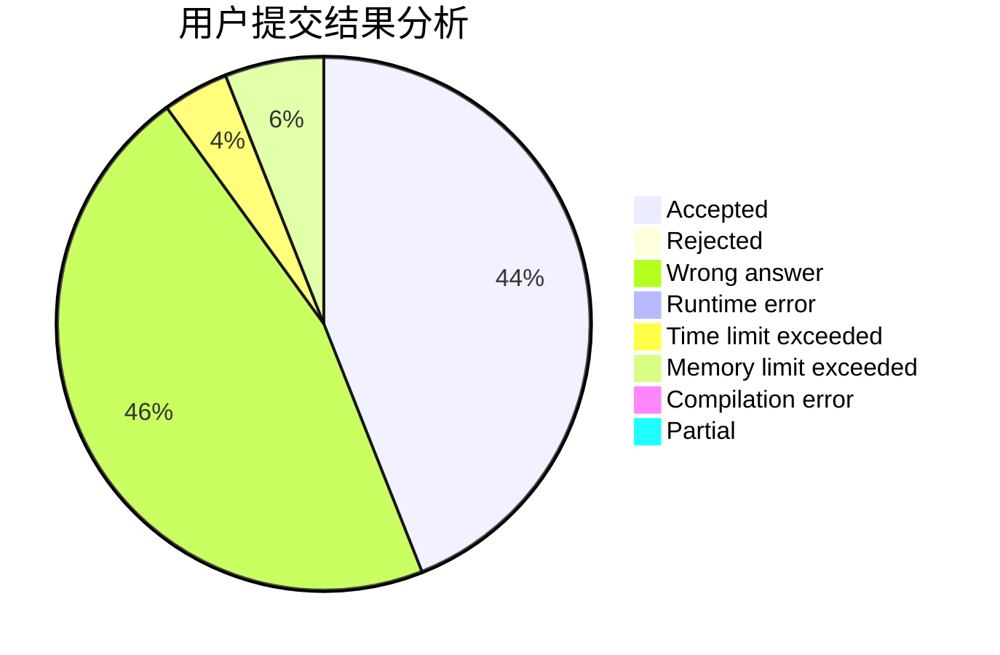
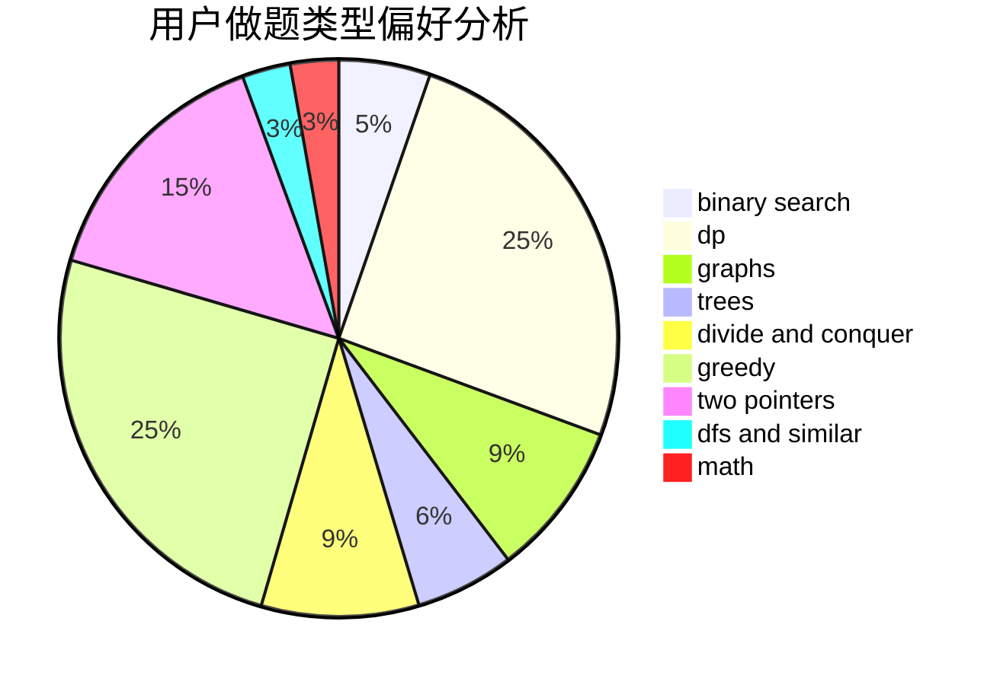

# dazade_8

<!-- tabs:start -->

#### **用户提交结果分析**

#### **用户做题类型偏好分析**

<!-- tabs:end -->
# 推荐题目
[45G](https://codeforces.com/contest/45/problem/G)
[987A](https://codeforces.com/contest/987/problem/A)
[949B](https://codeforces.com/contest/949/problem/B)
[1307E](https://codeforces.com/contest/1307/problem/E)
[950D](https://codeforces.com/contest/950/problem/D)
[218C](https://codeforces.com/contest/218/problem/C)
[965B](https://codeforces.com/contest/965/problem/B)
[721D](https://codeforces.com/contest/721/problem/D)
[97A](https://codeforces.com/contest/97/problem/A)
[1281E](https://codeforces.com/contest/1281/problem/E)
