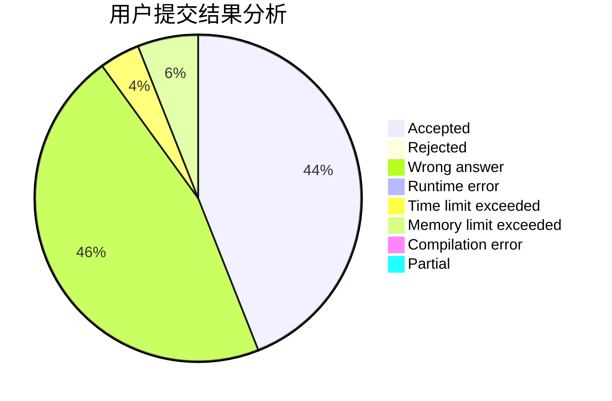
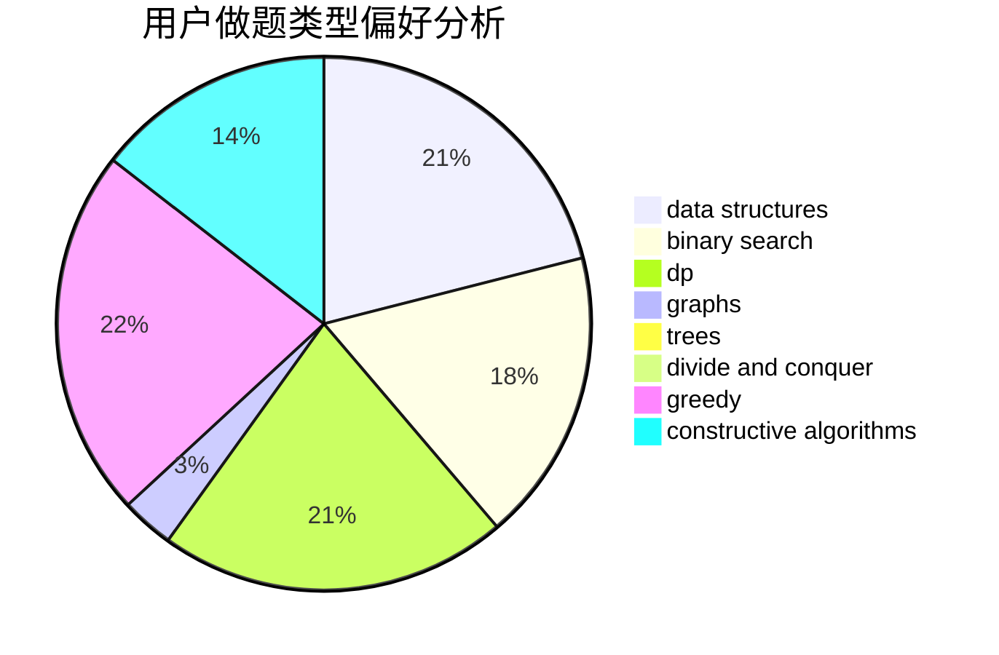
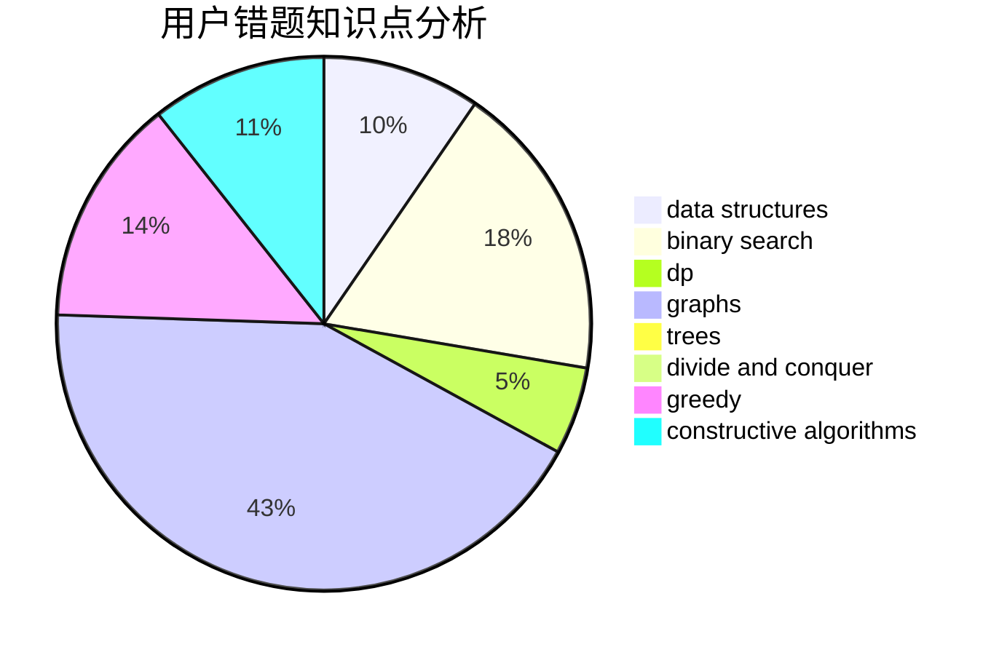

# dazade_8

<!-- tabs:start -->

#### **用户提交结果分析**

#### **用户做题类型偏好分析**

#### **用户错题知识点分析**

<!-- tabs:end -->
# 推荐题目
[438B](https://codeforces.com/contest/438/problem/B)		dsu,graphs,sortings,trees		  
[965A](https://codeforces.com/contest/965/problem/A)		math		  
[925E](https://codeforces.com/contest/925/problem/E)		data structures,
                        trees		  
[12D](https://codeforces.com/contest/12/problem/D)		data structures,
                        sortings		  
[930E](https://codeforces.com/contest/930/problem/E)		data structures,
                        dp,
                        math		  
[195C](https://codeforces.com/contest/195/problem/C)		expression parsing,
                        implementation		  
[948A](https://codeforces.com/contest/948/problem/A)		brute force,
                        dfs and similar,
                        graphs,
                        implementation		  
[702F](https://codeforces.com/contest/702/problem/F)		data structures		  
[958C1](https://codeforces.com/contest/958C/problem/1)		brute force		  
[1272C](https://codeforces.com/contest/1272/problem/C)		combinatorics,
                        dp,
                        implementation		  
