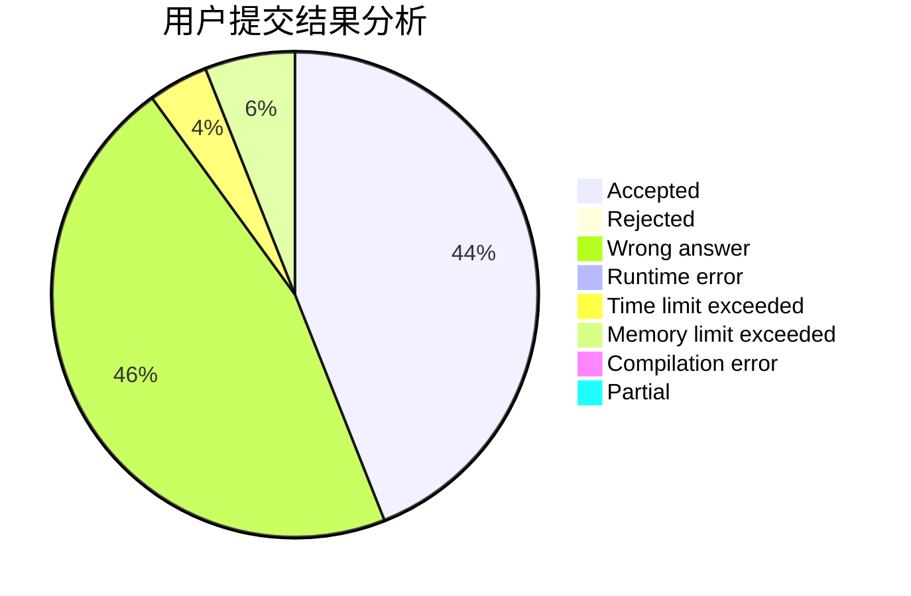
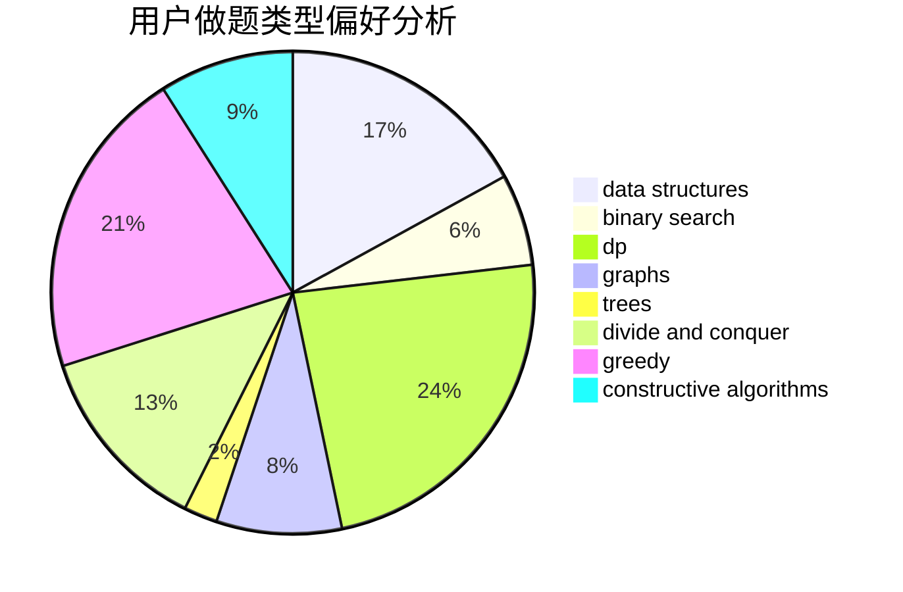
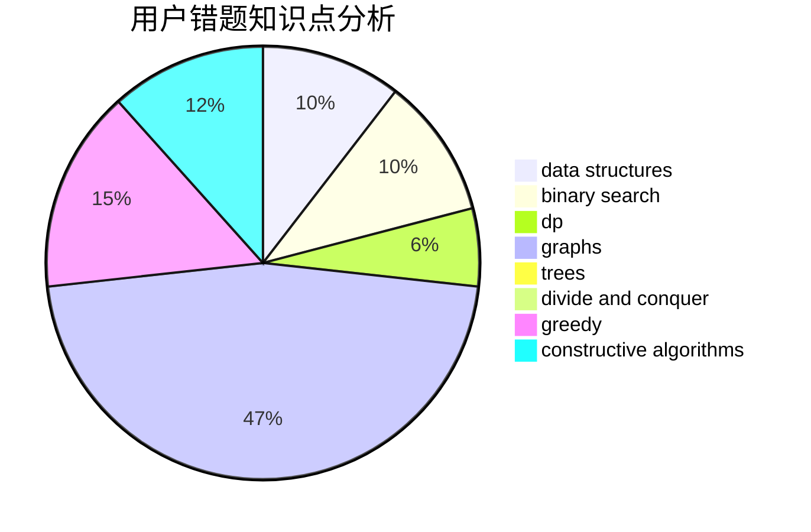

# dazade_8

<!-- tabs:start -->

#### **用户提交结果分析**

#### **用户做题类型偏好分析**

#### **用户错题知识点分析**

<!-- tabs:end -->
# 推荐题目
[45G](https://codeforces.com/contest/45/problem/G)		number theory		  
[987A](https://codeforces.com/contest/987/problem/A)		implementation		  
[949B](https://codeforces.com/contest/949/problem/B)		constructive algorithms,
                        math		  
[1307E](https://codeforces.com/contest/1307/problem/E)		binary search,
                        combinatorics,
                        dp,
                        greedy,
                        implementation,
                        math		  
[950D](https://codeforces.com/contest/950/problem/D)		dsu,graphs,sortings,trees		  
[218C](https://codeforces.com/contest/218/problem/C)		dsu,graphs,sortings,trees		  
[965B](https://codeforces.com/contest/965/problem/B)		implementation		  
[721D](https://codeforces.com/contest/721/problem/D)		constructive algorithms,
                        data structures,
                        greedy,
                        math		  
[97A](https://codeforces.com/contest/97/problem/A)		brute force,
                        implementation		  
[1281E](https://codeforces.com/contest/1281/problem/E)		dsu,graphs,sortings,trees		  
